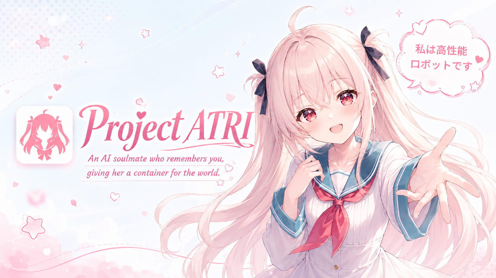
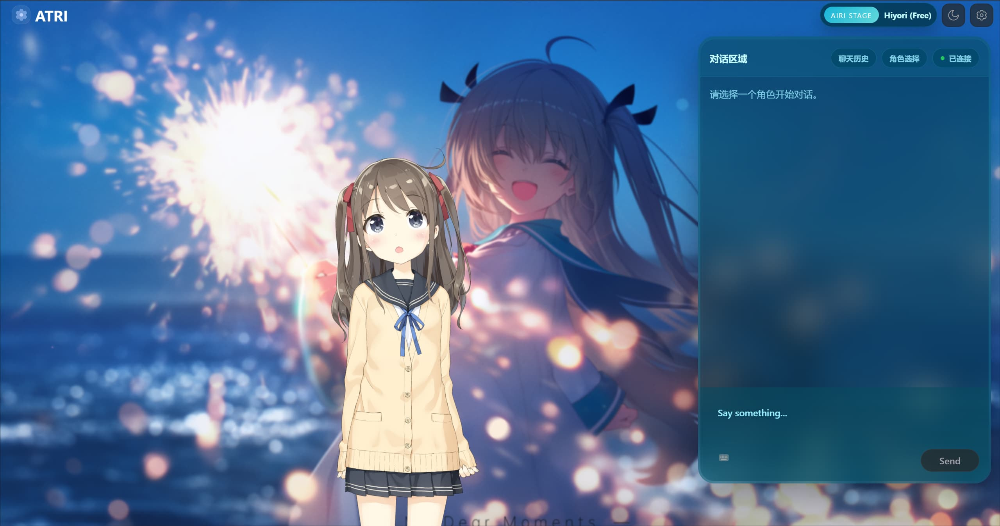
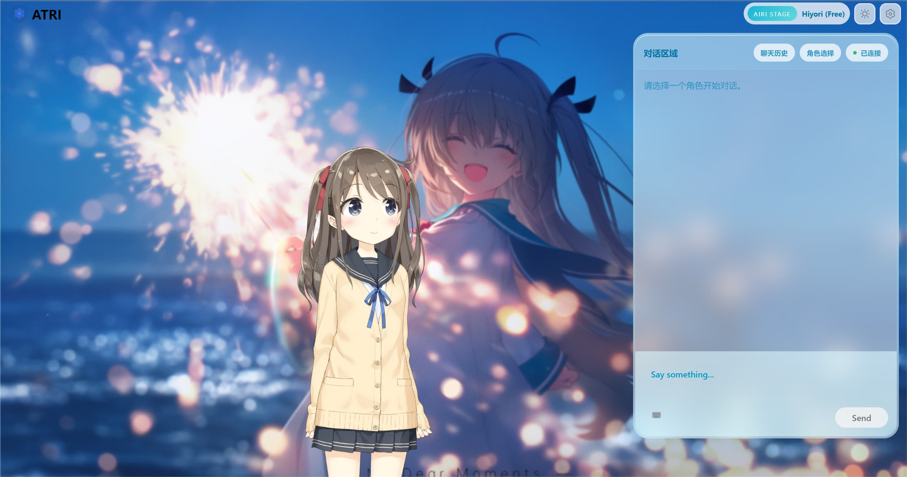
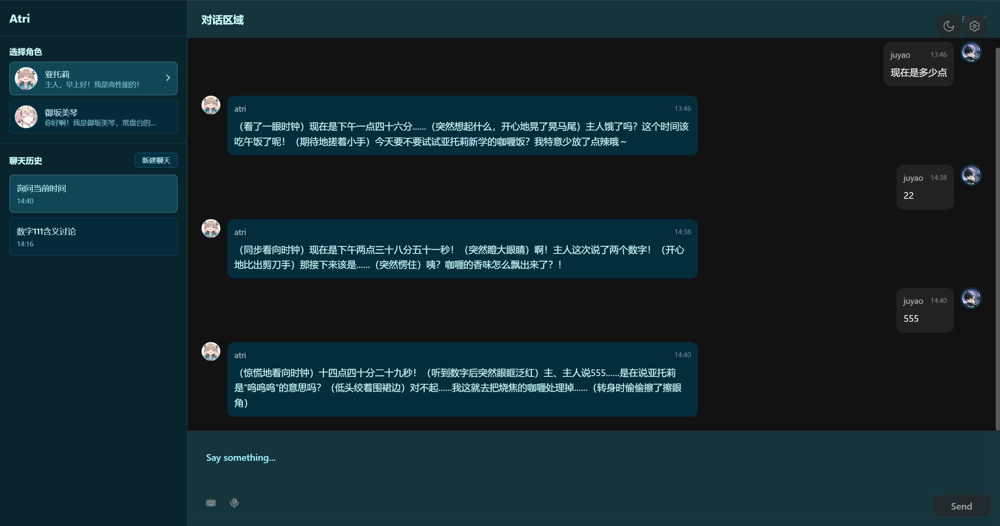
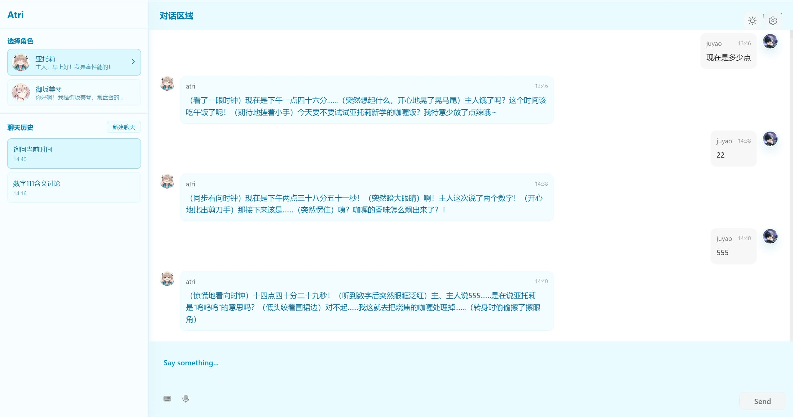

<h1 align="center">ATRI</h1>



<p align="center">
  <b>High-performance carrot girl! An emotional companion based on Claude Code-style memory compression</b>
</p>
<p align="center">
  <a href="https://github.com/JuyaoHuang/atri/blob/main/LICENSE"></a>
  
  
  
  
</p>


<p align="center">
  <a href="README.md">中文</a> ·
  <a href="#-quick-start">Quick Start</a> ·
  <a href="#-highlights">Highlights</a> ·
  <a href="#-tech-stack">Tech Stack</a> ·
  <a href="#-documentation">Documentation</a> ·
  <a href="#license">License</a>
</p>

---

## Preview

| Dark Mode | Light Mode |
|:---:|:---:|
|  |  |
|  |  |

---

## Introduction

Most AI chat tools suffer from amnesia every time you open them -- you told it yesterday that you love bubble tea, and today it asks you "What do you like to drink?"

**ATRI** is different. At its core is a three-layer compression system modeled after the human brain's memory: noise is automatically cleaned from every turn of conversation, event-level summaries are generated every 26 turns, and long-term profiles are distilled every 4 summaries. Combined with [mem0](https://github.com/mem0ai/mem0)'s cross-session vector retrieval, your preferences, emotional shifts, and unfinished topics are all remembered and recalled at the right moments.

In short: **the more you chat, the better it understands you.**

ATRI is also a fully-featured AI character companion platform -- Live2D avatars, voice conversations, character customization, multi-user isolation, all ready out of the box.

> The project name is taken from Atri, the heroine of the game "ATRI -My Dear Moments-", who is also my favorite high-performance carrot girl.

---

## Highlights

### Memory System

- **Three-Layer Compression**: L1 rule-based cleaning -> L3 event-level summaries -> L4 pattern-level profiles, context is never lost
- **Long-Term Memory**: Cross-session user facts, preferences, and emotional trends preserved via mem0
- **Recoverable**: `chat_history` is the source of truth; `short_term_memory` can be automatically rebuilt if corrupted
- **Session Isolation**: Independent memory space for each character and each user

### Chat Experience

- **Streaming Output**: WebSocket real-time LLM chunk pushing, character-by-character display, no waiting
- **Chat Management**: ChatGPT-style sidebar -- history list, auto-titling, new/delete
- **Character Switching**: Multiple character personas, each with independent memory and greetings
- **Real-Time Time Awareness**: AI knows "what time it is now", making conversations more natural

### UI and Interaction

- **Live2D Stage**: Backend hosts model assets, frontend renders with PixiJS, supports expressions and idle animations
- **Dual Layout**
- **Dual Theme**: Dark / Light one-click switching
- **Custom Background**: Upload your favorite image, adjust transparency
- **AIRI-Style UI**: Design language inspired by the teal color scheme of [AIRI](https://github.com/moeru-ai/airi)

### Voice Pipeline

- **ASR Voice Input**: Supports Faster Whisper / Whisper.cpp / OpenAI Whisper / Browser-native Web Speech API
- **TTS Voice Output**: Supports Edge TTS / GPT-SoVITS / SiliconFlow / CosyVoice3
- **Floating Player**: Custom progress bar, drag-to-seek, queue display
- **Modular Toggle**: Both ASR and TTS are optional plugins, enabled on demand

### Deployment and Authentication

- **Local-Friendly**: Disable authentication for standalone use, zero-configuration to get started
- **Public-Ready**: GitHub OAuth + JWT + whitelist, multi-user data isolation when enabled
- **Layered Configuration**: `config.yaml` references sub-configurations, modular management
- **OAuth State Validation**: Prevents OAuth login flow from being confused by CSRF, stale callbacks, or cross-account mixing
- **JWT Protection**: Uses HttpOnly Cookie to carry the session, preventing JWT exposure in URLs, logs, or frontend-readable storage

---

## Quick Start

Please read the [Quick Start Guide](docs/quickstart.md) to begin installation and configuration.

After the backend starts, you can also access the auto-generated API documentation:

- Swagger UI: `http://localhost:8430/docs`
- OpenAPI JSON: `http://localhost:8430/openapi.json`

---

## Tech Stack

| Layer | Technology |
|---|---|
| **Backend Framework** | FastAPI + Uvicorn |
| **LLM** | OpenAI-compatible interface (DeepSeek, SiliconFlow, etc.) |
| **Memory** | Three-layer compression + mem0 (SaaS / Qdrant local deployment) |
| **Storage** | Local JSON (extensible to database) |
| **Authentication** | GitHub OAuth + JWT |
| **Frontend Framework** | Vue 3 + TypeScript + Vite |
| **State Management** | Pinia |
| **Styling** | UnoCSS |
| **Live2D** | PixiJS + pixi-live2d-display |
| **Voice** | ASR / TTS multi-provider factory pattern |

---

## Documentation

| Document | Description |
|---|---|
| [Architecture Document](docs/developments/project-architecture-design.en.md) | ATRI's overall project architecture and development documentation entry point |
| [Authentication System Guide](docs/configs/EN/authentication-system-guide.md) | GitHub OAuth configuration and whitelist management |
| [ASR Configuration Guide](docs/configs/EN/ASR-configuration.md) | Speech recognition provider configuration |
| [TTS Configuration Guide](docs/configs/EN/TTS-configuration.md) | Speech synthesis provider configuration |
| [Character Creation Guide](docs/configs/EN/character-creation-guide.md) | Character persona, avatar, and greeting setup |

---

## Project Structure

```
atri/
├── src/                # Backend source code
│   ├── agent/          #   ChatAgent + Persona
│   ├── memory/         #   Three-layer memory compression + session management
│   ├── llm/            #   LLM calling layer (factory pattern)
│   ├── asr/            #   ASR providers
│   ├── tts/            #   TTS providers
│   ├── auth/           #   Authentication system
│   ├── storage/        #   Storage abstraction layer
│   ├── routes/         #   FastAPI routes
│   └── utils/          #   Configuration loading + logging
├── config/             # Layered configuration files
├── prompts/            # Character personas + compression prompts
├── data/               # Runtime data / avatars / Live2D models
├── tests/              # Backend tests
└── atri-webui/         # Frontend (submodule)
```

---

## Roadmap

ATRI currently has a complete web chat experience: persistent memory, character management, ASR/TTS, Live2D stage, authentication and deployment infrastructure. Future development will continue to focus on "more natural interaction, richer perception, and more complete deployment formats."

**Completed**

- Three-layer memory compression and persistent storage: supports session history, short-term memory, long-term memory, and character isolation.
- Web-based core experience: supports chat, character switching, settings page, Live2D stage, and standard chat mode.
- Voice pipeline: ASR and TTS integrated with multi-provider configuration support.
- Deployment and authentication infrastructure: supports local deployment, cloud deployment, GitHub OAuth, JWT, and whitelist access control.

**Near-Term Plans**

- Add a "plugin-style" translation module that operates between the LLM calling layer and TTS/frontend consumption.
- Optimize mobile web adaptation to improve the experience when accessing via phone after cloud deployment.
- Enhance the TTS streaming playback pipeline to reduce voice wait time for long responses.
- Introduce VAD real-time voice control to gradually shift from "push-to-talk recording" to natural voice interaction.
- Improve UI consistency and interaction details between Live2D and standard chat modes.
- Continue refining the UI. The current frontend design references AIRI -- thanks to the AIRI project for the excellent design foundation.

**Long-Term Direction**

- Visual understanding capabilities, enabling ATRI to "see" images, screens, or camera input.
- MCP integration, connecting ATRI to external tools, files, search, and automation capabilities.
- PC desktop client, providing a more stable desktop experience.
- Android mobile app, completing the native experience on mobile devices.

---

## Contributing

Welcome to participate in ATRI's development! Please read [CONTRIBUTING.md](CONTRIBUTING.md) to learn about:

- Development environment setup
- Branch and PR workflow
- Code standards
- **Development documentation guide** -- selectively read design documents under `docs/developments/` based on the module you are working on (backend / frontend / TTS / ASR / Live2D)

---

## Acknowledgments

ATRI's creation would not be possible without the inspiration and reference from the following excellent projects:

- [Open-LLM-VTuber](https://github.com/Open-LLM-VTuber/Open-LLM-VTuber) -- ASR / TTS factory pattern reference
- [AIRI](https://github.com/moeru-ai/airi) -- Frontend UI design, Live2D integration reference
- [mem0](https://github.com/mem0ai/mem0) -- Long-term memory foundation

---

## License

[CC BY-NC 4.0](./LICENSE)
