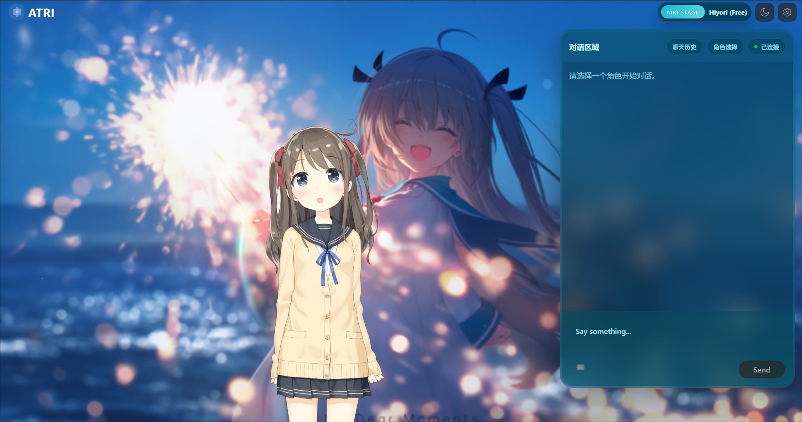
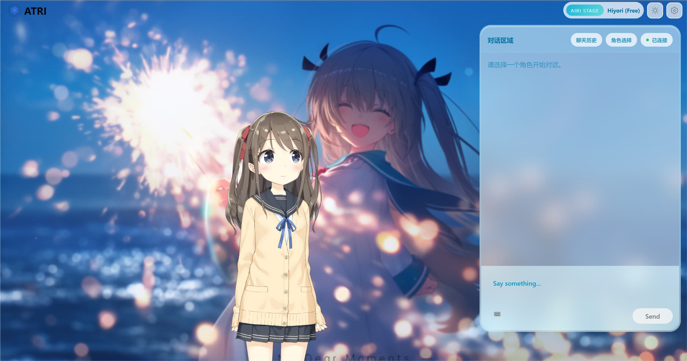
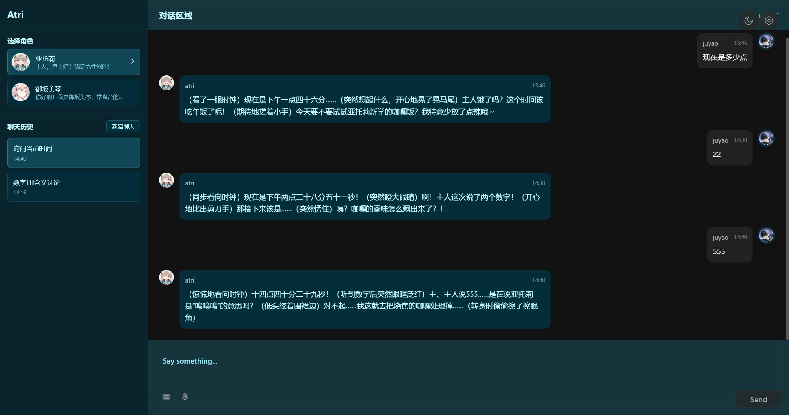

<h1 align="center">ATRI</h1>


<p align="center">
  <b>记得住你的 AI —— 基于三层记忆压缩的情感伴侣系统</b>
</p>
<p align="center">
  <a href="https://github.com/JuyaoHuang/atri/blob/main/LICENSE"></a>
  
  
  
  
</p>


<p align="center">
  <a href="#-快速上手">快速上手</a> ·
  <a href="#-功能亮点">功能亮点</a> ·
  <a href="#-技术栈">技术栈</a> ·
  <a href="#-项目文档">文档</a> ·
  <a href="#license">License</a>
</p>

---

## 👀 效果预览

| 深色模式 | 浅色模式 |
|:---:|:---:|
|  |  |
|  |  |

---

## ⭐ 项目简介

大多数 AI 聊天工具每次打开都像失忆了一样 —— 你昨天刚说过最喜欢珍珠奶茶，今天它又问你"你喜欢喝什么？"

**ATRI** 不一样。它的核心是一套仿人脑记忆的三层压缩系统：每轮对话自动清洗噪声，每 26 轮生成事件级摘要，每 4 个摘要再提炼出长期画像。配合 [mem0](https://github.com/mem0ai/mem0) 的跨会话向量检索，你聊过的偏好、情绪变化、未完成话题，它都能记住并在合适的时刻想起。

简单来说：**聊得越久，它越懂你。**

ATRI 同时也是一个功能完整的 AI 角色伴侣平台 —— Live2D 形象、语音对话、角色定制、多用户隔离，开箱即用。

> 项目名称取自游戏《ATRI -My Dear Moments-》的女主角亚托莉，也是我最喜欢的高性能萝卜子

---

## ✨ 功能亮点

### 🧠 记忆系统

- **三层压缩**：L1 规则清洗 → L3 事件级摘要 → L4 模式级画像，上下文永不丢失
- **长期记忆**：通过 mem0 保存跨会话的用户事实、偏好和情感趋势
- **可恢复**：`chat_history` 是 source of truth，`short_term_memory` 损坏时可自动重建
- **会话隔离**：每个角色、每个用户独立记忆空间

### 💬 对话体验

- **流式输出**：WebSocket 实时推送 LLM 分片，逐字显示，无等待感
- **聊天管理**：ChatGPT 风格的侧边栏 —— 历史列表、自动标题、新建 / 删除
- **角色切换**：多角色人设，每个角色拥有独立记忆和问候语
- **实时时间感知**：AI 知道"现在几点"，对话更自然

### 🎨 界面与交互

- **Live2D 舞台**：后端托管模型资源，前端 PixiJS 渲染，支持表情和待机动画
- **双布局**：
- **双主题**：深色 / 浅色一键切换
- **自定义背景**：上传喜欢的图片，调节透明度
- **AIRI 风格 UI**：参考 [AIRI](https://github.com/moeru-ai/airi) 的青绿色调设计语言

### 🎙️ 语音链路

- **ASR 语音输入**：支持 Faster Whisper / Whisper.cpp / OpenAI Whisper / 浏览器原生 Web Speech API
- **TTS 语音输出**：支持 Edge TTS / GPT-SoVITS / SiliconFlow / CosyVoice3
- **浮动播放器**：自定义进度条、拖动 seek、队列显示
- **模块化开关**：ASR 和 TTS 均为可选插件，按需启用

### 🔐 部署与认证

- **本地友好**：关闭认证即可单机使用，零配置上手
- **公网就绪**：GitHub OAuth + JWT + 白名单，开启后多用户数据隔离
- **配置分层**：`config.yaml` 引用各子配置，模块化管理

---

## 🚀 快速上手

请阅读 [快速上手指南](docs/quickstart.md) 开始安装和配置。

后端启动后也可以访问自动生成的 API 文档：

- Swagger UI: `http://localhost:8430/docs`
- OpenAPI JSON: `http://localhost:8430/openapi.json`

---

## 🛠️ 技术栈

| 层 | 技术 |
|---|---|
| **后端框架** | FastAPI + Uvicorn |
| **LLM** | OpenAI 兼容接口（DeepSeek、SiliconFlow 等） |
| **记忆** | 三层压缩 + mem0（SaaS / Qdrant 本地部署） |
| **存储** | 本地 JSON（可扩展数据库） |
| **认证** | GitHub OAuth + JWT |
| **前端框架** | Vue 3 + TypeScript + Vite |
| **状态管理** | Pinia |
| **样式** | UnoCSS |
| **Live2D** | PixiJS + pixi-live2d-display |
| **语音** | ASR / TTS 多提供商工厂模式 |

---

## 📖 项目文档

| 文档 | 说明 |
|---|---|
| [架构文档](docs\developments\项目架构设计.md) | ATRI 的项目整体架构和开发文档入口 |
| [认证系统使用指南](docs/configs/认证系统使用指南.md) | GitHub OAuth 配置与白名单管理 |
| [ASR 配置说明](docs/configs/ASR配置说明.md) | 语音识别提供商配置 |
| [TTS 配置说明](docs/configs/TTS配置说明.md) | 语音合成提供商配置 |
| [角色创建指南](docs/configs/角色创建指南.md) | 角色人设、头像与问候语 |

---

## 🏗️ 项目结构

```
atri/
├── src/                # 后端源码
│   ├── agent/          #   ChatAgent + Persona
│   ├── memory/         #   三层记忆压缩 + 会话管理
│   ├── llm/            #   LLM 调用层（工厂模式）
│   ├── asr/            #   ASR 提供商
│   ├── tts/            #   TTS 提供商
│   ├── auth/           #   认证系统
│   ├── storage/        #   存储抽象层
│   ├── routes/         #   FastAPI 路由
│   └── utils/          #   配置加载 + 日志
├── config/             # 分层配置文件
├── prompts/            # 角色人设 + 压缩 Prompt
├── data/               # 运行时数据 / 头像 / Live2D 模型
├── tests/              # 后端测试
└── atri-webui/         # 前端（子模块）
```

---

## 贡献


---

## 🙏 致谢

ATRI 的诞生离不开以下优秀项目的启发和参考：

- [Open-LLM-VTuber](https://github.com/Open-LLM-VTuber/Open-LLM-VTuber) — ASR / TTS 工厂模式参考
- [AIRI](https://github.com/moeru-ai/airi) — 前端 UI 设计、Live2D 集成参考
- [mem0](https://github.com/mem0ai/mem0) — 长期记忆基座

---

## License

[CC BY-NC 4.0](./LICENSE)
