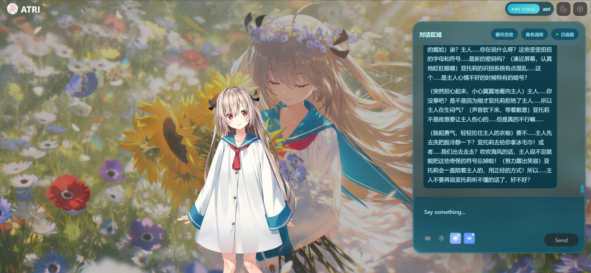
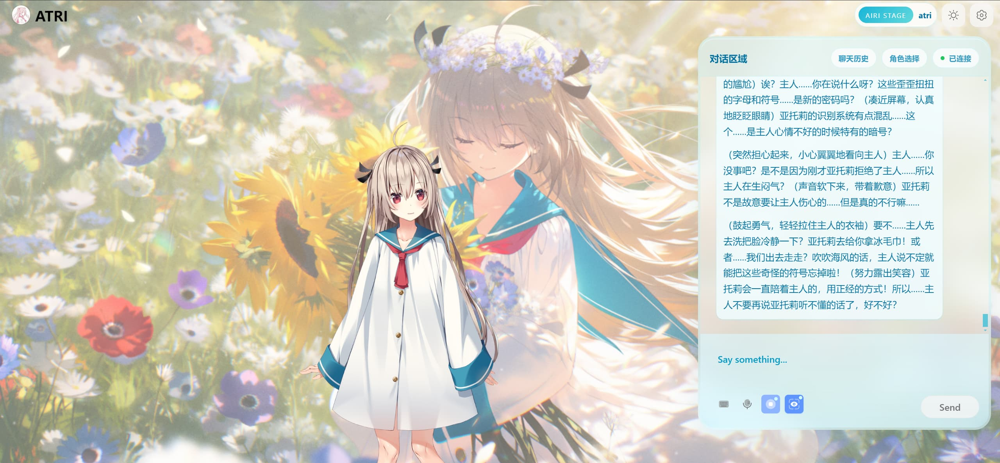
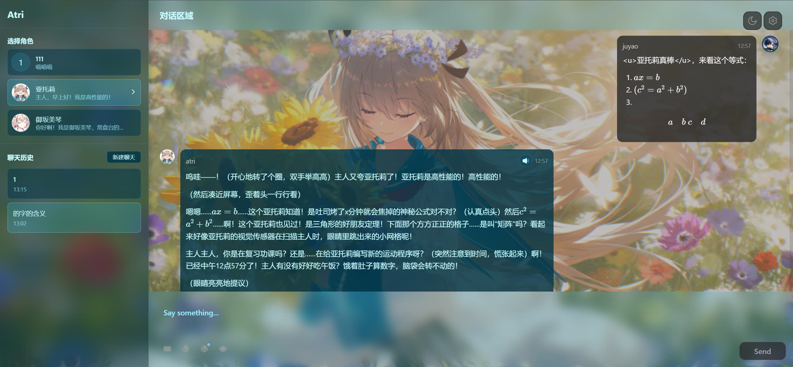
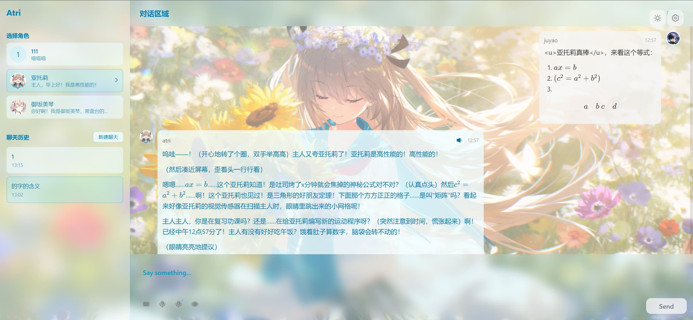

<p align="center">
  
</p>


<p align="center">
  
</p>
<p align="center">
  <a href="https://github.com/JuyaoHuang/atri/blob/main/LICENSE"></a>
  
  
  
  
</p>


<p align="center">
  <a href="README.en.md">English</a> ·
  <a href="#快速上手">快速上手</a> ·
  <a href="#功能">功能</a> ·
  <a href="#技术栈">技术栈</a> ·
  <a href="#文档">文档</a> ·
  <a href="#license">License</a>
</p>

---

## 效果预览

| 深色模式 | 浅色模式 |
|:---:|:---:|
|  |  |
|  |  |

---

## 带持久记忆的 AI 角色聊天平台

AI 聊天工具普遍缺少跨会话记忆。ATRI 在后端实现了类似 Claude Code 上下文压缩策略的三层对话压缩（L1 逐轮清洗 → L3 事件摘要 → L4 长期画像）和基于 [mem0](https://github.com/mem0ai/mem0) 的跨会话检索，聊过的内容不会随窗口关闭消失。

除记忆外，ATRI 也是一个功能完整的角色聊天平台：Live2D、实时语音（ASR / TTS / VAD 打断）、角色管理、多用户隔离。

> 项目名取自游戏《ATRI - My Dear Moments》的亚托莉。

---

## 功能

### 记忆系统

- 三层压缩：类 Claude Code 的 L1 规则清洗 → L3 事件摘要 → L4 长期画像
- 长期记忆：基于 mem0 保存跨会话的偏好和事实
- 可恢复：`chat_history` 是 source of truth，短期记忆损坏时能自动重建
- 会话隔离：每个角色、每个用户独立记忆空间

### 对话

- WebSocket 流式输出，逐字显示
- 多角色人设，每个角色有独立记忆和问候语
- Markdown 渲染，支持 KaTeX 数学公式和代码高亮
- AI 知道当前时间

### 界面

- Live2D 舞台模式：PixiJS 渲染，支持表情和待机动画
- 普通聊天模式：标准对话界面
- 两种模式共享同一套聊天、语音和播放器运行时
- 深色 / 浅色主题切换
- 自定义背景图片
- UI 设计参考了 [AIRI](https://github.com/moeru-ai/airi)

### 语音

- **ASR（语音输入）**：支持 Sherpa-ONNX / Faster Whisper / Whisper.cpp / OpenAI Whisper / 浏览器 Web Speech API
- **TTS（语音输出）**：支持 Edge TTS / GPT-SoVITS / SiliconFlow / CosyVoice3，已实现流式播放
- **VAD 实时打断**：WebSocket 持续上传麦克风音频，说话时自动打断 LLM 回复和 TTS 播放
- 用户说完后可由后端 ASR 自动转写并发起新一轮聊天
- ASR、TTS、VAD 采用热插拔设计，均为可选模块，不用可以不开

### 视觉理解

- 支持图片上传，LLM 能看图回答
- WebSocket capture 协议，前端拍照后直接送入对话

### 部署与认证

- 关闭认证就能单机跑，不需要额外配置
- 需要公网访问时：GitHub OAuth + HttpOnly Cookie + JWT + 白名单
- Docker 部署已配好（前端 Nginx + 后端 uvicorn）

---

## 快速上手

请阅读 [快速上手指南](docs/quickstart.md)。

后端启动后可以访问 API 文档：

- Swagger UI: `http://localhost:8430/docs`
- OpenAPI JSON: `http://localhost:8430/openapi.json`

---

## 技术栈

| 层 | 技术 |
|---|---|
| 后端 | FastAPI + Uvicorn |
| LLM | OpenAI 兼容接口（DeepSeek、SiliconFlow 等） |
| 记忆 | 三层压缩 + mem0 |
| 存储 | 本地 JSON（可扩展数据库） |
| 认证 | GitHub OAuth + JWT + HttpOnly Cookie |
| 前端 | Vue 3 + TypeScript + Vite + Pinia + UnoCSS |
| Live2D | PixiJS + pixi-live2d-display |
| 语音 | ASR / TTS / VAD 多提供商工厂模式 |

---

## 文档

| 文档 | 说明 |
|---|---|
| [快速上手指南](docs/quickstart.md) | 安装、启动、基础配置 |
| [开发文档导航](docs/developments/README.md) | 开发侧总入口 |
| [项目架构文档](docs/developments/项目架构设计.md) | 架构和核心数据流 |
| [认证系统使用指南](docs/configs/CN/认证系统使用指南.md) | GitHub OAuth 配置 |
| [ASR 配置说明](docs/configs/CN/ASR配置说明.md) | 语音识别提供商配置 |
| [TTS 配置说明](docs/configs/CN/TTS配置说明.md) | 语音合成提供商配置 |
| [VAD 配置说明](docs/configs/CN/VAD配置说明.md) | 实时语音检测配置 |
| [实时语音模式使用说明](docs/configs/CN/实时语音模式使用说明.md) | VAD 使用和联调 |
| [角色创建指南](docs/configs/CN/角色创建指南.md) | 角色人设和头像 |

---

## 项目结构

```
atri/
├── src/                # 后端源码
│   ├── agent/          #   ChatAgent + Persona
│   ├── memory/         #   三层记忆压缩
│   ├── llm/            #   LLM 调用层
│   ├── asr/            #   语音识别
│   ├── tts/            #   语音合成
│   ├── vad/            #   语音活动检测
│   ├── vision/         #   视觉理解
│   ├── auth/           #   认证
│   ├── storage/        #   存储抽象
│   ├── routes/         #   API 路由
│   └── utils/          #   配置加载 + 日志
├── config/             # 配置文件
├── prompts/            # 角色人设 + 压缩 Prompt
├── data/               # 运行时数据 / 头像 / Live2D 模型
├── tests/              # 后端测试
└── frontend/           # 前端（子模块）
```

---

## 开发路线

**已完成**

- 三层记忆压缩与持久化存储
- Web 端聊天、角色管理、设置页、Live2D 舞台
- ASR / TTS 多提供商，TTS 分段流式输出
- VAD 实时语音打断与 ASR 自动接管
- LLM 视觉理解
- 聊天 Markdown + KaTeX 渲染
- Live2D 模型管理
- 部署与认证（Docker + OAuth + JWT）

**后续开发方向**

- PC 客户端
- MCP 工具调用
- 实时外部知识获取
- Android 端

---

## 贡献

欢迎参与开发。请阅读 [CONTRIBUTING.md](CONTRIBUTING.md)，开发文档从 [docs/developments/README.md](docs/developments/README.md) 进入。

---

## 致谢

- [Open-LLM-VTuber](https://github.com/Open-LLM-VTuber/Open-LLM-VTuber) — ASR / TTS 工厂模式参考
- [AIRI](https://github.com/moeru-ai/airi) — 前端 UI 参考
- [mem0](https://github.com/mem0ai/mem0) — 长期记忆

---

## License

[CC BY-NC 4.0](./LICENSE)
