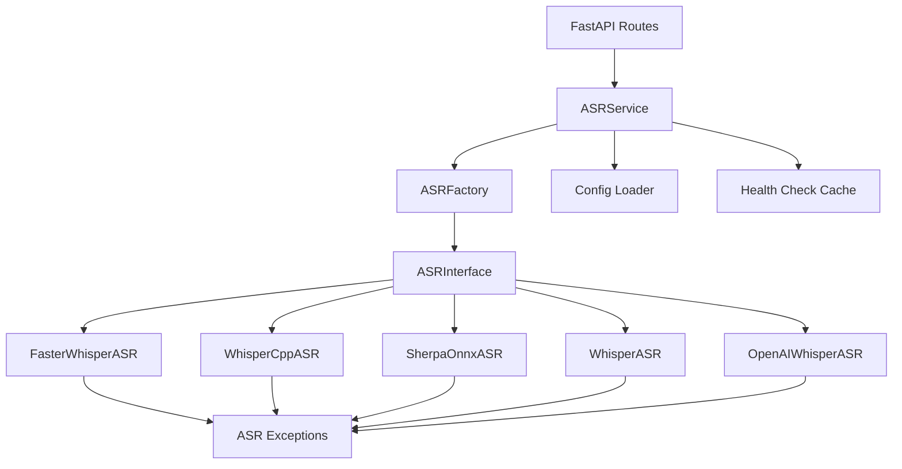

# ASR 模块设计文档

## 📚 参考文档

- **设计讨论历史**：`docs/总结_前端对话历史.md` - Round 10-16
- **详细对话记录**：`docs/前端设计对话历史.md` - Round 10-16
- **参考项目**：
  - OLV 架构文档：`docs/projects-docs/OLV架构文档.md`
  - AIRI 项目：`D:\Coding\GitHub_Resuorse\AIRI\`
  - OLV 项目：`D:\Coding\GitHub_Resuorse\open-llm-vtuber\`

## 📂 参考代码路径

- **OLV ASR 实现**：`open-llm-vtuber/src/asr/`
- **AIRI ASR 实现**：`AIRI/packages/core/src/asr/`
- **atri 目标路径**：`emotion-robot/src/asr/`

---

## 1. 模块概述

### 1.1 模块定位

ASR（Automatic Speech Recognition，自动语音识别）模块是 atri 项目的核心语音输入组件，负责将用户的语音输入转换为文本，为后续的 LLM 对话提供输入源。

### 1.2 核心功能

- **多 Provider 支持**：支持 6 种不同的 ASR 引擎，包括本地部署、云服务和浏览器原生方案
- **统一接口抽象**：通过 `ASRInterface` 提供统一的调用接口，屏蔽底层实现差异
- **热切换机制**：支持运行时动态切换 ASR Provider，无需重启服务
- **流式转录**：支持实时语音识别（流式输入/输出）
- **健康检查**：自动检测 Provider 可用性，确保服务稳定
- **异常处理**：完善的异常层次结构，便于错误定位和处理

### 1.3 设计目标

- **可扩展性**：通过装饰器工厂模式，轻松添加新的 ASR Provider
- **可维护性**：清晰的分层架构，职责明确，便于维护和调试
- **高性能**：支持模型预加载、结果缓存，优化响应速度
- **易用性**：提供 RESTful API 和 WebSocket 接口，方便前端集成

---

## 2. 技术选型

### 2.1 支持的 ASR Provider

atri 项目支持 6 种 ASR Provider，覆盖本地部署、云服务和浏览器原生三种场景：

| Provider | 类型 | 部署方式 | 特点 | 适用场景 |
|----------|------|----------|------|----------|
| **faster_whisper** | 本地 | Python 库 | 高准确率、低延迟、支持多语言 | 生产环境推荐 |
| **whisper_cpp** | 本地 | C++ 库 | 极低资源占用、快速推理 | 资源受限环境 |
| **sherpa_onnx_asr** | 本地 | ONNX Runtime | 跨平台、高性能 | 跨平台部署 |
| **whisper** | 本地 | OpenAI 官方库 | 原版实现、高准确率 | 开发测试 |
| **openai_whisper** | 云服务 | OpenAI API | 无需本地资源、持续更新 | 快速接入、无本地算力 |
| **web_speech_api** | 浏览器 | Web API | 零成本、实时响应 | 浏览器端实时转录 |

### 2.2 技术选型对比

#### 2.2.1 准确率对比

- **最高准确率**：`whisper`（OpenAI 原版）、`faster_whisper`
- **中等准确率**：`whisper_cpp`、`sherpa_onnx_asr`
- **依赖网络质量**：`openai_whisper`、`web_speech_api`

#### 2.2.2 延迟对比

- **最低延迟**：`whisper_cpp`（C++ 优化）、`web_speech_api`（浏览器原生）
- **中等延迟**：`faster_whisper`、`sherpa_onnx_asr`
- **较高延迟**：`whisper`（Python 实现）、`openai_whisper`（网络请求）

#### 2.2.3 资源占用对比

- **最低资源**：`web_speech_api`（浏览器端）、`whisper_cpp`
- **中等资源**：`faster_whisper`、`sherpa_onnx_asr`
- **较高资源**：`whisper`（需加载完整模型）
- **零本地资源**：`openai_whisper`（云服务）

#### 2.2.4 成本对比

- **零成本**：`faster_whisper`、`whisper_cpp`、`sherpa_onnx_asr`、`whisper`、`web_speech_api`
- **按量付费**：`openai_whisper`（$0.006/分钟）

### 2.3 技术选型依据

#### 2.3.1 本地部署方案（4 个）

**faster_whisper**（推荐）：
- 基于 CTranslate2 优化，速度比原版快 4 倍
- 内存占用减少 50%
- 支持 CPU 和 GPU 推理
- 参考：OLV 项目默认使用

**whisper_cpp**：
- C++ 实现，极致性能优化
- 适合嵌入式设备和资源受限环境
- 参考：OLV 项目备选方案

**sherpa_onnx_asr**：
- 基于 ONNX Runtime，跨平台兼容性好
- 支持流式识别
- 参考：OLV 项目扩展支持

**whisper**：
- OpenAI 官方实现，准确率最高
- 适合开发测试和对比基准
- 参考：OLV 项目基准测试

#### 2.3.2 云服务方案（1 个）

**openai_whisper**：
- 无需本地部署，快速接入
- 持续更新，模型效果最优
- 适合无本地算力或快速原型开发
- 参考：AIRI 项目使用

#### 2.3.3 浏览器原生方案（1 个）

**web_speech_api**：
- 浏览器原生支持，零成本
- 实时响应，适合交互式场景
- 隐私保护（音频不离开浏览器）
- 参考：AIRI 项目前端实现

---

## 3. 架构设计

### 3.1 整体架构

ASR 模块采用分层架构，从上到下分为：

```
┌─────────────────────────────────────────────────────────┐
│                     API 层 (FastAPI)                     │
│  /api/asr/providers  /api/asr/transcribe  /ws/asr       │
└─────────────────────────────────────────────────────────┘
                            ↓
┌─────────────────────────────────────────────────────────┐
│                   服务层 (Service)                       │
│  ASRService: 管理 Provider 切换、健康检查、缓存         │
└─────────────────────────────────────────────────────────┘
                            ↓
┌─────────────────────────────────────────────────────────┐
│                  工厂层 (ASRFactory)                     │
│  装饰器注册表 + Provider 创建                            │
└─────────────────────────────────────────────────────────┘
                            ↓
┌─────────────────────────────────────────────────────────┐
│                 接口层 (ASRInterface)                    │
│  抽象基类：定义统一接口                                  │
└─────────────────────────────────────────────────────────┘
                            ↓
┌─────────────────────────────────────────────────────────┐
│                Provider 层 (具体实现)                    │
│  faster_whisper  whisper_cpp  sherpa_onnx  ...          │
└─────────────────────────────────────────────────────────┘
                            ↓
┌─────────────────────────────────────────────────────────┐
│                  异常层 (Exceptions)                     │
│  ASRError  ASRConnectionError  ASRConfigError  ...      │
└─────────────────────────────────────────────────────────┘
```

### 3.2 目录结构

```
src/asr/
├── __init__.py              # 导入所有 Provider 触发装饰器注册
├── interface.py             # ASRInterface 抽象基类
├── factory.py               # ASRFactory 装饰器注册工厂
├── service.py               # ASRService 服务层（热切换、健康检查）
├── exceptions.py            # ASR 异常层次
├── config.py                # 配置加载和验证
└── providers/
    ├── __init__.py          # 导入所有 Provider
    ├── faster_whisper.py    # @ASRFactory.register("faster_whisper")
    ├── whisper_cpp.py       # @ASRFactory.register("whisper_cpp")
    ├── sherpa_onnx.py       # @ASRFactory.register("sherpa_onnx_asr")
    ├── whisper.py           # @ASRFactory.register("whisper")
    └── openai_whisper.py    # @ASRFactory.register("openai_whisper")
```

**注意**：`web_speech_api` 在前端实现，不在后端目录中。

### 3.3 核心组件关系



### 3.4 数据流

#### 3.4.1 同步转录流程

```
用户音频 → POST /api/asr/transcribe
    ↓
ASRService.transcribe()
    ↓
获取当前 active_provider
    ↓
ASRFactory.create(provider_name)
    ↓
provider.transcribe(audio_data)
    ↓
返回文本结果
```

#### 3.4.2 流式转录流程

```
用户音频流 → WebSocket /ws/asr
    ↓
ASRService.transcribe_stream()
    ↓
获取当前 active_provider
    ↓
provider.transcribe_stream(audio_stream)
    ↓
实时返回文本片段
```

#### 3.4.3 热切换流程

```
POST /api/asr/set-provider {"provider": "faster_whisper"}
    ↓
ASRService.set_provider("faster_whisper")
    ↓
health_check() 检查新 Provider 可用性
    ↓
更新 active_provider
    ↓
返回切换结果
```

---

## 4. 接口设计

### 4.1 ASRInterface 抽象基类

**文件路径**：`src/asr/interface.py`

**参考代码**：`docs/前端设计对话历史.md` Round 16 (line 4996-5015)

```python
from abc import ABC, abstractmethod
from typing import AsyncIterator, List
import numpy as np

class ASRInterface(ABC):
    """ASR 抽象基类，所有 Provider 必须实现此接口"""
    
    @abstractmethod
    async def transcribe(self, audio_data: bytes) -> str:
        """
        同步转录音频为文本
        
        Args:
            audio_data: 音频数据（bytes 格式，通常为 WAV/MP3）
        
        Returns:
            转录后的文本
        
        Raises:
            ASRError: 转录失败时抛出
        """
        pass
    
    @abstractmethod
    async def transcribe_stream(
        self, 
        audio_stream: AsyncIterator[bytes]
    ) -> AsyncIterator[str]:
        """
        流式转录音频为文本（实时语音识别）
        
        Args:
            audio_stream: 音频流（异步迭代器）
        
        Yields:
            实时转录的文本片段
        
        Raises:
            ASRError: 转录失败时抛出
        """
        pass
    
    @abstractmethod
    async def get_supported_languages(self) -> List[str]:
        """
        获取支持的语言列表
        
        Returns:
            语言代码列表（如 ["zh", "en", "ja"]）
        """
        pass
    
    @abstractmethod
    async def health_check(self) -> bool:
        """
        健康检查（启动时 + 切换时调用）
        
        Returns:
            True: Provider 可用
            False: Provider 不可用
        
        实现建议：
        1. 检查模型是否加载
        2. 使用空音频测试转录功能
        3. 捕获所有异常并返回 False
        """
        pass
```

### 4.2 接口设计原则

#### 4.2.1 统一抽象

- 所有 Provider 必须实现 `ASRInterface` 的 4 个方法
- 屏蔽底层实现差异（本地模型 vs 云服务 vs 浏览器 API）
- 调用方无需关心具体使用哪个 Provider

#### 4.2.2 异步优先

- 所有方法均为 `async def`，避免阻塞事件循环
- 支持并发处理多个转录请求
- 流式接口使用 `AsyncIterator` 实现实时响应

#### 4.2.3 类型安全

- 使用 Python 类型注解（`bytes`, `str`, `List[str]`, `AsyncIterator`）
- 便于 IDE 自动补全和类型检查
- 提高代码可维护性

#### 4.2.4 异常透明

- 所有异常统一抛出 `ASRError` 及其子类
- 调用方可以统一捕获和处理
- 便于错误日志记录和监控

---

## 5. 工厂模式实现

### 5.1 ASRFactory 装饰器注册工厂

**文件路径**：`src/asr/factory.py`

**参考代码**：`docs/总结_前端对话历史.md` Round 10 (line 2485-2510)

**设计模式**：装饰器工厂模式（复用 atri LLM 调用层架构）

```python
from typing import Dict, Type, Optional
from .interface import ASRInterface
from .exceptions import ASRConfigError

class ASRFactory:
    """ASR Provider 工厂类（装饰器注册模式）"""
    
    _registry: Dict[str, Type[ASRInterface]] = {}
    
    @classmethod
    def register(cls, provider_name: str):
        """
        装饰器：注册 ASR Provider
        
        用法：
            @ASRFactory.register("faster_whisper")
            class FasterWhisperASR(ASRInterface):
                ...
        """
        def decorator(provider_class: Type[ASRInterface]):
            cls._registry[provider_name] = provider_class
            return provider_class
        return decorator
    
    @classmethod
    def create(cls, provider_name: str, config: dict) -> ASRInterface:
        """
        创建 ASR Provider 实例
        
        Args:
            provider_name: Provider 名称（如 "faster_whisper"）
            config: Provider 配置字典
        
        Returns:
            ASRInterface 实例
        
        Raises:
            ASRConfigError: Provider 未注册时抛出
        """
        if provider_name not in cls._registry:
            raise ASRConfigError(
                f"ASR Provider '{provider_name}' not registered. "
                f"Available: {list(cls._registry.keys())}"
            )
        
        provider_class = cls._registry[provider_name]
        return provider_class(config)
    
    @classmethod
    def list_providers(cls) -> list[str]:
        """获取所有已注册的 Provider 名称"""
        return list(cls._registry.keys())
```

### 5.2 Provider 注册示例

**文件路径**：`src/asr/providers/faster_whisper.py`

```python
from ..factory import ASRFactory
from ..interface import ASRInterface
from ..exceptions import ASRError, ASRConfigError
from typing import AsyncIterator, List
import numpy as np

@ASRFactory.register("faster_whisper")
class FasterWhisperASR(ASRInterface):
    """faster_whisper Provider 实现"""
    
    def __init__(self, config: dict):
        """
        初始化 faster_whisper
        
        Args:
            config: 配置字典，包含：
                - model_size: 模型大小（tiny/base/small/medium/large）
                - device: 设备（cpu/cuda）
                - compute_type: 计算类型（int8/float16/float32）
                - language: 默认语言（zh/en/ja）
        """
        try:
            from faster_whisper import WhisperModel
        except ImportError:
            raise ASRConfigError(
                "faster_whisper not installed. "
                "Run: pip install faster-whisper"
            )
        
        self.model_size = config.get("model_size", "base")
        self.device = config.get("device", "cpu")
        self.compute_type = config.get("compute_type", "int8")
        self.language = config.get("language", "zh")
        
        # 预加载模型
        self.model = WhisperModel(
            self.model_size,
            device=self.device,
            compute_type=self.compute_type
        )
    
    async def transcribe(self, audio_data: bytes) -> str:
        """实现转录逻辑"""
        # ... 实现细节
        pass
    
    async def transcribe_stream(self, audio_stream: AsyncIterator[bytes]) -> AsyncIterator[str]:
        """流式转录（当前阶段不实现）"""
        raise NotImplementedError("Stream transcription not supported yet")
    
    async def get_supported_languages(self) -> List[str]:
        """返回支持的语言列表"""
        return ["zh", "en", "ja", "ko", "fr", "de", "es", "ru"]
    
    async def health_check(self) -> bool:
        """健康检查"""
        try:
            # 检查模型是否加载
            if self.model is None:
                return False
            
            # 使用空音频测试（1 秒静音）
            test_audio = np.zeros(16000, dtype=np.float32)
            segments, _ = self.model.transcribe(test_audio)
            list(segments)  # 强制执行转录
            
            return True
        except Exception as e:
            print(f"Health check failed: {e}")
            return False
```

### 5.3 自动注册机制

**文件路径**：`src/asr/__init__.py`

```python
"""
ASR 模块入口
导入所有 Provider 触发装饰器注册
"""

from .interface import ASRInterface
from .factory import ASRFactory
from .service import ASRService
from .exceptions import (
    ASRError,
    ASRConnectionError,
    ASRConfigError,
    ASRAPIError,
    ASRRateLimitError
)

# 导入所有 Provider 触发 @ASRFactory.register 装饰器
from .providers import (
    faster_whisper,
    whisper_cpp,
    sherpa_onnx,
    whisper,
    openai_whisper
)

__all__ = [
    "ASRInterface",
    "ASRFactory",
    "ASRService",
    "ASRError",
    "ASRConnectionError",
    "ASRConfigError",
    "ASRAPIError",
    "ASRRateLimitError",
]
```

### 5.4 工厂模式优势

#### 5.4.1 解耦创建逻辑

- Provider 创建逻辑集中在工厂类
- 调用方无需知道具体 Provider 的构造细节
- 便于统一管理和维护

#### 5.4.2 自动注册

- 使用装饰器自动注册 Provider
- 无需手动维护注册表
- 添加新 Provider 只需添加装饰器

#### 5.4.3 类型安全

- 工厂方法返回 `ASRInterface` 类型
- 编译时类型检查
- IDE 自动补全支持

#### 5.4.4 可扩展性

- 添加新 Provider 无需修改工厂类
- 符合开闭原则（对扩展开放，对修改关闭）

---

## 6. 异常层次设计

### 6.1 异常类层次结构

**文件路径**：`src/asr/exceptions.py`

**参考代码**：`docs/总结_前端对话历史.md` Round 10 (line 2512-2530)

```python
class ASRError(Exception):
    """ASR 基础异常类"""
    pass

class ASRConnectionError(ASRError):
    """连接错误（网络请求失败、模型加载失败）"""
    pass

class ASRConfigError(ASRError):
    """配置错误（参数缺失、格式错误、Provider 未注册）"""
    pass

class ASRAPIError(ASRError):
    """API 调用错误（云服务返回错误）"""
    pass

class ASRRateLimitError(ASRError):
    """速率限制错误（API 调用超限）"""
    pass
```

### 6.2 异常使用场景

| 异常类 | 使用场景 | 示例 |
|--------|---------|------|
| `ASRError` | 通用 ASR 错误 | 未知错误、转录失败 |
| `ASRConnectionError` | 网络/模型加载失败 | OpenAI API 连接超时、模型文件损坏 |
| `ASRConfigError` | 配置错误 | Provider 未注册、参数缺失、格式错误 |
| `ASRAPIError` | 云服务 API 错误 | OpenAI API 返回 400/500 错误 |
| `ASRRateLimitError` | 速率限制 | OpenAI API 返回 429 错误 |

### 6.3 异常处理示例

#### 6.3.1 Provider 实现中抛出异常

```python
@ASRFactory.register("openai_whisper")
class OpenAIWhisperASR(ASRInterface):
    async def transcribe(self, audio_data: bytes) -> str:
        try:
            response = await self.client.audio.transcriptions.create(
                model="whisper-1",
                file=audio_data
            )
            return response.text
        except httpx.TimeoutException:
            raise ASRConnectionError("OpenAI API timeout")
        except httpx.HTTPStatusError as e:
            if e.response.status_code == 429:
                raise ASRRateLimitError("OpenAI API rate limit exceeded")
            elif e.response.status_code >= 500:
                raise ASRAPIError(f"OpenAI API server error: {e}")
            else:
                raise ASRAPIError(f"OpenAI API error: {e}")
        except Exception as e:
            raise ASRError(f"Unexpected error: {e}")
```

#### 6.3.2 API 层统一捕获异常

```python
from fastapi import APIRouter, HTTPException
from src.asr.exceptions import ASRError, ASRRateLimitError

router = APIRouter()

@router.post("/api/asr/transcribe")
async def transcribe(audio: bytes):
    try:
        result = await asr_service.transcribe(audio)
        return {"text": result}
    except ASRRateLimitError as e:
        raise HTTPException(status_code=429, detail=str(e))
    except ASRError as e:
        raise HTTPException(status_code=500, detail=str(e))
```

### 6.4 异常设计原则

#### 6.4.1 分层清晰

- 基类 `ASRError` 捕获所有 ASR 相关错误
- 子类细化错误类型，便于精确处理
- 符合 Python 异常层次最佳实践

#### 6.4.2 语义明确

- 异常名称清晰表达错误类型
- 错误消息包含足够的上下文信息
- 便于调试和日志分析

#### 6.4.3 可扩展性

- 可根据需要添加新的异常子类
- 不影响现有异常处理逻辑

---

## 7. 配置文件设计

### 7.1 配置文件结构

**文件路径**：`config/asr_config.yaml`

**参考代码**：`docs/总结_前端对话历史.md` Round 10 (line 2532-2580)

```yaml
# ASR 配置文件
asr:
  # 默认激活的 Provider
  default_provider: "faster_whisper"
  
  # Provider 配置
  providers:
    # 本地 Provider：faster_whisper
    faster_whisper:
      enabled: true
      model_size: "base"           # tiny/base/small/medium/large
      device: "cpu"                # cpu/cuda
      compute_type: "int8"         # int8/float16/float32
      language: "zh"               # 默认语言
      download_root: "./models/whisper"
      
    # 本地 Provider：whisper_cpp
    whisper_cpp:
      enabled: false
      model_path: "./models/whisper.cpp/ggml-base.bin"
      n_threads: 4
      language: "zh"
      
    # 本地 Provider：sherpa_onnx_asr
    sherpa_onnx_asr:
      enabled: false
      model_type: "whisper"        # whisper/paraformer/zipformer
      encoder: "./models/sherpa-onnx/encoder.onnx"
      decoder: "./models/sherpa-onnx/decoder.onnx"
      joiner: "./models/sherpa-onnx/joiner.onnx"
      tokens: "./models/sherpa-onnx/tokens.txt"
      provider: "cpu"              # cpu/cuda
      num_threads: 4
      
    # 本地 Provider：whisper（基准测试用）
    whisper:
      enabled: false
      model_size: "base"
      device: "cpu"
      language: "zh"
      download_root: "./models/whisper"
      
    # 云服务 Provider：openai_whisper
    openai_whisper:
      enabled: true
      api_key: "${OPENAI_API_KEY}"  # 环境变量
      base_url: "https://api.openai.com/v1"
      model: "whisper-1"
      timeout: 30                   # 请求超时（秒）
      
  # 健康检查配置
  health_check:
    enabled: true
    cache_ttl: 300                  # 缓存 TTL（秒）
    timeout: 10                     # 健康检查超时（秒）
    
  # VAD 配置（语音活动检测）
  vad:
    enabled: true
    threshold: 0.5                  # 语音检测阈值
    min_silence_duration: 0.5       # 最小静音时长（秒）
    speech_pad: 0.3                 # 语音前后填充（秒）
```

### 7.2 配置加载和验证

**文件路径**：`src/asr/config.py`

```python
import yaml
import os
from pathlib import Path
from typing import Dict, Any
from .exceptions import ASRConfigError

class ASRConfig:
    """ASR 配置加载和验证"""
    
    def __init__(self, config_path: str = "config/asr_config.yaml"):
        self.config_path = Path(config_path)
        self.config = self._load_config()
        self._validate_config()
    
    def _load_config(self) -> Dict[str, Any]:
        """加载配置文件"""
        if not self.config_path.exists():
            raise ASRConfigError(f"Config file not found: {self.config_path}")
        
        with open(self.config_path, "r", encoding="utf-8") as f:
            config = yaml.safe_load(f)
        
        # 替换环境变量
        config = self._replace_env_vars(config)
        
        return config.get("asr", {})
    
    def _replace_env_vars(self, config: Dict) -> Dict:
        """递归替换环境变量（${VAR_NAME}）"""
        if isinstance(config, dict):
            return {k: self._replace_env_vars(v) for k, v in config.items()}
        elif isinstance(config, list):
            return [self._replace_env_vars(item) for item in config]
        elif isinstance(config, str) and config.startswith("${") and config.endswith("}"):
            var_name = config[2:-1]
            value = os.getenv(var_name)
            if value is None:
                raise ASRConfigError(f"Environment variable not set: {var_name}")
            return value
        else:
            return config
    
    def _validate_config(self):
        """验证配置完整性"""
        # 检查必需字段
        if "default_provider" not in self.config:
            raise ASRConfigError("Missing 'default_provider' in config")
        
        if "providers" not in self.config:
            raise ASRConfigError("Missing 'providers' in config")
        
        # 检查默认 Provider 是否存在
        default_provider = self.config["default_provider"]
        if default_provider not in self.config["providers"]:
            raise ASRConfigError(
                f"Default provider '{default_provider}' not found in providers"
            )
        
        # 检查默认 Provider 是否启用
        if not self.config["providers"][default_provider].get("enabled", False):
            raise ASRConfigError(
                f"Default provider '{default_provider}' is not enabled"
            )
    
    def get_provider_config(self, provider_name: str) -> Dict[str, Any]:
        """获取指定 Provider 的配置"""
        if provider_name not in self.config["providers"]:
            raise ASRConfigError(f"Provider '{provider_name}' not found in config")
        
        return self.config["providers"][provider_name]
    
    def get_default_provider(self) -> str:
        """获取默认 Provider 名称"""
        return self.config["default_provider"]
    
    def list_enabled_providers(self) -> list[str]:
        """获取所有启用的 Provider 名称"""
        return [
            name for name, config in self.config["providers"].items()
            if config.get("enabled", False)
        ]
```

### 7.3 配置设计原则

#### 7.3.1 环境变量支持

- 敏感信息（API Key）使用环境变量
- 格式：`${ENV_VAR_NAME}`
- 避免硬编码密钥

#### 7.3.2 分层配置

- 全局配置：`default_provider`、`health_check`、`vad`
- Provider 配置：每个 Provider 独立配置
- 便于管理和维护

#### 7.3.3 可扩展性

- 添加新 Provider 只需添加配置块
- 无需修改代码

#### 7.3.4 验证机制

- 启动时验证配置完整性
- 提前发现配置错误
- 避免运行时错误

---

## 8. 健康检查机制

### 8.1 健康检查设计

**参考代码**：`docs/总结_前端对话历史.md` Round 10 (line 2582-2610)

**触发时机**：
1. 服务启动时：检查默认 Provider 可用性
2. Provider 切换时：检查新 Provider 可用性
3. 定期检查（可选）：监控 Provider 健康状态

**实现方式**：
- 每个 Provider 实现 `health_check()` 方法
- 返回 `bool` 值（True: 可用，False: 不可用）
- 结果缓存 5 分钟（避免频繁检查）

### 8.2 健康检查实现

**文件路径**：`src/asr/service.py`

```python
from typing import Dict, Optional
from datetime import datetime, timedelta
from .factory import ASRFactory
from .config import ASRConfig
from .exceptions import ASRError, ASRConfigError

class ASRService:
    """ASR 服务层（管理 Provider 切换、健康检查）"""
    
    def __init__(self, config: ASRConfig):
        self.config = config
        self.active_provider: Optional[str] = None
        self.provider_instances: Dict[str, Any] = {}
        self.health_cache: Dict[str, tuple[bool, datetime]] = {}
        self.cache_ttl = timedelta(seconds=config.config.get("health_check", {}).get("cache_ttl", 300))
        
        # 初始化默认 Provider
        self._initialize_default_provider()
    
    def _initialize_default_provider(self):
        """初始化默认 Provider"""
        default_provider = self.config.get_default_provider()
        
        # 健康检查
        if not self.health_check(default_provider):
            raise ASRError(f"Default provider '{default_provider}' is not available")
        
        self.active_provider = default_provider
    
    async def health_check(self, provider_name: str, use_cache: bool = True) -> bool:
        """
        健康检查
        
        Args:
            provider_name: Provider 名称
            use_cache: 是否使用缓存（默认 True）
        
        Returns:
            True: Provider 可用
            False: Provider 不可用
        """
        # 检查缓存
        if use_cache and provider_name in self.health_cache:
            is_healthy, cached_at = self.health_cache[provider_name]
            if datetime.now() - cached_at < self.cache_ttl:
                return is_healthy
        
        # 执行健康检查
        try:
            provider_config = self.config.get_provider_config(provider_name)
            provider = ASRFactory.create(provider_name, provider_config)
            is_healthy = await provider.health_check()
        except Exception as e:
            print(f"Health check failed for {provider_name}: {e}")
            is_healthy = False
        
        # 更新缓存
        self.health_cache[provider_name] = (is_healthy, datetime.now())
        
        return is_healthy
    
    async def set_provider(self, provider_name: str) -> Dict[str, Any]:
        """
        热切换 Provider
        
        Args:
            provider_name: 新 Provider 名称
        
        Returns:
            切换结果字典
        
        Raises:
            ASRConfigError: Provider 未启用或不可用
        """
        # 检查 Provider 是否启用
        enabled_providers = self.config.list_enabled_providers()
        if provider_name not in enabled_providers:
            raise ASRConfigError(
                f"Provider '{provider_name}' is not enabled. "
                f"Enabled providers: {enabled_providers}"
            )
        
        # 健康检查（强制不使用缓存）
        if not await self.health_check(provider_name, use_cache=False):
            raise ASRError(f"Provider '{provider_name}' is not available")
        
        # 切换 Provider
        old_provider = self.active_provider
        self.active_provider = provider_name
        
        return {
            "success": True,
            "old_provider": old_provider,
            "new_provider": provider_name,
            "message": f"Switched from {old_provider} to {provider_name}"
        }
    
    async def get_provider_status(self) -> Dict[str, Any]:
        """
        获取所有 Provider 的健康状态
        
        Returns:
            Provider 状态字典
        """
        enabled_providers = self.config.list_enabled_providers()
        status = {}
        
        for provider_name in enabled_providers:
            is_healthy = await self.health_check(provider_name)
            status[provider_name] = {
                "enabled": True,
                "healthy": is_healthy,
                "active": provider_name == self.active_provider
            }
        
        return {
            "active_provider": self.active_provider,
            "providers": status
        }
```

### 8.3 健康检查示例

#### 8.3.1 本地模型健康检查

```python
@ASRFactory.register("faster_whisper")
class FasterWhisperASR(ASRInterface):
    async def health_check(self) -> bool:
        try:
            # 1. 检查模型是否加载
            if self.model is None:
                return False
            
            # 2. 使用空音频测试转录功能
            test_audio = np.zeros(16000, dtype=np.float32)  # 1 秒静音
            segments, _ = self.model.transcribe(test_audio)
            list(segments)  # 强制执行转录
            
            return True
        except Exception as e:
            print(f"Health check failed: {e}")
            return False
```

#### 8.3.2 云服务健康检查

```python
@ASRFactory.register("openai_whisper")
class OpenAIWhisperASR(ASRInterface):
    async def health_check(self) -> bool:
        try:
            # 1. 检查 API Key 是否配置
            if not self.api_key:
                return False
            
            # 2. 发送测试请求（使用最小音频）
            # 生成 1 秒静音 WAV 文件
            test_audio = self._generate_silent_wav(duration=1.0)
            
            response = await self.client.audio.transcriptions.create(
                model="whisper-1",
                file=test_audio,
                timeout=10
            )
            
            return True
        except Exception as e:
            print(f"Health check failed: {e}")
            return False
```

### 8.4 健康检查设计原则

#### 8.4.1 轻量级检查

- 使用最小音频（1 秒静音）
- 避免消耗大量资源
- 快速返回结果

#### 8.4.2 缓存机制

- 结果缓存 5 分钟（可配置）
- 避免频繁检查
- 减少 API 调用成本

#### 8.4.3 异常处理

- 捕获所有异常并返回 False
- 不影响主流程
- 记录错误日志便于调试

#### 8.4.4 强制刷新

- 切换 Provider 时强制刷新缓存
- 确保切换前 Provider 真实可用
- 避免切换到不可用的 Provider

---

## 9. Provider 实现规范

### 9.1 faster_whisper Provider

**文件路径**：`src/asr/providers/faster_whisper.py`

**参考代码**：`open-llm-vtuber/src/asr/asr_faster_whisper.py`

**特点**：
- 基于 CTranslate2 优化，速度快 4 倍
- 内存占用减少 50%
- 支持 CPU 和 GPU 推理
- 生产环境推荐

**配置参数**：

```yaml
faster_whisper:
  enabled: true
  model_size: "base"           # tiny/base/small/medium/large
  device: "cpu"                # cpu/cuda
  compute_type: "int8"         # int8/float16/float32
  language: "zh"               # 默认语言
  download_root: "./models/whisper"
```

**实现要点**：

```python
from faster_whisper import WhisperModel
import numpy as np
from ..factory import ASRFactory
from ..interface import ASRInterface
from ..exceptions import ASRError, ASRConfigError

@ASRFactory.register("faster_whisper")
class FasterWhisperASR(ASRInterface):
    def __init__(self, config: dict):
        try:
            from faster_whisper import WhisperModel
        except ImportError:
            raise ASRConfigError(
                "faster_whisper not installed. "
                "Run: pip install faster-whisper"
            )
        
        self.model_size = config.get("model_size", "base")
        self.device = config.get("device", "cpu")
        self.compute_type = config.get("compute_type", "int8")
        self.language = config.get("language", "zh")
        self.download_root = config.get("download_root", "./models/whisper")
        
        # 预加载模型
        self.model = WhisperModel(
            self.model_size,
            device=self.device,
            compute_type=self.compute_type,
            download_root=self.download_root
        )
    
    async def transcribe(self, audio_data: bytes) -> str:
        """转录音频为文本"""
        try:
            # 将 bytes 转换为 numpy array
            audio_np = self._bytes_to_numpy(audio_data)
            
            # 转录
            segments, info = self.model.transcribe(
                audio_np,
                language=self.language,
                beam_size=5,
                vad_filter=True  # 启用 VAD 过滤
            )
            
            # 拼接所有片段
            text = " ".join([segment.text for segment in segments])
            return text.strip()
        except Exception as e:
            raise ASRError(f"Transcription failed: {e}")
    
    async def transcribe_stream(self, audio_stream):
        """流式转录（暂不实现）"""
        raise NotImplementedError("Stream transcription not supported yet")
    
    async def get_supported_languages(self) -> list[str]:
        """返回支持的语言列表"""
        return ["zh", "en", "ja", "ko", "fr", "de", "es", "ru", "ar", "hi"]
    
    async def health_check(self) -> bool:
        """健康检查"""
        try:
            if self.model is None:
                return False
            
            # 使用 1 秒静音测试
            test_audio = np.zeros(16000, dtype=np.float32)
            segments, _ = self.model.transcribe(test_audio)
            list(segments)
            
            return True
        except Exception:
            return False
    
    def _bytes_to_numpy(self, audio_data: bytes) -> np.ndarray:
        """将音频 bytes 转换为 numpy array"""
        # 实现音频解码逻辑（WAV/MP3 → numpy）
        # 可使用 librosa、soundfile 等库
        pass
```

---

### 9.2 whisper_cpp Provider

**文件路径**：`src/asr/providers/whisper_cpp.py`

**参考代码**：`open-llm-vtuber/src/asr/asr_whisper_cpp.py`

**特点**：
- C++ 实现，极致性能优化
- 资源占用极低
- 适合嵌入式设备

**配置参数**：

```yaml
whisper_cpp:
  enabled: false
  model_path: "./models/whisper.cpp/ggml-base.bin"
  n_threads: 4
  language: "zh"
```

**实现要点**：

```python
from ..factory import ASRFactory
from ..interface import ASRInterface
from ..exceptions import ASRError, ASRConfigError

@ASRFactory.register("whisper_cpp")
class WhisperCppASR(ASRInterface):
    def __init__(self, config: dict):
        try:
            from whispercpp import Whisper
        except ImportError:
            raise ASRConfigError(
                "whispercpp not installed. "
                "Run: pip install whispercpp"
            )
        
        self.model_path = config.get("model_path")
        self.n_threads = config.get("n_threads", 4)
        self.language = config.get("language", "zh")
        
        if not self.model_path:
            raise ASRConfigError("model_path is required for whisper_cpp")
        
        # 加载模型
        self.model = Whisper.from_pretrained(self.model_path)
    
    async def transcribe(self, audio_data: bytes) -> str:
        """转录音频为文本"""
        try:
            # whisper.cpp 需要 WAV 文件路径或 numpy array
            audio_np = self._bytes_to_numpy(audio_data)
            
            result = self.model.transcribe(
                audio_np,
                language=self.language,
                n_threads=self.n_threads
            )
            
            return result["text"].strip()
        except Exception as e:
            raise ASRError(f"Transcription failed: {e}")
    
    async def transcribe_stream(self, audio_stream):
        raise NotImplementedError("Stream transcription not supported yet")
    
    async def get_supported_languages(self) -> list[str]:
        return ["zh", "en", "ja", "ko", "fr", "de", "es", "ru"]
    
    async def health_check(self) -> bool:
        try:
            if self.model is None:
                return False
            
            test_audio = np.zeros(16000, dtype=np.float32)
            self.model.transcribe(test_audio)
            
            return True
        except Exception:
            return False
```

---

### 9.3 sherpa_onnx_asr Provider

**文件路径**：`src/asr/providers/sherpa_onnx.py`

**参考代码**：`open-llm-vtuber/src/asr/asr_sherpa_onnx.py`

**特点**：
- 基于 ONNX Runtime，跨平台兼容性好
- 支持流式识别
- 高性能推理

**配置参数**：

```yaml
sherpa_onnx_asr:
  enabled: false
  model_type: "whisper"        # whisper/paraformer/zipformer
  encoder: "./models/sherpa-onnx/encoder.onnx"
  decoder: "./models/sherpa-onnx/decoder.onnx"
  joiner: "./models/sherpa-onnx/joiner.onnx"
  tokens: "./models/sherpa-onnx/tokens.txt"
  provider: "cpu"              # cpu/cuda
  num_threads: 4
```

**实现要点**：

```python
from ..factory import ASRFactory
from ..interface import ASRInterface
from ..exceptions import ASRError, ASRConfigError

@ASRFactory.register("sherpa_onnx_asr")
class SherpaOnnxASR(ASRInterface):
    def __init__(self, config: dict):
        try:
            import sherpa_onnx
        except ImportError:
            raise ASRConfigError(
                "sherpa_onnx not installed. "
                "Run: pip install sherpa-onnx"
            )
        
        self.model_type = config.get("model_type", "whisper")
        self.encoder = config.get("encoder")
        self.decoder = config.get("decoder")
        self.joiner = config.get("joiner")
        self.tokens = config.get("tokens")
        self.provider = config.get("provider", "cpu")
        self.num_threads = config.get("num_threads", 4)
        
        # 创建识别器
        recognizer_config = sherpa_onnx.OnlineRecognizerConfig(
            model_config=sherpa_onnx.OnlineModelConfig(
                encoder=self.encoder,
                decoder=self.decoder,
                joiner=self.joiner,
                tokens=self.tokens,
                provider=self.provider,
                num_threads=self.num_threads
            )
        )
        
        self.recognizer = sherpa_onnx.OnlineRecognizer(recognizer_config)
    
    async def transcribe(self, audio_data: bytes) -> str:
        """转录音频为文本"""
        try:
            audio_np = self._bytes_to_numpy(audio_data)
            
            # 创建流
            stream = self.recognizer.create_stream()
            stream.accept_waveform(16000, audio_np)
            
            # 解码
            while self.recognizer.is_ready(stream):
                self.recognizer.decode_stream(stream)
            
            result = self.recognizer.get_result(stream)
            return result.text.strip()
        except Exception as e:
            raise ASRError(f"Transcription failed: {e}")
    
    async def transcribe_stream(self, audio_stream):
        """流式转录（sherpa_onnx 原生支持）"""
        # 可实现真正的流式转录
        raise NotImplementedError("Stream transcription not implemented yet")
    
    async def get_supported_languages(self) -> list[str]:
        return ["zh", "en"]  # 取决于模型
    
    async def health_check(self) -> bool:
        try:
            if self.recognizer is None:
                return False
            
            test_audio = np.zeros(16000, dtype=np.float32)
            stream = self.recognizer.create_stream()
            stream.accept_waveform(16000, test_audio)
            
            return True
        except Exception:
            return False
```

---

### 9.4 whisper Provider

**文件路径**：`src/asr/providers/whisper.py`

**参考代码**：`open-llm-vtuber/src/asr/asr_whisper.py`

**特点**：
- OpenAI 官方实现
- 准确率最高
- 适合开发测试和基准对比

**配置参数**：

```yaml
whisper:
  enabled: false
  model_size: "base"
  device: "cpu"
  language: "zh"
  download_root: "./models/whisper"
```

**实现要点**：

```python
from ..factory import ASRFactory
from ..interface import ASRInterface
from ..exceptions import ASRError, ASRConfigError

@ASRFactory.register("whisper")
class WhisperASR(ASRInterface):
    def __init__(self, config: dict):
        try:
            import whisper
        except ImportError:
            raise ASRConfigError(
                "whisper not installed. "
                "Run: pip install openai-whisper"
            )
        
        self.model_size = config.get("model_size", "base")
        self.device = config.get("device", "cpu")
        self.language = config.get("language", "zh")
        self.download_root = config.get("download_root", "./models/whisper")
        
        # 加载模型
        self.model = whisper.load_model(
            self.model_size,
            device=self.device,
            download_root=self.download_root
        )
    
    async def transcribe(self, audio_data: bytes) -> str:
        """转录音频为文本"""
        try:
            audio_np = self._bytes_to_numpy(audio_data)
            
            result = self.model.transcribe(
                audio_np,
                language=self.language,
                fp16=False  # CPU 不支持 fp16
            )
            
            return result["text"].strip()
        except Exception as e:
            raise ASRError(f"Transcription failed: {e}")
    
    async def transcribe_stream(self, audio_stream):
        raise NotImplementedError("Stream transcription not supported yet")
    
    async def get_supported_languages(self) -> list[str]:
        return ["zh", "en", "ja", "ko", "fr", "de", "es", "ru", "ar", "hi"]
    
    async def health_check(self) -> bool:
        try:
            if self.model is None:
                return False
            
            test_audio = np.zeros(16000, dtype=np.float32)
            self.model.transcribe(test_audio)
            
            return True
        except Exception:
            return False
```

---

### 9.5 openai_whisper Provider

**文件路径**：`src/asr/providers/openai_whisper.py`

**参考代码**：`AIRI/packages/core/src/asr/openai_whisper.py`

**特点**：
- 云服务，无需本地资源
- 持续更新，模型效果最优
- 按量付费（$0.006/分钟）

**配置参数**：

```yaml
openai_whisper:
  enabled: true
  api_key: "${OPENAI_API_KEY}"
  base_url: "https://api.openai.com/v1"
  model: "whisper-1"
  timeout: 30
```

**实现要点**：

```python
from openai import AsyncOpenAI
import httpx
from ..factory import ASRFactory
from ..interface import ASRInterface
from ..exceptions import (
    ASRError, 
    ASRConnectionError, 
    ASRAPIError, 
    ASRRateLimitError
)

@ASRFactory.register("openai_whisper")
class OpenAIWhisperASR(ASRInterface):
    def __init__(self, config: dict):
        self.api_key = config.get("api_key")
        self.base_url = config.get("base_url", "https://api.openai.com/v1")
        self.model = config.get("model", "whisper-1")
        self.timeout = config.get("timeout", 30)
        
        if not self.api_key:
            raise ASRConfigError("api_key is required for openai_whisper")
        
        self.client = AsyncOpenAI(
            api_key=self.api_key,
            base_url=self.base_url,
            timeout=self.timeout
        )
    
    async def transcribe(self, audio_data: bytes) -> str:
        """转录音频为文本"""
        try:
            # OpenAI API 需要文件对象
            audio_file = ("audio.wav", audio_data, "audio/wav")
            
            response = await self.client.audio.transcriptions.create(
                model=self.model,
                file=audio_file
            )
            
            return response.text.strip()
        except httpx.TimeoutException:
            raise ASRConnectionError("OpenAI API timeout")
        except httpx.HTTPStatusError as e:
            if e.response.status_code == 429:
                raise ASRRateLimitError("OpenAI API rate limit exceeded")
            elif e.response.status_code >= 500:
                raise ASRAPIError(f"OpenAI API server error: {e}")
            else:
                raise ASRAPIError(f"OpenAI API error: {e}")
        except Exception as e:
            raise ASRError(f"Unexpected error: {e}")
    
    async def transcribe_stream(self, audio_stream):
        raise NotImplementedError("OpenAI API does not support streaming")
    
    async def get_supported_languages(self) -> list[str]:
        # OpenAI Whisper 支持 99 种语言
        return ["zh", "en", "ja", "ko", "fr", "de", "es", "ru", "ar", "hi"]
    
    async def health_check(self) -> bool:
        try:
            if not self.api_key:
                return False
            
            # 生成 1 秒静音 WAV
            test_audio = self._generate_silent_wav(duration=1.0)
            
            await self.client.audio.transcriptions.create(
                model=self.model,
                file=("test.wav", test_audio, "audio/wav"),
                timeout=10
            )
            
            return True
        except Exception:
            return False
    
    def _generate_silent_wav(self, duration: float) -> bytes:
        """生成静音 WAV 文件"""
        # 实现 WAV 文件生成逻辑
        pass
```

---

### 9.6 web_speech_api Provider（前端实现）

**文件路径**：前端代码（非后端）

**参考代码**：`AIRI/packages/web/src/asr/web_speech_api.ts`

**特点**：
- 浏览器原生支持
- 零成本，实时响应
- 隐私保护（音频不离开浏览器）

**前端实现示例**：

```typescript
// src/asr/web_speech_api.ts
export class WebSpeechASR {
  private recognition: SpeechRecognition | null = null;
  
  constructor(config: { language: string }) {
    const SpeechRecognition = 
      window.SpeechRecognition || window.webkitSpeechRecognition;
    
    if (!SpeechRecognition) {
      throw new Error("Web Speech API not supported");
    }
    
    this.recognition = new SpeechRecognition();
    this.recognition.lang = config.language;
    this.recognition.continuous = true;
    this.recognition.interimResults = true;
  }
  
  async transcribe(audioBlob: Blob): Promise<string> {
    // Web Speech API 不支持 Blob 输入
    throw new Error("Use transcribeStream for real-time recognition");
  }
  
  async *transcribeStream(): AsyncGenerator<string> {
    if (!this.recognition) {
      throw new Error("Recognition not initialized");
    }
    
    this.recognition.start();
    
    while (true) {
      const result = await new Promise<string>((resolve) => {
        this.recognition!.onresult = (event) => {
          const transcript = event.results[event.results.length - 1][0].transcript;
          resolve(transcript);
        };
      });
      
      yield result;
    }
  }
  
  async getSupportedLanguages(): Promise<string[]> {
    return ["zh-CN", "en-US", "ja-JP", "ko-KR"];
  }
  
  async healthCheck(): Promise<boolean> {
    return this.recognition !== null;
  }
}
```

**后端 API 说明**：
- `web_speech_api` 不需要后端实现
- 前端直接调用浏览器 API
- 后端 API 返回 Provider 列表时包含 `web_speech_api`，但标记为 `frontend_only: true`

---

## 10. API 接口设计

### 10.1 RESTful API 端点

**文件路径**：`src/routes/asr.py`

**参考代码**：`docs/总结_前端对话历史.md` Round 10 (line 2612-2680)

#### 10.1.1 获取 Provider 列表

```http
GET /api/asr/providers
```

**响应示例**：

```json
{
  "active_provider": "faster_whisper",
  "providers": [
    {
      "name": "faster_whisper",
      "type": "local",
      "enabled": true,
      "healthy": true,
      "active": true,
      "description": "高准确率、低延迟、支持多语言"
    },
    {
      "name": "openai_whisper",
      "type": "cloud",
      "enabled": true,
      "healthy": true,
      "active": false,
      "description": "无需本地资源、持续更新"
    },
    {
      "name": "web_speech_api",
      "type": "browser",
      "enabled": true,
      "healthy": true,
      "active": false,
      "frontend_only": true,
      "description": "浏览器原生支持、零成本"
    }
  ]
}
```

**实现代码**：

```python
from fastapi import APIRouter, HTTPException
from src.asr.service import ASRService

router = APIRouter()

@router.get("/api/asr/providers")
async def get_providers():
    """获取所有 ASR Provider 列表"""
    try:
        status = await asr_service.get_provider_status()
        
        # 添加 web_speech_api（前端实现）
        status["providers"]["web_speech_api"] = {
            "enabled": True,
            "healthy": True,
            "active": False,
            "frontend_only": True
        }
        
        return status
    except Exception as e:
        raise HTTPException(status_code=500, detail=str(e))
```

---

#### 10.1.2 切换 Provider

```http
POST /api/asr/set-provider
Content-Type: application/json

{
  "provider": "openai_whisper"
}
```

**响应示例**：

```json
{
  "success": true,
  "old_provider": "faster_whisper",
  "new_provider": "openai_whisper",
  "message": "Switched from faster_whisper to openai_whisper"
}
```

**实现代码**：

```python
from pydantic import BaseModel

class SetProviderRequest(BaseModel):
    provider: str

@router.post("/api/asr/set-provider")
async def set_provider(request: SetProviderRequest):
    """切换 ASR Provider"""
    try:
        result = await asr_service.set_provider(request.provider)
        return result
    except ASRConfigError as e:
        raise HTTPException(status_code=400, detail=str(e))
    except ASRError as e:
        raise HTTPException(status_code=500, detail=str(e))
```

---

#### 10.1.3 获取支持的语言

```http
GET /api/asr/languages?provider=faster_whisper
```

**响应示例**：

```json
{
  "provider": "faster_whisper",
  "languages": [
    {"code": "zh", "name": "中文"},
    {"code": "en", "name": "English"},
    {"code": "ja", "name": "日本語"},
    {"code": "ko", "name": "한국어"}
  ]
}
```

**实现代码**：

```python
@router.get("/api/asr/languages")
async def get_languages(provider: str = None):
    """获取支持的语言列表"""
    try:
        if provider is None:
            provider = asr_service.active_provider
        
        provider_config = asr_service.config.get_provider_config(provider)
        provider_instance = ASRFactory.create(provider, provider_config)
        
        languages = await provider_instance.get_supported_languages()
        
        # 语言代码映射为名称
        language_names = {
            "zh": "中文", "en": "English", "ja": "日本語",
            "ko": "한국어", "fr": "Français", "de": "Deutsch",
            "es": "Español", "ru": "Русский"
        }
        
        return {
            "provider": provider,
            "languages": [
                {"code": code, "name": language_names.get(code, code)}
                for code in languages
            ]
        }
    except Exception as e:
        raise HTTPException(status_code=500, detail=str(e))
```

---

#### 10.1.4 同步转录

```http
POST /api/asr/transcribe
Content-Type: multipart/form-data

audio: <audio_file>
language: zh (optional)
```

**响应示例**：

```json
{
  "text": "你好，这是一段测试音频",
  "provider": "faster_whisper",
  "language": "zh",
  "duration": 1.23
}
```

**实现代码**：

```python
from fastapi import UploadFile, File, Form
import time

@router.post("/api/asr/transcribe")
async def transcribe(
    audio: UploadFile = File(...),
    language: str = Form(None)
):
    """同步转录音频为文本"""
    try:
        start_time = time.time()
        
        # 读取音频数据
        audio_data = await audio.read()
        
        # 转录
        text = await asr_service.transcribe(audio_data, language)
        
        duration = time.time() - start_time
        
        return {
            "text": text,
            "provider": asr_service.active_provider,
            "language": language or "auto",
            "duration": round(duration, 2)
        }
    except ASRError as e:
        raise HTTPException(status_code=500, detail=str(e))
```

---

#### 10.1.5 健康检查

```http
GET /api/asr/providers/{provider_name}/health
```

**响应示例**：

```json
{
  "provider": "faster_whisper",
  "healthy": true,
  "checked_at": "2025-01-15T10:30:00Z"
}
```

**实现代码**：

```python
from datetime import datetime

@router.get("/api/asr/providers/{provider_name}/health")
async def check_health(provider_name: str, force: bool = False):
    """检查 Provider 健康状态"""
    try:
        is_healthy = await asr_service.health_check(
            provider_name, 
            use_cache=not force
        )
        
        return {
            "provider": provider_name,
            "healthy": is_healthy,
            "checked_at": datetime.utcnow().isoformat() + "Z"
        }
    except Exception as e:
        raise HTTPException(status_code=500, detail=str(e))
```

---

### 10.2 WebSocket 接口（流式转录）

**端点**：`WebSocket /ws/asr`

**参考代码**：`docs/总结_前端对话历史.md` Round 10 (line 2682-2720)

**实现代码**：

```python
from fastapi import WebSocket, WebSocketDisconnect
import json

@router.websocket("/ws/asr")
async def websocket_asr(websocket: WebSocket):
    """WebSocket 流式转录"""
    await websocket.accept()
    
    try:
        # 接收配置消息
        config_msg = await websocket.receive_text()
        config = json.loads(config_msg)
        
        provider_name = config.get("provider", asr_service.active_provider)
        language = config.get("language", "zh")
        
        # 创建 Provider 实例
        provider_config = asr_service.config.get_provider_config(provider_name)
        provider = ASRFactory.create(provider_name, provider_config)
        
        # 创建音频流
        async def audio_stream():
            while True:
                try:
                    audio_chunk = await websocket.receive_bytes()
                    yield audio_chunk
                except WebSocketDisconnect:
                    break
        
        # 流式转录
        async for text_chunk in provider.transcribe_stream(audio_stream()):
            await websocket.send_json({
                "type": "transcript",
                "text": text_chunk,
                "is_final": False
            })
        
        # 发送最终结果
        await websocket.send_json({
            "type": "transcript",
            "text": "",
            "is_final": True
        })
    
    except WebSocketDisconnect:
        print("WebSocket disconnected")
    except Exception as e:
        await websocket.send_json({
            "type": "error",
            "message": str(e)
        })
        await websocket.close()
```

---

### 10.3 错误码定义

| HTTP 状态码 | 错误类型 | 说明 |
|------------|---------|------|
| 400 | Bad Request | 请求参数错误、Provider 未启用 |
| 404 | Not Found | Provider 不存在 |
| 429 | Too Many Requests | API 速率限制（OpenAI） |
| 500 | Internal Server Error | 转录失败、模型加载失败 |
| 503 | Service Unavailable | Provider 不可用 |

**错误响应格式**：

```json
{
  "detail": "Provider 'faster_whisper' is not available",
  "error_type": "ASRError",
  "provider": "faster_whisper"
}
```

---

## 11. 性能优化

### 11.1 模型预加载

**策略**：
- 服务启动时预加载默认 Provider 的模型
- 避免首次请求时加载模型导致延迟
- 支持懒加载（按需加载其他 Provider）

**实现**：

```python
class ASRService:
    def __init__(self, config: ASRConfig):
        self.config = config
        self.provider_instances: Dict[str, ASRInterface] = {}
        
        # 预加载默认 Provider
        self._preload_default_provider()
    
    def _preload_default_provider(self):
        """预加载默认 Provider"""
        default_provider = self.config.get_default_provider()
        provider_config = self.config.get_provider_config(default_provider)
        
        # 创建并缓存实例
        self.provider_instances[default_provider] = ASRFactory.create(
            default_provider, 
            provider_config
        )
```

---

### 11.2 音频预处理

**优化点**：
- 音频格式统一转换为 16kHz 单声道 WAV
- 使用 librosa 或 soundfile 加速音频解码
- 支持音频压缩（减少网络传输）

**实现**：

```python
import librosa
import numpy as np

def preprocess_audio(audio_data: bytes) -> np.ndarray:
    """
    预处理音频数据
    
    Args:
        audio_data: 原始音频数据（任意格式）
    
    Returns:
        16kHz 单声道 numpy array
    """
    # 使用 librosa 加载音频
    audio, sr = librosa.load(
        io.BytesIO(audio_data),
        sr=16000,  # 重采样到 16kHz
        mono=True  # 转换为单声道
    )
    
    return audio
```

---

### 11.3 批处理支持

**策略**：
- 支持批量转录多个音频文件
- 并发处理，提高吞吐量
- 适合离线批量处理场景

**实现**：

```python
@router.post("/api/asr/transcribe-batch")
async def transcribe_batch(
    audio_files: list[UploadFile] = File(...),
    language: str = Form(None)
):
    """批量转录音频"""
    try:
        # 并发转录
        tasks = [
            asr_service.transcribe(await audio.read(), language)
            for audio in audio_files
        ]
        
        results = await asyncio.gather(*tasks, return_exceptions=True)
        
        return {
            "results": [
                {"text": result, "success": True} 
                if not isinstance(result, Exception) 
                else {"error": str(result), "success": False}
                for result in results
            ]
        }
    except Exception as e:
        raise HTTPException(status_code=500, detail=str(e))
```

---

### 11.4 内存管理

**优化点**：
- 及时释放音频数据内存
- 限制并发转录数量（避免 OOM）
- 使用流式处理减少内存占用

**实现**：

```python
import asyncio

class ASRService:
    def __init__(self, config: ASRConfig):
        self.config = config
        self.semaphore = asyncio.Semaphore(5)  # 最多 5 个并发转录
    
    async def transcribe(self, audio_data: bytes, language: str = None) -> str:
        """转录音频（带并发限制）"""
        async with self.semaphore:
            try:
                provider = self._get_active_provider()
                result = await provider.transcribe(audio_data)
                return result
            finally:
                # 及时释放内存
                del audio_data
```

---

### 11.5 结果缓存

**策略**：
- 缓存相同音频的转录结果（基于音频哈希）
- 避免重复转录
- 设置合理的缓存过期时间

**实现**：

```python
import hashlib
from functools import lru_cache

class ASRService:
    def __init__(self, config: ASRConfig):
        self.config = config
        self.transcription_cache: Dict[str, tuple[str, datetime]] = {}
        self.cache_ttl = timedelta(hours=1)
    
    def _get_audio_hash(self, audio_data: bytes) -> str:
        """计算音频哈希"""
        return hashlib.sha256(audio_data).hexdigest()
    
    async def transcribe(self, audio_data: bytes, language: str = None) -> str:
        """转录音频（带缓存）"""
        # 检查缓存
        audio_hash = self._get_audio_hash(audio_data)
        
        if audio_hash in self.transcription_cache:
            cached_text, cached_at = self.transcription_cache[audio_hash]
            if datetime.now() - cached_at < self.cache_ttl:
                return cached_text
        
        # 执行转录
        provider = self._get_active_provider()
        result = await provider.transcribe(audio_data)
        
        # 更新缓存
        self.transcription_cache[audio_hash] = (result, datetime.now())
        
        return result
```

---

## 12. 测试策略

### 12.1 单元测试

**测试框架**：pytest + pytest-asyncio

**测试覆盖**：
- ASRInterface 抽象基类
- ASRFactory 装饰器注册
- 各 Provider 实现
- 异常处理
- 配置加载和验证

**测试示例**：

```python
# tests/asr/test_factory.py
import pytest
from src.asr.factory import ASRFactory
from src.asr.interface import ASRInterface
from src.asr.exceptions import ASRConfigError

def test_factory_register():
    """测试装饰器注册"""
    @ASRFactory.register("test_provider")
    class TestProvider(ASRInterface):
        async def transcribe(self, audio_data: bytes) -> str:
            return "test"
        
        async def transcribe_stream(self, audio_stream):
            raise NotImplementedError()
        
        async def get_supported_languages(self):
            return ["zh", "en"]
        
        async def health_check(self):
            return True
    
    # 验证注册成功
    assert "test_provider" in ASRFactory.list_providers()

def test_factory_create():
    """测试 Provider 创建"""
    provider = ASRFactory.create("test_provider", {})
    assert isinstance(provider, ASRInterface)

def test_factory_create_unknown_provider():
    """测试创建未注册的 Provider"""
    with pytest.raises(ASRConfigError):
        ASRFactory.create("unknown_provider", {})
```

```python
# tests/asr/test_providers.py
import pytest
import numpy as np
from src.asr.providers.faster_whisper import FasterWhisperASR

@pytest.mark.asyncio
async def test_faster_whisper_transcribe():
    """测试 faster_whisper 转录"""
    config = {
        "model_size": "tiny",
        "device": "cpu",
        "compute_type": "int8",
        "language": "zh"
    }
    
    provider = FasterWhisperASR(config)
    
    # 使用测试音频
    test_audio = np.random.randn(16000).astype(np.float32)
    result = await provider.transcribe(test_audio.tobytes())
    
    assert isinstance(result, str)

@pytest.mark.asyncio
async def test_faster_whisper_health_check():
    """测试健康检查"""
    config = {
        "model_size": "tiny",
        "device": "cpu",
        "compute_type": "int8",
        "language": "zh"
    }
    
    provider = FasterWhisperASR(config)
    is_healthy = await provider.health_check()
    
    assert is_healthy is True
```

---

### 12.2 集成测试

**测试覆盖**：
- API 端点（RESTful + WebSocket）
- Provider 切换
- 健康检查
- 错误处理

**测试示例**：

```python
# tests/asr/test_api.py
import pytest
from fastapi.testclient import TestClient
from src.main import app

client = TestClient(app)

def test_get_providers():
    """测试获取 Provider 列表"""
    response = client.get("/api/asr/providers")
    assert response.status_code == 200
    
    data = response.json()
    assert "active_provider" in data
    assert "providers" in data
    assert len(data["providers"]) > 0

def test_set_provider():
    """测试切换 Provider"""
    response = client.post(
        "/api/asr/set-provider",
        json={"provider": "faster_whisper"}
    )
    assert response.status_code == 200
    
    data = response.json()
    assert data["success"] is True
    assert data["new_provider"] == "faster_whisper"

def test_transcribe():
    """测试同步转录"""
    # 创建测试音频文件
    test_audio = b"..." # WAV 文件内容
    
    response = client.post(
        "/api/asr/transcribe",
        files={"audio": ("test.wav", test_audio, "audio/wav")}
    )
    assert response.status_code == 200
    
    data = response.json()
    assert "text" in data
    assert "provider" in data
```

---

### 12.3 性能测试

**测试指标**：
- 转录延迟（P50、P95、P99）
- 吞吐量（QPS）
- 内存占用
- CPU 占用

**测试工具**：
- locust（负载测试）
- pytest-benchmark（基准测试）

**测试示例**：

```python
# tests/asr/test_performance.py
import pytest
from src.asr.service import ASRService
import numpy as np

@pytest.mark.benchmark
def test_transcribe_latency(benchmark):
    """测试转录延迟"""
    asr_service = ASRService(config)
    test_audio = np.random.randn(16000).astype(np.float32).tobytes()
    
    result = benchmark(asr_service.transcribe, test_audio)
    
    # 验证延迟 < 1 秒
    assert benchmark.stats.mean < 1.0
```

---

### 12.4 测试覆盖率目标

- **单元测试覆盖率**：≥ 80%
- **集成测试覆盖率**：≥ 60%
- **关键路径覆盖率**：100%（转录、切换、健康检查）

**生成覆盖率报告**：

```bash
pytest --cov=src/asr --cov-report=html tests/asr/
```

---

## 13. 部署和运维

### 13.1 模型文件管理

**目录结构**：

```
models/
├── whisper/
│   ├── tiny.pt
│   ├── base.pt
│   ├── small.pt
│   └── medium.pt
├── whisper.cpp/
│   ├── ggml-tiny.bin
│   ├── ggml-base.bin
│   └── ggml-small.bin
└── sherpa-onnx/
    ├── encoder.onnx
    ├── decoder.onnx
    ├── joiner.onnx
    └── tokens.txt
```

**模型下载脚本**：

```bash
#!/bin/bash
# scripts/download_models.sh

# 下载 faster_whisper 模型
python -c "from faster_whisper import WhisperModel; WhisperModel('base', download_root='./models/whisper')"

# 下载 whisper.cpp 模型
wget https://huggingface.co/ggerganov/whisper.cpp/resolve/main/ggml-base.bin -P ./models/whisper.cpp/

# 下载 sherpa-onnx 模型
wget https://huggingface.co/csukuangfj/sherpa-onnx-whisper-base/resolve/main/encoder.onnx -P ./models/sherpa-onnx/
wget https://huggingface.co/csukuangfj/sherpa-onnx-whisper-base/resolve/main/decoder.onnx -P ./models/sherpa-onnx/
wget https://huggingface.co/csukuangfj/sherpa-onnx-whisper-base/resolve/main/joiner.onnx -P ./models/sherpa-onnx/
wget https://huggingface.co/csukuangfj/sherpa-onnx-whisper-base/resolve/main/tokens.txt -P ./models/sherpa-onnx/
```

---

### 13.2 依赖安装

**requirements.txt**：

```txt
# ASR 核心依赖
faster-whisper>=0.10.0
openai-whisper>=20231117
whispercpp>=1.0.0
sherpa-onnx>=1.9.0
openai>=1.0.0

# 音频处理
librosa>=0.10.0
soundfile>=0.12.0
numpy>=1.24.0

# Web 框架
fastapi>=0.104.0
uvicorn>=0.24.0
python-multipart>=0.0.6

# 配置管理
pyyaml>=6.0
pydantic>=2.0.0

# 测试
pytest>=7.4.0
pytest-asyncio>=0.21.0
pytest-cov>=4.1.0
httpx>=0.25.0
```

**安装命令**：

```bash
# 安装所有依赖
pip install -r requirements.txt

# 仅安装特定 Provider 依赖
pip install faster-whisper  # faster_whisper
pip install openai          # openai_whisper
pip install whispercpp      # whisper_cpp
pip install sherpa-onnx     # sherpa_onnx_asr
```

---

### 13.3 环境要求

**硬件要求**：

| Provider | CPU | 内存 | GPU | 存储 |
|----------|-----|------|-----|------|
| faster_whisper (tiny) | 2 核 | 2GB | 可选 | 100MB |
| faster_whisper (base) | 4 核 | 4GB | 可选 | 300MB |
| faster_whisper (small) | 4 核 | 8GB | 可选 | 1GB |
| whisper_cpp | 2 核 | 1GB | - | 100MB |
| sherpa_onnx_asr | 2 核 | 2GB | 可选 | 500MB |
| openai_whisper | - | - | - | - |

**软件要求**：

- Python 3.10+
- CUDA 11.8+（GPU 推理）
- FFmpeg（音频解码）

---

### 13.4 监控指标

**关键指标**：

1. **转录延迟**：
   - P50、P95、P99 延迟
   - 按 Provider 分组统计

2. **吞吐量**：
   - 每秒转录请求数（QPS）
   - 每秒转录音频时长

3. **错误率**：
   - 转录失败率
   - 按异常类型分组统计

4. **资源占用**：
   - CPU 使用率
   - 内存使用量
   - GPU 使用率（如有）

5. **Provider 健康状态**：
   - 各 Provider 可用性
   - 健康检查失败次数

**监控实现**：

```python
# src/asr/metrics.py
from prometheus_client import Counter, Histogram, Gauge

# 转录请求计数
transcribe_requests = Counter(
    "asr_transcribe_requests_total",
    "Total transcription requests",
    ["provider", "status"]
)

# 转录延迟
transcribe_latency = Histogram(
    "asr_transcribe_latency_seconds",
    "Transcription latency",
    ["provider"]
)

# Provider 健康状态
provider_health = Gauge(
    "asr_provider_health",
    "Provider health status (1=healthy, 0=unhealthy)",
    ["provider"]
)

# 使用示例
async def transcribe(audio_data: bytes) -> str:
    provider_name = asr_service.active_provider
    
    with transcribe_latency.labels(provider=provider_name).time():
        try:
            result = await asr_service.transcribe(audio_data)
            transcribe_requests.labels(provider=provider_name, status="success").inc()
            return result
        except Exception as e:
            transcribe_requests.labels(provider=provider_name, status="error").inc()
            raise
```

---

## 14. 扩展指南

### 14.1 添加新的 Provider

**步骤**：

1. **创建 Provider 类**：

```python
# src/asr/providers/my_custom_asr.py
from ..factory import ASRFactory
from ..interface import ASRInterface
from ..exceptions import ASRError

@ASRFactory.register("my_custom_asr")
class MyCustomASR(ASRInterface):
    def __init__(self, config: dict):
        # 初始化逻辑
        pass
    
    async def transcribe(self, audio_data: bytes) -> str:
        # 转录逻辑
        pass
    
    async def transcribe_stream(self, audio_stream):
        # 流式转录逻辑
        pass
    
    async def get_supported_languages(self) -> list[str]:
        # 返回支持的语言
        pass
    
    async def health_check(self) -> bool:
        # 健康检查逻辑
        pass
```

2. **添加配置**：

```yaml
# config/asr_config.yaml
asr:
  providers:
    my_custom_asr:
      enabled: true
      api_key: "${MY_CUSTOM_API_KEY}"
      # 其他配置参数
```

3. **导入 Provider**：

```python
# src/asr/providers/__init__.py
from . import my_custom_asr  # 触发装饰器注册
```

4. **编写测试**：

```python
# tests/asr/test_my_custom_asr.py
import pytest
from src.asr.providers.my_custom_asr import MyCustomASR

@pytest.mark.asyncio
async def test_my_custom_asr():
    config = {"api_key": "test_key"}
    provider = MyCustomASR(config)
    
    result = await provider.transcribe(b"test_audio")
    assert isinstance(result, str)
```

---

### 14.2 自定义 Provider 开发流程

**开发流程**：

1. **需求分析**：
   - 确定 Provider 类型（本地/云服务/浏览器）
   - 确定支持的功能（同步/流式/多语言）
   - 确定配置参数

2. **接口实现**：
   - 继承 `ASRInterface`
   - 实现 4 个抽象方法
   - 使用 `@ASRFactory.register` 装饰器

3. **异常处理**：
   - 捕获所有异常并转换为 `ASRError` 子类
   - 提供清晰的错误消息

4. **配置验证**：
   - 在 `__init__` 中验证必需参数
   - 抛出 `ASRConfigError` 提示缺失参数

5. **健康检查**：
   - 实现轻量级健康检查
   - 使用最小音频测试
   - 捕获所有异常并返回 False

6. **测试**：
   - 编写单元测试
   - 编写集成测试
   - 测试覆盖率 ≥ 80%

7. **文档**：
   - 添加 docstring
   - 更新配置文件示例
   - 更新 README

---

### 14.3 配置扩展

**添加新的配置参数**：

```yaml
# config/asr_config.yaml
asr:
  # 新增全局配置
  max_audio_duration: 300  # 最大音频时长（秒）
  enable_profiling: false  # 启用性能分析
  
  providers:
    faster_whisper:
      # 新增 Provider 配置
      enable_vad: true       # 启用 VAD
      vad_threshold: 0.5     # VAD 阈值
```

**读取新配置**：

```python
class ASRConfig:
    def get_max_audio_duration(self) -> int:
        """获取最大音频时长"""
        return self.config.get("max_audio_duration", 300)
    
    def is_profiling_enabled(self) -> bool:
        """是否启用性能分析"""
        return self.config.get("enable_profiling", False)
```

---

### 14.4 最佳实践

#### 14.4.1 Provider 实现

- ✅ 使用异步方法（`async def`）
- ✅ 捕获所有异常并转换为 `ASRError`
- ✅ 实现轻量级健康检查
- ✅ 支持配置验证
- ❌ 不要在 `__init__` 中执行耗时操作
- ❌ 不要硬编码配置参数

#### 14.4.2 配置管理

- ✅ 使用环境变量存储敏感信息
- ✅ 提供合理的默认值
- ✅ 验证配置完整性
- ❌ 不要在代码中硬编码 API Key
- ❌ 不要在配置文件中明文存储密钥

#### 14.4.3 错误处理

- ✅ 使用分层异常体系
- ✅ 提供清晰的错误消息
- ✅ 记录错误日志
- ❌ 不要吞掉异常
- ❌ 不要使用通用异常（`Exception`）

#### 14.4.4 性能优化

- ✅ 预加载模型
- ✅ 使用缓存
- ✅ 限制并发数量
- ✅ 及时释放内存
- ❌ 不要在热路径中执行耗时操作
- ❌ 不要无限制地缓存数据

---

## 15. 总结

ASR 模块是 atri 项目的核心语音输入组件，通过以下设计实现了高可扩展性、高可维护性和高性能：

### 15.1 核心特性

- **多 Provider 支持**：6 种 ASR 引擎，覆盖本地、云服务、浏览器三种场景
- **统一接口抽象**：`ASRInterface` 屏蔽底层实现差异
- **装饰器工厂模式**：自动注册，轻松扩展
- **热切换机制**：运行时动态切换 Provider
- **健康检查**：自动检测 Provider 可用性
- **完善的异常处理**：5 层异常体系，便于错误定位

### 15.2 技术亮点

- **分层架构**：API 层、服务层、工厂层、接口层、Provider 层、异常层
- **配置驱动**：YAML 配置文件，支持环境变量
- **性能优化**：模型预加载、结果缓存、批处理、并发限制
- **可观测性**：Prometheus 指标、日志记录、健康检查

### 15.3 参考项目

- **OLV**：本地 Provider 实现（faster_whisper、whisper_cpp、sherpa_onnx_asr）
- **AIRI**：云服务 Provider 实现（openai_whisper）、前端实现（web_speech_api）

### 15.4 下一步

- 实现流式转录（`transcribe_stream`）
- 集成 VAD（语音活动检测）
- 支持更多 Provider（Azure Speech、Google Speech-to-Text）
- 优化性能（模型量化、GPU 加速）
- 完善监控和告警

