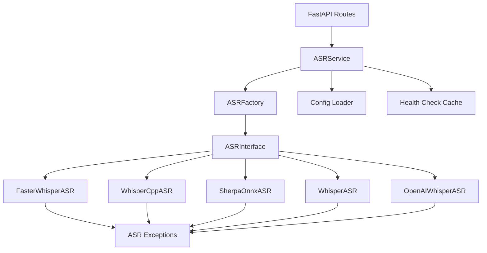

# ASR Module Design Document

## Reference Documents

- **Design Discussion History**: `docs/总结_前端对话历史.md` - Round 10-16
- **Detailed Conversation Log**: `docs/前端设计对话历史.md` - Round 10-16
- **Reference Projects**:
  - OLV Architecture Document: `docs/projects-docs/OLV架构文档.md`
  - AIRI Project: `D:\Coding\GitHub_Resuorse\AIRI\`
  - OLV Project: `D:\Coding\GitHub_Resuorse\open-llm-vtuber\`

## Reference Code Paths

- **OLV ASR Implementation**: `open-llm-vtuber/src/asr/`
- **AIRI ASR Implementation**: `AIRI/packages/core/src/asr/`
- **atri Target Path**: `emotion-robot/src/asr/`

---

## 1. Module Overview

### 1.1 Module Positioning

ASR (Automatic Speech Recognition) module is the core voice input component of the atri project, responsible for converting user voice input into text, providing input source for subsequent LLM conversations.

### 1.2 Core Features

- **Multi-Provider Support**: Supports 6 different ASR engines, including local deployment, cloud services, and browser-native solutions
- **Unified Interface Abstraction**: Provides a unified calling interface through `ASRInterface`, shielding underlying implementation differences
- **Hot-Switching Mechanism**: Supports runtime dynamic switching of ASR Providers without restarting the service
- **Streaming Transcription**: Supports real-time speech recognition (streaming input/output)
- **Health Check**: Automatically detects Provider availability to ensure service stability
- **Exception Handling**: Comprehensive exception hierarchy for easy error identification and handling

### 1.3 Design Goals

- **Extensibility**: Easily add new ASR Providers through the decorator factory pattern
- **Maintainability**: Clear layered architecture with well-defined responsibilities, easy to maintain and debug
- **High Performance**: Supports model preloading, result caching, and optimized response speed
- **Ease of Use**: Provides RESTful API and WebSocket interfaces for easy frontend integration

---

## 2. Technology Selection

### 2.1 Supported ASR Providers

The atri project supports 6 ASR Providers, covering three scenarios: local deployment, cloud services, and browser-native:

| Provider | Type | Deployment | Features | Use Cases |
|----------|------|------------|----------|-----------|
| **faster_whisper** | Local | Python library | High accuracy, low latency, multi-language support | Recommended for production |
| **whisper_cpp** | Local | C++ library | Extremely low resource usage, fast inference | Resource-constrained environments |
| **sherpa_onnx_asr** | Local | ONNX Runtime | Cross-platform, high performance | Cross-platform deployment |
| **whisper** | Local | OpenAI official library | Original implementation, high accuracy | Development and testing |
| **openai_whisper** | Cloud | OpenAI API | No local resources needed, continuously updated | Quick integration, no local compute |
| **web_speech_api** | Browser | Web API | Zero cost, real-time response | Browser-side real-time transcription |

### 2.2 Technology Selection Comparison

#### 2.2.1 Accuracy Comparison

- **Highest Accuracy**: `whisper` (OpenAI original), `faster_whisper`
- **Medium Accuracy**: `whisper_cpp`, `sherpa_onnx_asr`
- **Depends on Network Quality**: `openai_whisper`, `web_speech_api`

#### 2.2.2 Latency Comparison

- **Lowest Latency**: `whisper_cpp` (C++ optimized), `web_speech_api` (browser-native)
- **Medium Latency**: `faster_whisper`, `sherpa_onnx_asr`
- **Higher Latency**: `whisper` (Python implementation), `openai_whisper` (network requests)

#### 2.2.3 Resource Usage Comparison

- **Lowest Resources**: `web_speech_api` (browser-side), `whisper_cpp`
- **Medium Resources**: `faster_whisper`, `sherpa_onnx_asr`
- **Higher Resources**: `whisper` (requires loading full model)
- **Zero Local Resources**: `openai_whisper` (cloud service)

#### 2.2.4 Cost Comparison

- **Zero Cost**: `faster_whisper`, `whisper_cpp`, `sherpa_onnx_asr`, `whisper`, `web_speech_api`
- **Pay-per-use**: `openai_whisper` ($0.006/minute)

### 2.3 Technology Selection Rationale

#### 2.3.1 Local Deployment Solutions (4)

**faster_whisper** (Recommended):
- Based on CTranslate2 optimization, 4x faster than the original
- 50% reduction in memory usage
- Supports CPU and GPU inference
- Reference: Default choice in OLV project

**whisper_cpp**:
- C++ implementation, extreme performance optimization
- Suitable for embedded devices and resource-constrained environments
- Reference: Alternative solution in OLV project

**sherpa_onnx_asr**:
- Based on ONNX Runtime, good cross-platform compatibility
- Supports streaming recognition
- Reference: Extended support in OLV project

**whisper**:
- OpenAI official implementation, highest accuracy
- Suitable for development testing and benchmark comparison
- Reference: Benchmark testing in OLV project

#### 2.3.2 Cloud Service Solution (1)

**openai_whisper**:
- No local deployment needed, quick integration
- Continuously updated, optimal model performance
- Suitable for no local compute or rapid prototyping
- Reference: Used in AIRI project

#### 2.3.3 Browser-Native Solution (1)

**web_speech_api**:
- Browser-native support, zero cost
- Real-time response, suitable for interactive scenarios
- Privacy protection (audio never leaves the browser)
- Reference: AIRI project frontend implementation

---

## 3. Architecture Design

### 3.1 Overall Architecture

The ASR module uses a layered architecture, from top to bottom:

```
+-------------------------------------------------------------+
|                     API Layer (FastAPI)                       |
|  /api/asr/providers  /api/asr/transcribe  /ws/asr           |
+-------------------------------------------------------------+
                            |
                            v
+-------------------------------------------------------------+
|                   Service Layer (Service)                     |
|  ASRService: Manages Provider switching, health check, cache |
+-------------------------------------------------------------+
                            |
                            v
+-------------------------------------------------------------+
|                  Factory Layer (ASRFactory)                   |
|  Decorator registry + Provider creation                      |
+-------------------------------------------------------------+
                            |
                            v
+-------------------------------------------------------------+
|                 Interface Layer (ASRInterface)                |
|  Abstract base class: defines unified interface              |
+-------------------------------------------------------------+
                            |
                            v
+-------------------------------------------------------------+
|                Provider Layer (Concrete Implementations)      |
|  faster_whisper  whisper_cpp  sherpa_onnx  ...              |
+-------------------------------------------------------------+
                            |
                            v
+-------------------------------------------------------------+
|                  Exception Layer (Exceptions)                 |
|  ASRError  ASRConnectionError  ASRConfigError  ...          |
+-------------------------------------------------------------+
```

### 3.2 Directory Structure

```
src/asr/
+-- __init__.py              # Imports all Providers to trigger decorator registration
+-- interface.py             # ASRInterface abstract base class
+-- factory.py               # ASRFactory decorator registration factory
+-- service.py               # ASRService service layer (hot-switching, health check)
+-- exceptions.py            # ASR exception hierarchy
+-- config.py                # Configuration loading and validation
+-- providers/
    +-- __init__.py          # Imports all Providers
    +-- faster_whisper.py    # @ASRFactory.register("faster_whisper")
    +-- whisper_cpp.py       # @ASRFactory.register("whisper_cpp")
    +-- sherpa_onnx.py       # @ASRFactory.register("sherpa_onnx_asr")
    +-- whisper.py           # @ASRFactory.register("whisper")
    +-- openai_whisper.py    # @ASRFactory.register("openai_whisper")
```

**Note**: `web_speech_api` is implemented on the frontend, not in the backend directory.

### 3.3 Core Component Relationships



### 3.4 Data Flow

#### 3.4.1 Synchronous Transcription Flow

```
User Audio -> POST /api/asr/transcribe
    |
    v
ASRService.transcribe()
    |
    v
Get current active_provider
    |
    v
ASRFactory.create(provider_name)
    |
    v
provider.transcribe(audio_data)
    |
    v
Return text result
```

#### 3.4.2 Streaming Transcription Flow

```
User Audio Stream -> WebSocket /ws/asr
    |
    v
ASRService.transcribe_stream()
    |
    v
Get current active_provider
    |
    v
provider.transcribe_stream(audio_stream)
    |
    v
Return text chunks in real-time
```

#### 3.4.3 Hot-Switching Flow

```
POST /api/asr/set-provider {"provider": "faster_whisper"}
    |
    v
ASRService.set_provider("faster_whisper")
    |
    v
health_check() checks new Provider availability
    |
    v
Update active_provider
    |
    v
Return switching result
```

---

## 4. Interface Design

### 4.1 ASRInterface Abstract Base Class

**File Path**: `src/asr/interface.py`

**Reference Code**: `docs/前端设计对话历史.md` Round 16 (line 4996-5015)

```python
from abc import ABC, abstractmethod
from typing import AsyncIterator, List
import numpy as np

class ASRInterface(ABC):
    """ASR abstract base class, all Providers must implement this interface"""
    
    @abstractmethod
    async def transcribe(self, audio_data: bytes) -> str:
        """
        Synchronously transcribe audio to text
        
        Args:
            audio_data: Audio data (bytes format, usually WAV/MP3)
        
        Returns:
            Transcribed text
        
        Raises:
            ASRError: Raised when transcription fails
        """
        pass
    
    @abstractmethod
    async def transcribe_stream(
        self, 
        audio_stream: AsyncIterator[bytes]
    ) -> AsyncIterator[str]:
        """
        Stream transcribe audio to text (real-time speech recognition)
        
        Args:
            audio_stream: Audio stream (async iterator)
        
        Yields:
            Real-time transcribed text chunks
        
        Raises:
            ASRError: Raised when transcription fails
        """
        pass
    
    @abstractmethod
    async def get_supported_languages(self) -> List[str]:
        """
        Get list of supported languages
        
        Returns:
            List of language codes (e.g., ["zh", "en", "ja"])
        """
        pass
    
    @abstractmethod
    async def health_check(self) -> bool:
        """
        Health check (called at startup + switching)
        
        Returns:
            True: Provider available
            False: Provider unavailable
        
        Implementation suggestions:
        1. Check if model is loaded
        2. Test transcription with empty audio
        3. Catch all exceptions and return False
        """
        pass
```

### 4.2 Interface Design Principles

#### 4.2.1 Unified Abstraction

- All Providers must implement the 4 methods of `ASRInterface`
- Shields underlying implementation differences (local model vs cloud service vs browser API)
- Callers do not need to care about which specific Provider is used

#### 4.2.2 Async-First

- All methods are `async def`, avoiding blocking the event loop
- Supports concurrent processing of multiple transcription requests
- Streaming interface uses `AsyncIterator` for real-time response

#### 4.2.3 Type Safety

- Uses Python type annotations (`bytes`, `str`, `List[str]`, `AsyncIterator`)
- Facilitates IDE auto-completion and type checking
- Improves code maintainability

#### 4.2.4 Exception Transparency

- All exceptions are uniformly thrown as `ASRError` and its subclasses
- Callers can uniformly catch and handle exceptions
- Facilitates error logging and monitoring

---

## 5. Factory Pattern Implementation

### 5.1 ASRFactory Decorator Registration Factory

**File Path**: `src/asr/factory.py`

**Reference Code**: `docs/总结_前端对话历史.md` Round 10 (line 2485-2510)

**Design Pattern**: Decorator factory pattern (reuses atri LLM calling layer architecture)

```python
from typing import Dict, Type, Optional
from .interface import ASRInterface
from .exceptions import ASRConfigError

class ASRFactory:
    """ASR Provider factory class (decorator registration pattern)"""
    
    _registry: Dict[str, Type[ASRInterface]] = {}
    
    @classmethod
    def register(cls, provider_name: str):
        """
        Decorator: Register ASR Provider
        
        Usage:
            @ASRFactory.register("faster_whisper")
            class FasterWhisperASR(ASRInterface):
                ...
        """
        def decorator(provider_class: Type[ASRInterface]):
            cls._registry[provider_name] = provider_class
            return provider_class
        return decorator
    
    @classmethod
    def create(cls, provider_name: str, config: dict) -> ASRInterface:
        """
        Create ASR Provider instance
        
        Args:
            provider_name: Provider name (e.g., "faster_whisper")
            config: Provider configuration dictionary
        
        Returns:
            ASRInterface instance
        
        Raises:
            ASRConfigError: Raised when Provider is not registered
        """
        if provider_name not in cls._registry:
            raise ASRConfigError(
                f"ASR Provider '{provider_name}' not registered. "
                f"Available: {list(cls._registry.keys())}"
            )
        
        provider_class = cls._registry[provider_name]
        return provider_class(config)
    
    @classmethod
    def list_providers(cls) -> list[str]:
        """Get all registered Provider names"""
        return list(cls._registry.keys())
```

### 5.2 Provider Registration Example

**File Path**: `src/asr/providers/faster_whisper.py`

```python
from ..factory import ASRFactory
from ..interface import ASRInterface
from ..exceptions import ASRError, ASRConfigError
from typing import AsyncIterator, List
import numpy as np

@ASRFactory.register("faster_whisper")
class FasterWhisperASR(ASRInterface):
    """faster_whisper Provider implementation"""
    
    def __init__(self, config: dict):
        """
        Initialize faster_whisper
        
        Args:
            config: Configuration dictionary, containing:
                - model_size: Model size (tiny/base/small/medium/large)
                - device: Device (cpu/cuda)
                - compute_type: Compute type (int8/float16/float32)
                - language: Default language (zh/en/ja)
        """
        try:
            from faster_whisper import WhisperModel
        except ImportError:
            raise ASRConfigError(
                "faster_whisper not installed. "
                "Run: pip install faster-whisper"
            )
        
        self.model_size = config.get("model_size", "base")
        self.device = config.get("device", "cpu")
        self.compute_type = config.get("compute_type", "int8")
        self.language = config.get("language", "zh")
        
        # Preload model
        self.model = WhisperModel(
            self.model_size,
            device=self.device,
            compute_type=self.compute_type
        )
    
    async def transcribe(self, audio_data: bytes) -> str:
        """Implement transcription logic"""
        # ... implementation details
        pass
    
    async def transcribe_stream(self, audio_stream: AsyncIterator[bytes]) -> AsyncIterator[str]:
        """Streaming transcription (not implemented in current phase)"""
        raise NotImplementedError("Stream transcription not supported yet")
    
    async def get_supported_languages(self) -> List[str]:
        """Return list of supported languages"""
        return ["zh", "en", "ja", "ko", "fr", "de", "es", "ru"]
    
    async def health_check(self) -> bool:
        """Health check"""
        try:
            # Check if model is loaded
            if self.model is None:
                return False
            
            # Test with empty audio (1 second silence)
            test_audio = np.zeros(16000, dtype=np.float32)
            segments, _ = self.model.transcribe(test_audio)
            list(segments)  # Force execution of transcription
            
            return True
        except Exception as e:
            print(f"Health check failed: {e}")
            return False
```

### 5.3 Auto-Registration Mechanism

**File Path**: `src/asr/__init__.py`

```python
"""
ASR Module Entry Point
Imports all Providers to trigger decorator registration
"""

from .interface import ASRInterface
from .factory import ASRFactory
from .service import ASRService
from .exceptions import (
    ASRError,
    ASRConnectionError,
    ASRConfigError,
    ASRAPIError,
    ASRRateLimitError
)

# Import all Providers to trigger @ASRFactory.register decorators
from .providers import (
    faster_whisper,
    whisper_cpp,
    sherpa_onnx,
    whisper,
    openai_whisper
)

__all__ = [
    "ASRInterface",
    "ASRFactory",
    "ASRService",
    "ASRError",
    "ASRConnectionError",
    "ASRConfigError",
    "ASRAPIError",
    "ASRRateLimitError",
]
```

### 5.4 Factory Pattern Advantages

#### 5.4.1 Decoupled Creation Logic

- Provider creation logic is centralized in the factory class
- Callers do not need to know the specific Provider construction details
- Easy to manage and maintain uniformly

#### 5.4.2 Auto-Registration

- Uses decorators to automatically register Providers
- No need to manually maintain the registry
- Adding a new Provider only requires adding a decorator

#### 5.4.3 Type Safety

- Factory method returns `ASRInterface` type
- Compile-time type checking
- IDE auto-completion support

#### 5.4.4 Extensibility

- Adding a new Provider does not require modifying the factory class
- Follows the Open-Closed Principle (open for extension, closed for modification)

---

## 6. Exception Hierarchy Design

### 6.1 Exception Class Hierarchy

**File Path**: `src/asr/exceptions.py`

**Reference Code**: `docs/总结_前端对话历史.md` Round 10 (line 2512-2530)

```python
class ASRError(Exception):
    """ASR base exception class"""
    pass

class ASRConnectionError(ASRError):
    """Connection error (network request failure, model loading failure)"""
    pass

class ASRConfigError(ASRError):
    """Configuration error (missing parameters, format errors, Provider not registered)"""
    pass

class ASRAPIError(ASRError):
    """API call error (cloud service returns error)"""
    pass

class ASRRateLimitError(ASRError):
    """Rate limit error (API call exceeded)"""
    pass
```

### 6.2 Exception Usage Scenarios

| Exception Class | Usage Scenario | Example |
|-----------------|----------------|---------|
| `ASRError` | General ASR error | Unknown error, transcription failure |
| `ASRConnectionError` | Network/model loading failure | OpenAI API connection timeout, corrupted model file |
| `ASRConfigError` | Configuration error | Provider not registered, missing parameters, format error |
| `ASRAPIError` | Cloud service API error | OpenAI API returns 400/500 error |
| `ASRRateLimitError` | Rate limit | OpenAI API returns 429 error |

### 6.3 Exception Handling Examples

#### 6.3.1 Throwing Exceptions in Provider Implementation

```python
@ASRFactory.register("openai_whisper")
class OpenAIWhisperASR(ASRInterface):
    async def transcribe(self, audio_data: bytes) -> str:
        try:
            response = await self.client.audio.transcriptions.create(
                model="whisper-1",
                file=audio_data
            )
            return response.text
        except httpx.TimeoutException:
            raise ASRConnectionError("OpenAI API timeout")
        except httpx.HTTPStatusError as e:
            if e.response.status_code == 429:
                raise ASRRateLimitError("OpenAI API rate limit exceeded")
            elif e.response.status_code >= 500:
                raise ASRAPIError(f"OpenAI API server error: {e}")
            else:
                raise ASRAPIError(f"OpenAI API error: {e}")
        except Exception as e:
            raise ASRError(f"Unexpected error: {e}")
```

#### 6.3.2 Unified Exception Catching at API Layer

```python
from fastapi import APIRouter, HTTPException
from src.asr.exceptions import ASRError, ASRRateLimitError

router = APIRouter()

@router.post("/api/asr/transcribe")
async def transcribe(audio: bytes):
    try:
        result = await asr_service.transcribe(audio)
        return {"text": result}
    except ASRRateLimitError as e:
        raise HTTPException(status_code=429, detail=str(e))
    except ASRError as e:
        raise HTTPException(status_code=500, detail=str(e))
```

### 6.4 Exception Design Principles

#### 6.4.1 Clear Layering

- Base class `ASRError` catches all ASR-related errors
- Subclasses refine error types for precise handling
- Follows Python exception hierarchy best practices

#### 6.4.2 Semantic Clarity

- Exception names clearly express the error type
- Error messages contain sufficient context information
- Facilitates debugging and log analysis

#### 6.4.3 Extensibility

- New exception subclasses can be added as needed
- Does not affect existing exception handling logic

---

## 7. Configuration File Design

### 7.1 Configuration File Structure

**File Path**: `config/asr_config.yaml`

**Reference Code**: `docs/总结_前端对话历史.md` Round 10 (line 2532-2580)

```yaml
# ASR Configuration File
asr:
  # Default active Provider
  default_provider: "faster_whisper"
  
  # Provider configurations
  providers:
    # Local Provider: faster_whisper
    faster_whisper:
      enabled: true
      model_size: "base"           # tiny/base/small/medium/large
      device: "cpu"                # cpu/cuda
      compute_type: "int8"         # int8/float16/float32
      language: "zh"               # Default language
      download_root: "./models/whisper"
      
    # Local Provider: whisper_cpp
    whisper_cpp:
      enabled: false
      model_path: "./models/whisper.cpp/ggml-base.bin"
      n_threads: 4
      language: "zh"
      
    # Local Provider: sherpa_onnx_asr
    sherpa_onnx_asr:
      enabled: false
      model_type: "whisper"        # whisper/paraformer/zipformer
      encoder: "./models/sherpa-onnx/encoder.onnx"
      decoder: "./models/sherpa-onnx/decoder.onnx"
      joiner: "./models/sherpa-onnx/joiner.onnx"
      tokens: "./models/sherpa-onnx/tokens.txt"
      provider: "cpu"              # cpu/cuda
      num_threads: 4
      
    # Local Provider: whisper (for benchmarking)
    whisper:
      enabled: false
      model_size: "base"
      device: "cpu"
      language: "zh"
      download_root: "./models/whisper"
      
    # Cloud Service Provider: openai_whisper
    openai_whisper:
      enabled: true
      api_key: "${OPENAI_API_KEY}"  # Environment variable
      base_url: "https://api.openai.com/v1"
      model: "whisper-1"
      timeout: 30                   # Request timeout (seconds)
      
  # Health check configuration
  health_check:
    enabled: true
    cache_ttl: 300                  # Cache TTL (seconds)
    timeout: 10                     # Health check timeout (seconds)
    
  # VAD configuration (Voice Activity Detection)
  vad:
    enabled: true
    threshold: 0.5                  # Voice detection threshold
    min_silence_duration: 0.5       # Minimum silence duration (seconds)
    speech_pad: 0.3                 # Audio padding before/after speech (seconds)
```

### 7.2 Configuration Loading and Validation

**File Path**: `src/asr/config.py`

```python
import yaml
import os
from pathlib import Path
from typing import Dict, Any
from .exceptions import ASRConfigError

class ASRConfig:
    """ASR configuration loading and validation"""
    
    def __init__(self, config_path: str = "config/asr_config.yaml"):
        self.config_path = Path(config_path)
        self.config = self._load_config()
        self._validate_config()
    
    def _load_config(self) -> Dict[str, Any]:
        """Load configuration file"""
        if not self.config_path.exists():
            raise ASRConfigError(f"Config file not found: {self.config_path}")
        
        with open(self.config_path, "r", encoding="utf-8") as f:
            config = yaml.safe_load(f)
        
        # Replace environment variables
        config = self._replace_env_vars(config)
        
        return config.get("asr", {})
    
    def _replace_env_vars(self, config: Dict) -> Dict:
        """Recursively replace environment variables (${VAR_NAME})"""
        if isinstance(config, dict):
            return {k: self._replace_env_vars(v) for k, v in config.items()}
        elif isinstance(config, list):
            return [self._replace_env_vars(item) for item in config]
        elif isinstance(config, str) and config.startswith("${") and config.endswith("}"):
            var_name = config[2:-1]
            value = os.getenv(var_name)
            if value is None:
                raise ASRConfigError(f"Environment variable not set: {var_name}")
            return value
        else:
            return config
    
    def _validate_config(self):
        """Validate configuration completeness"""
        # Check required fields
        if "default_provider" not in self.config:
            raise ASRConfigError("Missing 'default_provider' in config")
        
        if "providers" not in self.config:
            raise ASRConfigError("Missing 'providers' in config")
        
        # Check if default Provider exists
        default_provider = self.config["default_provider"]
        if default_provider not in self.config["providers"]:
            raise ASRConfigError(
                f"Default provider '{default_provider}' not found in providers"
            )
        
        # Check if default Provider is enabled
        if not self.config["providers"][default_provider].get("enabled", False):
            raise ASRConfigError(
                f"Default provider '{default_provider}' is not enabled"
            )
    
    def get_provider_config(self, provider_name: str) -> Dict[str, Any]:
        """Get configuration for specified Provider"""
        if provider_name not in self.config["providers"]:
            raise ASRConfigError(f"Provider '{provider_name}' not found in config")
        
        return self.config["providers"][provider_name]
    
    def get_default_provider(self) -> str:
        """Get default Provider name"""
        return self.config["default_provider"]
    
    def list_enabled_providers(self) -> list[str]:
        """Get all enabled Provider names"""
        return [
            name for name, config in self.config["providers"].items()
            if config.get("enabled", False)
        ]
```

### 7.3 Configuration Design Principles

#### 7.3.1 Environment Variable Support

- Sensitive information (API Key) uses environment variables
- Format: `${ENV_VAR_NAME}`
- Avoids hardcoding secrets

#### 7.3.2 Layered Configuration

- Global configuration: `default_provider`, `health_check`, `vad`
- Provider configuration: Each Provider has independent configuration
- Easy to manage and maintain

#### 7.3.3 Extensibility

- Adding a new Provider only requires adding a configuration block
- No code modification needed

#### 7.3.4 Validation Mechanism

- Validates configuration completeness at startup
- Detects configuration errors early
- Avoids runtime errors

---

## 8. Health Check Mechanism

### 8.1 Health Check Design

**Reference Code**: `docs/总结_前端对话历史.md` Round 10 (line 2582-2610)

**Trigger Timing**:
1. Service startup: Check default Provider availability
2. Provider switching: Check new Provider availability
3. Periodic check (optional): Monitor Provider health status

**Implementation**:
- Each Provider implements the `health_check()` method
- Returns `bool` value (True: available, False: unavailable)
- Results cached for 5 minutes (avoids frequent checks)

### 8.2 Health Check Implementation

**File Path**: `src/asr/service.py`

```python
from typing import Dict, Optional
from datetime import datetime, timedelta
from .factory import ASRFactory
from .config import ASRConfig
from .exceptions import ASRError, ASRConfigError

class ASRService:
    """ASR service layer (manages Provider switching, health check)"""
    
    def __init__(self, config: ASRConfig):
        self.config = config
        self.active_provider: Optional[str] = None
        self.provider_instances: Dict[str, Any] = {}
        self.health_cache: Dict[str, tuple[bool, datetime]] = {}
        self.cache_ttl = timedelta(seconds=config.config.get("health_check", {}).get("cache_ttl", 300))
        
        # Initialize default Provider
        self._initialize_default_provider()
    
    def _initialize_default_provider(self):
        """Initialize default Provider"""
        default_provider = self.config.get_default_provider()
        
        # Health check
        if not self.health_check(default_provider):
            raise ASRError(f"Default provider '{default_provider}' is not available")
        
        self.active_provider = default_provider
    
    async def health_check(self, provider_name: str, use_cache: bool = True) -> bool:
        """
        Health check
        
        Args:
            provider_name: Provider name
            use_cache: Whether to use cache (default True)
        
        Returns:
            True: Provider available
            False: Provider unavailable
        """
        # Check cache
        if use_cache and provider_name in self.health_cache:
            is_healthy, cached_at = self.health_cache[provider_name]
            if datetime.now() - cached_at < self.cache_ttl:
                return is_healthy
        
        # Execute health check
        try:
            provider_config = self.config.get_provider_config(provider_name)
            provider = ASRFactory.create(provider_name, provider_config)
            is_healthy = await provider.health_check()
        except Exception as e:
            print(f"Health check failed for {provider_name}: {e}")
            is_healthy = False
        
        # Update cache
        self.health_cache[provider_name] = (is_healthy, datetime.now())
        
        return is_healthy
    
    async def set_provider(self, provider_name: str) -> Dict[str, Any]:
        """
        Hot-switch Provider
        
        Args:
            provider_name: New Provider name
        
        Returns:
            Switching result dictionary
        
        Raises:
            ASRConfigError: Provider not enabled or unavailable
        """
        # Check if Provider is enabled
        enabled_providers = self.config.list_enabled_providers()
        if provider_name not in enabled_providers:
            raise ASRConfigError(
                f"Provider '{provider_name}' is not enabled. "
                f"Enabled providers: {enabled_providers}"
            )
        
        # Health check (force without cache)
        if not await self.health_check(provider_name, use_cache=False):
            raise ASRError(f"Provider '{provider_name}' is not available")
        
        # Switch Provider
        old_provider = self.active_provider
        self.active_provider = provider_name
        
        return {
            "success": True,
            "old_provider": old_provider,
            "new_provider": provider_name,
            "message": f"Switched from {old_provider} to {provider_name}"
        }
    
    async def get_provider_status(self) -> Dict[str, Any]:
        """
        Get health status of all Providers
        
        Returns:
            Provider status dictionary
        """
        enabled_providers = self.config.list_enabled_providers()
        status = {}
        
        for provider_name in enabled_providers:
            is_healthy = await self.health_check(provider_name)
            status[provider_name] = {
                "enabled": True,
                "healthy": is_healthy,
                "active": provider_name == self.active_provider
            }
        
        return {
            "active_provider": self.active_provider,
            "providers": status
        }
```

### 8.3 Health Check Examples

#### 8.3.1 Local Model Health Check

```python
@ASRFactory.register("faster_whisper")
class FasterWhisperASR(ASRInterface):
    async def health_check(self) -> bool:
        try:
            # 1. Check if model is loaded
            if self.model is None:
                return False
            
            # 2. Test transcription with empty audio
            test_audio = np.zeros(16000, dtype=np.float32)  # 1 second silence
            segments, _ = self.model.transcribe(test_audio)
            list(segments)  # Force execution of transcription
            
            return True
        except Exception as e:
            print(f"Health check failed: {e}")
            return False
```

#### 8.3.2 Cloud Service Health Check

```python
@ASRFactory.register("openai_whisper")
class OpenAIWhisperASR(ASRInterface):
    async def health_check(self) -> bool:
        try:
            # 1. Check if API Key is configured
            if not self.api_key:
                return False
            
            # 2. Send test request (using minimal audio)
            # Generate 1 second silent WAV file
            test_audio = self._generate_silent_wav(duration=1.0)
            
            response = await self.client.audio.transcriptions.create(
                model="whisper-1",
                file=test_audio,
                timeout=10
            )
            
            return True
        except Exception as e:
            print(f"Health check failed: {e}")
            return False
```

### 8.4 Health Check Design Principles

#### 8.4.1 Lightweight Check

- Uses minimal audio (1 second silence)
- Avoids consuming large amounts of resources
- Returns results quickly

#### 8.4.2 Caching Mechanism

- Results cached for 5 minutes (configurable)
- Avoids frequent checks
- Reduces API call costs

#### 8.4.3 Exception Handling

- Catches all exceptions and returns False
- Does not affect the main flow
- Records error logs for debugging

#### 8.4.4 Force Refresh

- Force refreshes cache when switching Providers
- Ensures Provider is truly available before switching
- Avoids switching to an unavailable Provider

---

## 9. Provider Implementation Specifications

### 9.1 faster_whisper Provider

**File Path**: `src/asr/providers/faster_whisper.py`

**Reference Code**: `open-llm-vtuber/src/asr/asr_faster_whisper.py`

**Features**:
- Based on CTranslate2 optimization, 4x faster
- 50% reduction in memory usage
- Supports CPU and GPU inference
- Recommended for production

**Configuration Parameters**:

```yaml
faster_whisper:
  enabled: true
  model_size: "base"           # tiny/base/small/medium/large
  device: "cpu"                # cpu/cuda
  compute_type: "int8"         # int8/float16/float32
  language: "zh"               # Default language
  download_root: "./models/whisper"
```

**Implementation Key Points**:

```python
from faster_whisper import WhisperModel
import numpy as np
from ..factory import ASRFactory
from ..interface import ASRInterface
from ..exceptions import ASRError, ASRConfigError

@ASRFactory.register("faster_whisper")
class FasterWhisperASR(ASRInterface):
    def __init__(self, config: dict):
        try:
            from faster_whisper import WhisperModel
        except ImportError:
            raise ASRConfigError(
                "faster_whisper not installed. "
                "Run: pip install faster-whisper"
            )
        
        self.model_size = config.get("model_size", "base")
        self.device = config.get("device", "cpu")
        self.compute_type = config.get("compute_type", "int8")
        self.language = config.get("language", "zh")
        self.download_root = config.get("download_root", "./models/whisper")
        
        # Preload model
        self.model = WhisperModel(
            self.model_size,
            device=self.device,
            compute_type=self.compute_type,
            download_root=self.download_root
        )
    
    async def transcribe(self, audio_data: bytes) -> str:
        """Transcribe audio to text"""
        try:
            # Convert bytes to numpy array
            audio_np = self._bytes_to_numpy(audio_data)
            
            # Transcribe
            segments, info = self.model.transcribe(
                audio_np,
                language=self.language,
                beam_size=5,
                vad_filter=True  # Enable VAD filtering
            )
            
            # Concatenate all segments
            text = " ".join([segment.text for segment in segments])
            return text.strip()
        except Exception as e:
            raise ASRError(f"Transcription failed: {e}")
    
    async def transcribe_stream(self, audio_stream):
        """Streaming transcription (not implemented yet)"""
        raise NotImplementedError("Stream transcription not supported yet")
    
    async def get_supported_languages(self) -> list[str]:
        """Return list of supported languages"""
        return ["zh", "en", "ja", "ko", "fr", "de", "es", "ru", "ar", "hi"]
    
    async def health_check(self) -> bool:
        """Health check"""
        try:
            if self.model is None:
                return False
            
            # Test with 1 second silence
            test_audio = np.zeros(16000, dtype=np.float32)
            segments, _ = self.model.transcribe(test_audio)
            list(segments)
            
            return True
        except Exception:
            return False
    
    def _bytes_to_numpy(self, audio_data: bytes) -> np.ndarray:
        """Convert audio bytes to numpy array"""
        # Implement audio decoding logic (WAV/MP3 -> numpy)
        # Can use libraries like librosa, soundfile, etc.
        pass
```

---

### 9.2 whisper_cpp Provider

**File Path**: `src/asr/providers/whisper_cpp.py`

**Reference Code**: `open-llm-vtuber/src/asr/asr_whisper_cpp.py`

**Features**:
- C++ implementation, extreme performance optimization
- Extremely low resource usage
- Suitable for embedded devices

**Configuration Parameters**:

```yaml
whisper_cpp:
  enabled: false
  model_path: "./models/whisper.cpp/ggml-base.bin"
  n_threads: 4
  language: "zh"
```

**Implementation Key Points**:

```python
from ..factory import ASRFactory
from ..interface import ASRInterface
from ..exceptions import ASRError, ASRConfigError

@ASRFactory.register("whisper_cpp")
class WhisperCppASR(ASRInterface):
    def __init__(self, config: dict):
        try:
            from whispercpp import Whisper
        except ImportError:
            raise ASRConfigError(
                "whispercpp not installed. "
                "Run: pip install whispercpp"
            )
        
        self.model_path = config.get("model_path")
        self.n_threads = config.get("n_threads", 4)
        self.language = config.get("language", "zh")
        
        if not self.model_path:
            raise ASRConfigError("model_path is required for whisper_cpp")
        
        # Load model
        self.model = Whisper.from_pretrained(self.model_path)
    
    async def transcribe(self, audio_data: bytes) -> str:
        """Transcribe audio to text"""
        try:
            # whisper.cpp requires WAV file path or numpy array
            audio_np = self._bytes_to_numpy(audio_data)
            
            result = self.model.transcribe(
                audio_np,
                language=self.language,
                n_threads=self.n_threads
            )
            
            return result["text"].strip()
        except Exception as e:
            raise ASRError(f"Transcription failed: {e}")
    
    async def transcribe_stream(self, audio_stream):
        raise NotImplementedError("Stream transcription not supported yet")
    
    async def get_supported_languages(self) -> list[str]:
        return ["zh", "en", "ja", "ko", "fr", "de", "es", "ru"]
    
    async def health_check(self) -> bool:
        try:
            if self.model is None:
                return False
            
            test_audio = np.zeros(16000, dtype=np.float32)
            self.model.transcribe(test_audio)
            
            return True
        except Exception:
            return False
```

---

### 9.3 sherpa_onnx_asr Provider

**File Path**: `src/asr/providers/sherpa_onnx.py`

**Reference Code**: `open-llm-vtuber/src/asr/asr_sherpa_onnx.py`

**Features**:
- Based on ONNX Runtime, good cross-platform compatibility
- Supports streaming recognition
- High-performance inference

**Configuration Parameters**:

```yaml
sherpa_onnx_asr:
  enabled: false
  model_type: "whisper"        # whisper/paraformer/zipformer
  encoder: "./models/sherpa-onnx/encoder.onnx"
  decoder: "./models/sherpa-onnx/decoder.onnx"
  joiner: "./models/sherpa-onnx/joiner.onnx"
  tokens: "./models/sherpa-onnx/tokens.txt"
  provider: "cpu"              # cpu/cuda
  num_threads: 4
```

**Implementation Key Points**:

```python
from ..factory import ASRFactory
from ..interface import ASRInterface
from ..exceptions import ASRError, ASRConfigError

@ASRFactory.register("sherpa_onnx_asr")
class SherpaOnnxASR(ASRInterface):
    def __init__(self, config: dict):
        try:
            import sherpa_onnx
        except ImportError:
            raise ASRConfigError(
                "sherpa_onnx not installed. "
                "Run: pip install sherpa-onnx"
            )
        
        self.model_type = config.get("model_type", "whisper")
        self.encoder = config.get("encoder")
        self.decoder = config.get("decoder")
        self.joiner = config.get("joiner")
        self.tokens = config.get("tokens")
        self.provider = config.get("provider", "cpu")
        self.num_threads = config.get("num_threads", 4)
        
        # Create recognizer
        recognizer_config = sherpa_onnx.OnlineRecognizerConfig(
            model_config=sherpa_onnx.OnlineModelConfig(
                encoder=self.encoder,
                decoder=self.decoder,
                joiner=self.joiner,
                tokens=self.tokens,
                provider=self.provider,
                num_threads=self.num_threads
            )
        )
        
        self.recognizer = sherpa_onnx.OnlineRecognizer(recognizer_config)
    
    async def transcribe(self, audio_data: bytes) -> str:
        """Transcribe audio to text"""
        try:
            audio_np = self._bytes_to_numpy(audio_data)
            
            # Create stream
            stream = self.recognizer.create_stream()
            stream.accept_waveform(16000, audio_np)
            
            # Decode
            while self.recognizer.is_ready(stream):
                self.recognizer.decode_stream(stream)
            
            result = self.recognizer.get_result(stream)
            return result.text.strip()
        except Exception as e:
            raise ASRError(f"Transcription failed: {e}")
    
    async def transcribe_stream(self, audio_stream):
        """Streaming transcription (sherpa_onnx natively supports)"""
        # Can implement true streaming transcription
        raise NotImplementedError("Stream transcription not implemented yet")
    
    async def get_supported_languages(self) -> list[str]:
        return ["zh", "en"]  # Depends on model
    
    async def health_check(self) -> bool:
        try:
            if self.recognizer is None:
                return False
            
            test_audio = np.zeros(16000, dtype=np.float32)
            stream = self.recognizer.create_stream()
            stream.accept_waveform(16000, test_audio)
            
            return True
        except Exception:
            return False
```

---

### 9.4 whisper Provider

**File Path**: `src/asr/providers/whisper.py`

**Reference Code**: `open-llm-vtuber/src/asr/asr_whisper.py`

**Features**:
- OpenAI official implementation
- Highest accuracy
- Suitable for development testing and benchmark comparison

**Configuration Parameters**:

```yaml
whisper:
  enabled: false
  model_size: "base"
  device: "cpu"
  language: "zh"
  download_root: "./models/whisper"
```

**Implementation Key Points**:

```python
from ..factory import ASRFactory
from ..interface import ASRInterface
from ..exceptions import ASRError, ASRConfigError

@ASRFactory.register("whisper")
class WhisperASR(ASRInterface):
    def __init__(self, config: dict):
        try:
            import whisper
        except ImportError:
            raise ASRConfigError(
                "whisper not installed. "
                "Run: pip install openai-whisper"
            )
        
        self.model_size = config.get("model_size", "base")
        self.device = config.get("device", "cpu")
        self.language = config.get("language", "zh")
        self.download_root = config.get("download_root", "./models/whisper")
        
        # Load model
        self.model = whisper.load_model(
            self.model_size,
            device=self.device,
            download_root=self.download_root
        )
    
    async def transcribe(self, audio_data: bytes) -> str:
        """Transcribe audio to text"""
        try:
            audio_np = self._bytes_to_numpy(audio_data)
            
            result = self.model.transcribe(
                audio_np,
                language=self.language,
                fp16=False  # CPU does not support fp16
            )
            
            return result["text"].strip()
        except Exception as e:
            raise ASRError(f"Transcription failed: {e}")
    
    async def transcribe_stream(self, audio_stream):
        raise NotImplementedError("Stream transcription not supported yet")
    
    async def get_supported_languages(self) -> list[str]:
        return ["zh", "en", "ja", "ko", "fr", "de", "es", "ru", "ar", "hi"]
    
    async def health_check(self) -> bool:
        try:
            if self.model is None:
                return False
            
            test_audio = np.zeros(16000, dtype=np.float32)
            self.model.transcribe(test_audio)
            
            return True
        except Exception:
            return False
```

---

### 9.5 openai_whisper Provider

**File Path**: `src/asr/providers/openai_whisper.py`

**Reference Code**: `AIRI/packages/core/src/asr/openai_whisper.py`

**Features**:
- Cloud service, no local resources needed
- Continuously updated, optimal model performance
- Pay-per-use ($0.006/minute)

**Configuration Parameters**:

```yaml
openai_whisper:
  enabled: true
  api_key: "${OPENAI_API_KEY}"
  base_url: "https://api.openai.com/v1"
  model: "whisper-1"
  timeout: 30
```

**Implementation Key Points**:

```python
from openai import AsyncOpenAI
import httpx
from ..factory import ASRFactory
from ..interface import ASRInterface
from ..exceptions import (
    ASRError, 
    ASRConnectionError, 
    ASRAPIError, 
    ASRRateLimitError
)

@ASRFactory.register("openai_whisper")
class OpenAIWhisperASR(ASRInterface):
    def __init__(self, config: dict):
        self.api_key = config.get("api_key")
        self.base_url = config.get("base_url", "https://api.openai.com/v1")
        self.model = config.get("model", "whisper-1")
        self.timeout = config.get("timeout", 30)
        
        if not self.api_key:
            raise ASRConfigError("api_key is required for openai_whisper")
        
        self.client = AsyncOpenAI(
            api_key=self.api_key,
            base_url=self.base_url,
            timeout=self.timeout
        )
    
    async def transcribe(self, audio_data: bytes) -> str:
        """Transcribe audio to text"""
        try:
            # OpenAI API requires file object
            audio_file = ("audio.wav", audio_data, "audio/wav")
            
            response = await self.client.audio.transcriptions.create(
                model=self.model,
                file=audio_file
            )
            
            return response.text.strip()
        except httpx.TimeoutException:
            raise ASRConnectionError("OpenAI API timeout")
        except httpx.HTTPStatusError as e:
            if e.response.status_code == 429:
                raise ASRRateLimitError("OpenAI API rate limit exceeded")
            elif e.response.status_code >= 500:
                raise ASRAPIError(f"OpenAI API server error: {e}")
            else:
                raise ASRAPIError(f"OpenAI API error: {e}")
        except Exception as e:
            raise ASRError(f"Unexpected error: {e}")
    
    async def transcribe_stream(self, audio_stream):
        raise NotImplementedError("OpenAI API does not support streaming")
    
    async def get_supported_languages(self) -> list[str]:
        # OpenAI Whisper supports 99 languages
        return ["zh", "en", "ja", "ko", "fr", "de", "es", "ru", "ar", "hi"]
    
    async def health_check(self) -> bool:
        try:
            if not self.api_key:
                return False
            
            # Generate 1 second silent WAV
            test_audio = self._generate_silent_wav(duration=1.0)
            
            await self.client.audio.transcriptions.create(
                model=self.model,
                file=("test.wav", test_audio, "audio/wav"),
                timeout=10
            )
            
            return True
        except Exception:
            return False
    
    def _generate_silent_wav(self, duration: float) -> bytes:
        """Generate silent WAV file"""
        # Implement WAV file generation logic
        pass
```

---

### 9.6 web_speech_api Provider (Frontend Implementation)

**File Path**: Frontend code (not backend)

**Reference Code**: `AIRI/packages/web/src/asr/web_speech_api.ts`

**Features**:
- Browser-native support
- Zero cost, real-time response
- Privacy protection (audio never leaves the browser)

**Frontend Implementation Example**:

```typescript
// src/asr/web_speech_api.ts
export class WebSpeechASR {
  private recognition: SpeechRecognition | null = null;
  
  constructor(config: { language: string }) {
    const SpeechRecognition = 
      window.SpeechRecognition || window.webkitSpeechRecognition;
    
    if (!SpeechRecognition) {
      throw new Error("Web Speech API not supported");
    }
    
    this.recognition = new SpeechRecognition();
    this.recognition.lang = config.language;
    this.recognition.continuous = true;
    this.recognition.interimResults = true;
  }
  
  async transcribe(audioBlob: Blob): Promise<string> {
    // Web Speech API does not support Blob input
    throw new Error("Use transcribeStream for real-time recognition");
  }
  
  async *transcribeStream(): AsyncGenerator<string> {
    if (!this.recognition) {
      throw new Error("Recognition not initialized");
    }
    
    this.recognition.start();
    
    while (true) {
      const result = await new Promise<string>((resolve) => {
        this.recognition!.onresult = (event) => {
          const transcript = event.results[event.results.length - 1][0].transcript;
          resolve(transcript);
        };
      });
      
      yield result;
    }
  }
  
  async getSupportedLanguages(): Promise<string[]> {
    return ["zh-CN", "en-US", "ja-JP", "ko-KR"];
  }
  
  async healthCheck(): Promise<boolean> {
    return this.recognition !== null;
  }
}
```

**Backend API Notes**:
- `web_speech_api` does not require backend implementation
- Frontend directly calls the browser API
- Backend API returns `web_speech_api` in the Provider list, but marks it as `frontend_only: true`

---

## 10. API Interface Design

### 10.1 RESTful API Endpoints

**File Path**: `src/routes/asr.py`

**Reference Code**: `docs/总结_前端对话历史.md` Round 10 (line 2612-2680)

#### 10.1.1 Get Provider List

```http
GET /api/asr/providers
```

**Response Example**:

```json
{
  "active_provider": "faster_whisper",
  "providers": [
    {
      "name": "faster_whisper",
      "type": "local",
      "enabled": true,
      "healthy": true,
      "active": true,
      "description": "High accuracy, low latency, multi-language support"
    },
    {
      "name": "openai_whisper",
      "type": "cloud",
      "enabled": true,
      "healthy": true,
      "active": false,
      "description": "No local resources needed, continuously updated"
    },
    {
      "name": "web_speech_api",
      "type": "browser",
      "enabled": true,
      "healthy": true,
      "active": false,
      "frontend_only": true,
      "description": "Browser-native support, zero cost"
    }
  ]
}
```

**Implementation Code**:

```python
from fastapi import APIRouter, HTTPException
from src.asr.service import ASRService

router = APIRouter()

@router.get("/api/asr/providers")
async def get_providers():
    """Get all ASR Provider list"""
    try:
        status = await asr_service.get_provider_status()
        
        # Add web_speech_api (frontend implementation)
        status["providers"]["web_speech_api"] = {
            "enabled": True,
            "healthy": True,
            "active": False,
            "frontend_only": True
        }
        
        return status
    except Exception as e:
        raise HTTPException(status_code=500, detail=str(e))
```

---

#### 10.1.2 Switch Provider

```http
POST /api/asr/set-provider
Content-Type: application/json

{
  "provider": "openai_whisper"
}
```

**Response Example**:

```json
{
  "success": true,
  "old_provider": "faster_whisper",
  "new_provider": "openai_whisper",
  "message": "Switched from faster_whisper to openai_whisper"
}
```

**Implementation Code**:

```python
from pydantic import BaseModel

class SetProviderRequest(BaseModel):
    provider: str

@router.post("/api/asr/set-provider")
async def set_provider(request: SetProviderRequest):
    """Switch ASR Provider"""
    try:
        result = await asr_service.set_provider(request.provider)
        return result
    except ASRConfigError as e:
        raise HTTPException(status_code=400, detail=str(e))
    except ASRError as e:
        raise HTTPException(status_code=500, detail=str(e))
```

---

#### 10.1.3 Get Supported Languages

```http
GET /api/asr/languages?provider=faster_whisper
```

**Response Example**:

```json
{
  "provider": "faster_whisper",
  "languages": [
    {"code": "zh", "name": "Chinese"},
    {"code": "en", "name": "English"},
    {"code": "ja", "name": "Japanese"},
    {"code": "ko", "name": "Korean"}
  ]
}
```

**Implementation Code**:

```python
@router.get("/api/asr/languages")
async def get_languages(provider: str = None):
    """Get supported language list"""
    try:
        if provider is None:
            provider = asr_service.active_provider
        
        provider_config = asr_service.config.get_provider_config(provider)
        provider_instance = ASRFactory.create(provider, provider_config)
        
        languages = await provider_instance.get_supported_languages()
        
        # Map language codes to names
        language_names = {
            "zh": "Chinese", "en": "English", "ja": "Japanese",
            "ko": "Korean", "fr": "French", "de": "German",
            "es": "Spanish", "ru": "Russian"
        }
        
        return {
            "provider": provider,
            "languages": [
                {"code": code, "name": language_names.get(code, code)}
                for code in languages
            ]
        }
    except Exception as e:
        raise HTTPException(status_code=500, detail=str(e))
```

---

#### 10.1.4 Synchronous Transcription

```http
POST /api/asr/transcribe
Content-Type: multipart/form-data

audio: <audio_file>
language: zh (optional)
```

**Response Example**:

```json
{
  "text": "Hello, this is a test audio",
  "provider": "faster_whisper",
  "language": "zh",
  "duration": 1.23
}
```

**Implementation Code**:

```python
from fastapi import UploadFile, File, Form
import time

@router.post("/api/asr/transcribe")
async def transcribe(
    audio: UploadFile = File(...),
    language: str = Form(None)
):
    """Synchronously transcribe audio to text"""
    try:
        start_time = time.time()
        
        # Read audio data
        audio_data = await audio.read()
        
        # Transcribe
        text = await asr_service.transcribe(audio_data, language)
        
        duration = time.time() - start_time
        
        return {
            "text": text,
            "provider": asr_service.active_provider,
            "language": language or "auto",
            "duration": round(duration, 2)
        }
    except ASRError as e:
        raise HTTPException(status_code=500, detail=str(e))
```

---

#### 10.1.5 Health Check

```http
GET /api/asr/providers/{provider_name}/health
```

**Response Example**:

```json
{
  "provider": "faster_whisper",
  "healthy": true,
  "checked_at": "2025-01-15T10:30:00Z"
}
```

**Implementation Code**:

```python
from datetime import datetime

@router.get("/api/asr/providers/{provider_name}/health")
async def check_health(provider_name: str, force: bool = False):
    """Check Provider health status"""
    try:
        is_healthy = await asr_service.health_check(
            provider_name, 
            use_cache=not force
        )
        
        return {
            "provider": provider_name,
            "healthy": is_healthy,
            "checked_at": datetime.utcnow().isoformat() + "Z"
        }
    except Exception as e:
        raise HTTPException(status_code=500, detail=str(e))
```

---

### 10.2 WebSocket Interface (Streaming Transcription)

**Endpoint**: `WebSocket /ws/asr`

**Reference Code**: `docs/总结_前端对话历史.md` Round 10 (line 2682-2720)

**Implementation Code**:

```python
from fastapi import WebSocket, WebSocketDisconnect
import json

@router.websocket("/ws/asr")
async def websocket_asr(websocket: WebSocket):
    """WebSocket streaming transcription"""
    await websocket.accept()
    
    try:
        # Receive configuration message
        config_msg = await websocket.receive_text()
        config = json.loads(config_msg)
        
        provider_name = config.get("provider", asr_service.active_provider)
        language = config.get("language", "zh")
        
        # Create Provider instance
        provider_config = asr_service.config.get_provider_config(provider_name)
        provider = ASRFactory.create(provider_name, provider_config)
        
        # Create audio stream
        async def audio_stream():
            while True:
                try:
                    audio_chunk = await websocket.receive_bytes()
                    yield audio_chunk
                except WebSocketDisconnect:
                    break
        
        # Streaming transcription
        async for text_chunk in provider.transcribe_stream(audio_stream()):
            await websocket.send_json({
                "type": "transcript",
                "text": text_chunk,
                "is_final": False
            })
        
        # Send final result
        await websocket.send_json({
            "type": "transcript",
            "text": "",
            "is_final": True
        })
    
    except WebSocketDisconnect:
        print("WebSocket disconnected")
    except Exception as e:
        await websocket.send_json({
            "type": "error",
            "message": str(e)
        })
        await websocket.close()
```

---

### 10.3 Error Code Definitions

| HTTP Status Code | Error Type | Description |
|-----------------|------------|-------------|
| 400 | Bad Request | Request parameter error, Provider not enabled |
| 404 | Not Found | Provider does not exist |
| 429 | Too Many Requests | API rate limit (OpenAI) |
| 500 | Internal Server Error | Transcription failed, model loading failed |
| 503 | Service Unavailable | Provider unavailable |

**Error Response Format**:

```json
{
  "detail": "Provider 'faster_whisper' is not available",
  "error_type": "ASRError",
  "provider": "faster_whisper"
}
```

---

## 11. Performance Optimization

### 11.1 Model Preloading

**Strategy**:
- Preload default Provider model at service startup
- Avoid latency from loading model on first request
- Support lazy loading (load other Providers on demand)

**Implementation**:

```python
class ASRService:
    def __init__(self, config: ASRConfig):
        self.config = config
        self.provider_instances: Dict[str, ASRInterface] = {}
        
        # Preload default Provider
        self._preload_default_provider()
    
    def _preload_default_provider(self):
        """Preload default Provider"""
        default_provider = self.config.get_default_provider()
        provider_config = self.config.get_provider_config(default_provider)
        
        # Create and cache instance
        self.provider_instances[default_provider] = ASRFactory.create(
            default_provider, 
            provider_config
        )
```

---

### 11.2 Audio Preprocessing

**Optimization Points**:
- Uniformly convert audio format to 16kHz mono WAV
- Use librosa or soundfile to accelerate audio decoding
- Support audio compression (reduce network transmission)

**Implementation**:

```python
import librosa
import numpy as np

def preprocess_audio(audio_data: bytes) -> np.ndarray:
    """
    Preprocess audio data
    
    Args:
        audio_data: Raw audio data (any format)
    
    Returns:
        16kHz mono numpy array
    """
    # Load audio using librosa
    audio, sr = librosa.load(
        io.BytesIO(audio_data),
        sr=16000,  # Resample to 16kHz
        mono=True  # Convert to mono
    )
    
    return audio
```

---

### 11.3 Batch Processing Support

**Strategy**:
- Support batch transcription of multiple audio files
- Concurrent processing for improved throughput
- Suitable for offline batch processing scenarios

**Implementation**:

```python
@router.post("/api/asr/transcribe-batch")
async def transcribe_batch(
    audio_files: list[UploadFile] = File(...),
    language: str = Form(None)
):
    """Batch transcribe audio"""
    try:
        # Concurrent transcription
        tasks = [
            asr_service.transcribe(await audio.read(), language)
            for audio in audio_files
        ]
        
        results = await asyncio.gather(*tasks, return_exceptions=True)
        
        return {
            "results": [
                {"text": result, "success": True} 
                if not isinstance(result, Exception) 
                else {"error": str(result), "success": False}
                for result in results
            ]
        }
    except Exception as e:
        raise HTTPException(status_code=500, detail=str(e))
```

---

### 11.4 Memory Management

**Optimization Points**:
- Release audio data memory promptly
- Limit concurrent transcription count (avoid OOM)
- Use streaming processing to reduce memory usage

**Implementation**:

```python
import asyncio

class ASRService:
    def __init__(self, config: ASRConfig):
        self.config = config
        self.semaphore = asyncio.Semaphore(5)  # Max 5 concurrent transcriptions
    
    async def transcribe(self, audio_data: bytes, language: str = None) -> str:
        """Transcribe audio (with concurrency limit)"""
        async with self.semaphore:
            try:
                provider = self._get_active_provider()
                result = await provider.transcribe(audio_data)
                return result
            finally:
                # Release memory promptly
                del audio_data
```

---

### 11.5 Result Caching

**Strategy**:
- Cache transcription results for identical audio (based on audio hash)
- Avoid redundant transcription
- Set reasonable cache expiration time

**Implementation**:

```python
import hashlib
from functools import lru_cache

class ASRService:
    def __init__(self, config: ASRConfig):
        self.config = config
        self.transcription_cache: Dict[str, tuple[str, datetime]] = {}
        self.cache_ttl = timedelta(hours=1)
    
    def _get_audio_hash(self, audio_data: bytes) -> str:
        """Calculate audio hash"""
        return hashlib.sha256(audio_data).hexdigest()
    
    async def transcribe(self, audio_data: bytes, language: str = None) -> str:
        """Transcribe audio (with cache)"""
        # Check cache
        audio_hash = self._get_audio_hash(audio_data)
        
        if audio_hash in self.transcription_cache:
            cached_text, cached_at = self.transcription_cache[audio_hash]
            if datetime.now() - cached_at < self.cache_ttl:
                return cached_text
        
        # Execute transcription
        provider = self._get_active_provider()
        result = await provider.transcribe(audio_data)
        
        # Update cache
        self.transcription_cache[audio_hash] = (result, datetime.now())
        
        return result
```

---

## 12. Testing Strategy

### 12.1 Unit Tests

**Testing Framework**: pytest + pytest-asyncio

**Test Coverage**:
- ASRInterface abstract base class
- ASRFactory decorator registration
- Each Provider implementation
- Exception handling
- Configuration loading and validation

**Test Examples**:

```python
# tests/asr/test_factory.py
import pytest
from src.asr.factory import ASRFactory
from src.asr.interface import ASRInterface
from src.asr.exceptions import ASRConfigError

def test_factory_register():
    """Test decorator registration"""
    @ASRFactory.register("test_provider")
    class TestProvider(ASRInterface):
        async def transcribe(self, audio_data: bytes) -> str:
            return "test"
        
        async def transcribe_stream(self, audio_stream):
            raise NotImplementedError()
        
        async def get_supported_languages(self):
            return ["zh", "en"]
        
        async def health_check(self):
            return True
    
    # Verify registration succeeded
    assert "test_provider" in ASRFactory.list_providers()

def test_factory_create():
    """Test Provider creation"""
    provider = ASRFactory.create("test_provider", {})
    assert isinstance(provider, ASRInterface)

def test_factory_create_unknown_provider():
    """Test creating unregistered Provider"""
    with pytest.raises(ASRConfigError):
        ASRFactory.create("unknown_provider", {})
```

```python
# tests/asr/test_providers.py
import pytest
import numpy as np
from src.asr.providers.faster_whisper import FasterWhisperASR

@pytest.mark.asyncio
async def test_faster_whisper_transcribe():
    """Test faster_whisper transcription"""
    config = {
        "model_size": "tiny",
        "device": "cpu",
        "compute_type": "int8",
        "language": "zh"
    }
    
    provider = FasterWhisperASR(config)
    
    # Use test audio
    test_audio = np.random.randn(16000).astype(np.float32)
    result = await provider.transcribe(test_audio.tobytes())
    
    assert isinstance(result, str)

@pytest.mark.asyncio
async def test_faster_whisper_health_check():
    """Test health check"""
    config = {
        "model_size": "tiny",
        "device": "cpu",
        "compute_type": "int8",
        "language": "zh"
    }
    
    provider = FasterWhisperASR(config)
    is_healthy = await provider.health_check()
    
    assert is_healthy is True
```

---

### 12.2 Integration Tests

**Test Coverage**:
- API endpoints (RESTful + WebSocket)
- Provider switching
- Health check
- Error handling

**Test Examples**:

```python
# tests/asr/test_api.py
import pytest
from fastapi.testclient import TestClient
from src.main import app

client = TestClient(app)

def test_get_providers():
    """Test getting Provider list"""
    response = client.get("/api/asr/providers")
    assert response.status_code == 200
    
    data = response.json()
    assert "active_provider" in data
    assert "providers" in data
    assert len(data["providers"]) > 0

def test_set_provider():
    """Test switching Provider"""
    response = client.post(
        "/api/asr/set-provider",
        json={"provider": "faster_whisper"}
    )
    assert response.status_code == 200
    
    data = response.json()
    assert data["success"] is True
    assert data["new_provider"] == "faster_whisper"

def test_transcribe():
    """Test synchronous transcription"""
    # Create test audio file
    test_audio = b"..." # WAV file content
    
    response = client.post(
        "/api/asr/transcribe",
        files={"audio": ("test.wav", test_audio, "audio/wav")}
    )
    assert response.status_code == 200
    
    data = response.json()
    assert "text" in data
    assert "provider" in data
```

---

### 12.3 Performance Tests

**Test Metrics**:
- Transcription latency (P50, P95, P99)
- Throughput (QPS)
- Memory usage
- CPU usage

**Testing Tools**:
- locust (load testing)
- pytest-benchmark (benchmark testing)

**Test Examples**:

```python
# tests/asr/test_performance.py
import pytest
from src.asr.service import ASRService
import numpy as np

@pytest.mark.benchmark
def test_transcribe_latency(benchmark):
    """Test transcription latency"""
    asr_service = ASRService(config)
    test_audio = np.random.randn(16000).astype(np.float32).tobytes()
    
    result = benchmark(asr_service.transcribe, test_audio)
    
    # Verify latency < 1 second
    assert benchmark.stats.mean < 1.0
```

---

### 12.4 Test Coverage Targets

- **Unit Test Coverage**: >= 80%
- **Integration Test Coverage**: >= 60%
- **Critical Path Coverage**: 100% (transcription, switching, health check)

**Generate Coverage Report**:

```bash
pytest --cov=src/asr --cov-report=html tests/asr/
```

---

## 13. Deployment and Operations

### 13.1 Model File Management

**Directory Structure**:

```
models/
+-- whisper/
|   +-- tiny.pt
|   +-- base.pt
|   +-- small.pt
|   +-- medium.pt
+-- whisper.cpp/
|   +-- ggml-tiny.bin
|   +-- ggml-base.bin
|   +-- ggml-small.bin
+-- sherpa-onnx/
    +-- encoder.onnx
    +-- decoder.onnx
    +-- joiner.onnx
    +-- tokens.txt
```

**Model Download Script**:

```bash
#!/bin/bash
# scripts/download_models.sh

# Download faster_whisper model
python -c "from faster_whisper import WhisperModel; WhisperModel('base', download_root='./models/whisper')"

# Download whisper.cpp model
wget https://huggingface.co/ggerganov/whisper.cpp/resolve/main/ggml-base.bin -P ./models/whisper.cpp/

# Download sherpa-onnx model
wget https://huggingface.co/csukuangfj/sherpa-onnx-whisper-base/resolve/main/encoder.onnx -P ./models/sherpa-onnx/
wget https://huggingface.co/csukuangfj/sherpa-onnx-whisper-base/resolve/main/decoder.onnx -P ./models/sherpa-onnx/
wget https://huggingface.co/csukuangfj/sherpa-onnx-whisper-base/resolve/main/joiner.onnx -P ./models/sherpa-onnx/
wget https://huggingface.co/csukuangfj/sherpa-onnx-whisper-base/resolve/main/tokens.txt -P ./models/sherpa-onnx/
```

---

### 13.2 Dependency Installation

**requirements.txt**:

```txt
# ASR Core Dependencies
faster-whisper>=0.10.0
openai-whisper>=20231117
whispercpp>=1.0.0
sherpa-onnx>=1.9.0
openai>=1.0.0

# Audio Processing
librosa>=0.10.0
soundfile>=0.12.0
numpy>=1.24.0

# Web Framework
fastapi>=0.104.0
uvicorn>=0.24.0
python-multipart>=0.0.6

# Configuration Management
pyyaml>=6.0
pydantic>=2.0.0

# Testing
pytest>=7.4.0
pytest-asyncio>=0.21.0
pytest-cov>=4.1.0
httpx>=0.25.0
```

**Installation Commands**:

```bash
# Install all dependencies
pip install -r requirements.txt

# Install specific Provider dependencies only
pip install faster-whisper  # faster_whisper
pip install openai          # openai_whisper
pip install whispercpp      # whisper_cpp
pip install sherpa-onnx     # sherpa_onnx_asr
```

---

### 13.3 Environment Requirements

**Hardware Requirements**:

| Provider | CPU | Memory | GPU | Storage |
|----------|-----|--------|-----|---------|
| faster_whisper (tiny) | 2 cores | 2GB | Optional | 100MB |
| faster_whisper (base) | 4 cores | 4GB | Optional | 300MB |
| faster_whisper (small) | 4 cores | 8GB | Optional | 1GB |
| whisper_cpp | 2 cores | 1GB | - | 100MB |
| sherpa_onnx_asr | 2 cores | 2GB | Optional | 500MB |
| openai_whisper | - | - | - | - |

**Software Requirements**:

- Python 3.10+
- CUDA 11.8+ (GPU inference)
- FFmpeg (audio decoding)

---

### 13.4 Monitoring Metrics

**Key Metrics**:

1. **Transcription Latency**:
   - P50, P95, P99 latency
   - Grouped by Provider

2. **Throughput**:
   - Transcription requests per second (QPS)
   - Audio duration transcribed per second

3. **Error Rate**:
   - Transcription failure rate
   - Grouped by exception type

4. **Resource Usage**:
   - CPU usage
   - Memory usage
   - GPU usage (if applicable)

5. **Provider Health Status**:
   - Each Provider's availability
   - Health check failure count

**Monitoring Implementation**:

```python
# src/asr/metrics.py
from prometheus_client import Counter, Histogram, Gauge

# Transcription request count
transcribe_requests = Counter(
    "asr_transcribe_requests_total",
    "Total transcription requests",
    ["provider", "status"]
)

# Transcription latency
transcribe_latency = Histogram(
    "asr_transcribe_latency_seconds",
    "Transcription latency",
    ["provider"]
)

# Provider health status
provider_health = Gauge(
    "asr_provider_health",
    "Provider health status (1=healthy, 0=unhealthy)",
    ["provider"]
)

# Usage example
async def transcribe(audio_data: bytes) -> str:
    provider_name = asr_service.active_provider
    
    with transcribe_latency.labels(provider=provider_name).time():
        try:
            result = await asr_service.transcribe(audio_data)
            transcribe_requests.labels(provider=provider_name, status="success").inc()
            return result
        except Exception as e:
            transcribe_requests.labels(provider=provider_name, status="error").inc()
            raise
```

---

## 14. Extension Guide

### 14.1 Adding a New Provider

**Steps**:

1. **Create Provider Class**:

```python
# src/asr/providers/my_custom_asr.py
from ..factory import ASRFactory
from ..interface import ASRInterface
from ..exceptions import ASRError

@ASRFactory.register("my_custom_asr")
class MyCustomASR(ASRInterface):
    def __init__(self, config: dict):
        # Initialization logic
        pass
    
    async def transcribe(self, audio_data: bytes) -> str:
        # Transcription logic
        pass
    
    async def transcribe_stream(self, audio_stream):
        # Streaming transcription logic
        pass
    
    async def get_supported_languages(self) -> list[str]:
        # Return supported languages
        pass
    
    async def health_check(self) -> bool:
        # Health check logic
        pass
```

2. **Add Configuration**:

```yaml
# config/asr_config.yaml
asr:
  providers:
    my_custom_asr:
      enabled: true
      api_key: "${MY_CUSTOM_API_KEY}"
      # Other configuration parameters
```

3. **Import Provider**:

```python
# src/asr/providers/__init__.py
from . import my_custom_asr  # Trigger decorator registration
```

4. **Write Tests**:

```python
# tests/asr/test_my_custom_asr.py
import pytest
from src.asr.providers.my_custom_asr import MyCustomASR

@pytest.mark.asyncio
async def test_my_custom_asr():
    config = {"api_key": "test_key"}
    provider = MyCustomASR(config)
    
    result = await provider.transcribe(b"test_audio")
    assert isinstance(result, str)
```

---

### 14.2 Custom Provider Development Workflow

**Development Workflow**:

1. **Requirements Analysis**:
   - Determine Provider type (local/cloud service/browser)
   - Determine supported features (synchronous/streaming/multi-language)
   - Determine configuration parameters

2. **Interface Implementation**:
   - Inherit `ASRInterface`
   - Implement 4 abstract methods
   - Use `@ASRFactory.register` decorator

3. **Exception Handling**:
   - Catch all exceptions and convert to `ASRError` subclasses
   - Provide clear error messages

4. **Configuration Validation**:
   - Validate required parameters in `__init__`
   - Throw `ASRConfigError` for missing parameters

5. **Health Check**:
   - Implement lightweight health check
   - Use minimal audio for testing
   - Catch all exceptions and return False

6. **Testing**:
   - Write unit tests
   - Write integration tests
   - Test coverage >= 80%

7. **Documentation**:
   - Add docstrings
   - Update configuration file examples
   - Update README

---

### 14.3 Configuration Extension

**Adding New Configuration Parameters**:

```yaml
# config/asr_config.yaml
asr:
  # New global configuration
  max_audio_duration: 300  # Maximum audio duration (seconds)
  enable_profiling: false  # Enable performance profiling
  
  providers:
    faster_whisper:
      # New Provider configuration
      enable_vad: true       # Enable VAD
      vad_threshold: 0.5     # VAD threshold
```

**Reading New Configuration**:

```python
class ASRConfig:
    def get_max_audio_duration(self) -> int:
        """Get maximum audio duration"""
        return self.config.get("max_audio_duration", 300)
    
    def is_profiling_enabled(self) -> bool:
        """Whether performance profiling is enabled"""
        return self.config.get("enable_profiling", False)
```

---

### 14.4 Best Practices

#### 14.4.1 Provider Implementation

- Use async methods (`async def`)
- Catch all exceptions and convert to `ASRError`
- Implement lightweight health check
- Support configuration validation
- Do NOT perform time-consuming operations in `__init__`
- Do NOT hardcode configuration parameters

#### 14.4.2 Configuration Management

- Use environment variables to store sensitive information
- Provide reasonable default values
- Validate configuration completeness
- Do NOT hardcode API Keys in code
- Do NOT store secrets in plaintext in configuration files

#### 14.4.3 Error Handling

- Use layered exception hierarchy
- Provide clear error messages
- Record error logs
- Do NOT swallow exceptions
- Do NOT use generic exceptions (`Exception`)

#### 14.4.4 Performance Optimization

- Preload models
- Use caching
- Limit concurrent count
- Release memory promptly
- Do NOT perform time-consuming operations in hot paths
- Do NOT cache data without limits

---

## 15. Summary

The ASR module is the core voice input component of the atri project, achieving high extensibility, high maintainability, and high performance through the following design:

### 15.1 Core Features

- **Multi-Provider Support**: 6 ASR engines covering local, cloud service, and browser scenarios
- **Unified Interface Abstraction**: `ASRInterface` shields underlying implementation differences
- **Decorator Factory Pattern**: Auto-registration, easy extension
- **Hot-Switching Mechanism**: Runtime dynamic Provider switching
- **Health Check**: Automatic detection of Provider availability
- **Comprehensive Exception Handling**: 5-layer exception hierarchy for easy error identification

### 15.2 Technical Highlights

- **Layered Architecture**: API layer, service layer, factory layer, interface layer, Provider layer, exception layer
- **Configuration-Driven**: YAML configuration file with environment variable support
- **Performance Optimization**: Model preloading, result caching, batch processing, concurrency limiting
- **Observability**: Prometheus metrics, logging, health checks

### 15.3 Reference Projects

- **OLV**: Local Provider implementations (faster_whisper, whisper_cpp, sherpa_onnx_asr)
- **AIRI**: Cloud service Provider implementation (openai_whisper), frontend implementation (web_speech_api)

### 15.4 Next Steps

- Implement streaming transcription (`transcribe_stream`)
- Integrate VAD (Voice Activity Detection)
- Support more Providers (Azure Speech, Google Speech-to-Text)
- Optimize performance (model quantization, GPU acceleration)
- Improve monitoring and alerting
