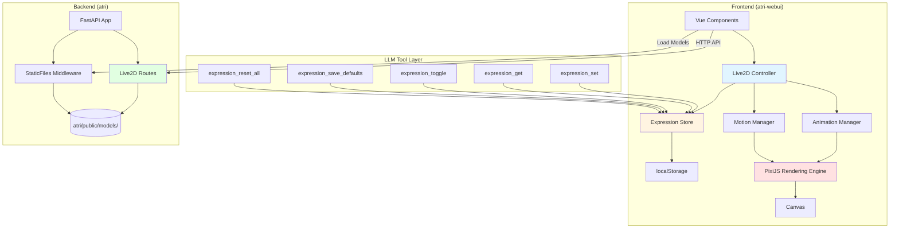

# Live2D Module Design Document

> **Document Version**: v1.0
> **Created**: 2026-04-22
> **Applicable Phase**: Phase 8 (Live2D Integration)
> **Reference Project**: AIRI (airi/packages/stage-ui-live2d)

---

## Table of Contents

1. [Module Overview](#1-module-overview)
2. [Technology Selection](#2-technology-selection)
3. [Architecture Design](#3-architecture-design)
4. [Rendering Implementation](#4-rendering-implementation)
5. [Expression Control System](#5-expression-control-system)
6. [Model Storage Solution](#6-model-storage-solution)
7. [Model Management](#7-model-management)
8. [API Interface Design](#8-api-interface-design)
9. [Configuration File Design](#9-configuration-file-design)
10. [Frontend-Backend Responsibility Division](#10-frontend-backend-responsibility-division)
11. [Performance Optimization](#11-performance-optimization)
12. [Testing Strategy](#12-testing-strategy)
13. [Deployment and Operations](#13-deployment-and-operations)
14. [Extension Guide](#14-extension-guide)
15. [Reference Materials](#15-reference-materials)

---

## 1. Module Overview

### 1.1 Module Positioning and Responsibilities

The Live2D module is responsible for integrating 2D dynamic character models in the atri project, providing users with a visual character interaction experience. This module fully reuses AIRI's Live2D implementation, with the frontend rendering engine and backend storage service working in coordination.

**Core Responsibilities**:
- Loading and rendering Live2D Cubism 2/3/4 models
- Providing an expression control system (via LLM tool interfaces)
- Managing model file storage and switching
- Implementing auto-animation (eye blinking, breathing, gaze tracking)
- Supporting lip sync (in coordination with the TTS module)

### 1.2 Core Feature List

1. **Model Rendering**
   - Loading Live2D models (.model3.json)
   - Real-time rendering and animation playback
   - Supporting Cubism 2/3/4 versions

2. **Auto-Animation**
   - Automatic eye blinking
   - Breathing animation
   - Idle eye movement
   - Mouse tracking (eyes follow the mouse)
   - Click-triggered actions

3. **Expression Control**
   - 5 LLM tool interfaces (set/get/toggle/save/reset)
   - 3 blend modes (Add/Multiply/Overwrite)
   - Expression parameter persistence (localStorage)

4. **Model Management**
   - Model upload (ZIP files)
   - Model switching
   - Model deletion
   - Model list query

5. **Lip Sync**
   - Integration with the TTS module
   - Real-time lip matching

### 1.3 Design Goals

- **Full reuse of AIRI implementation**: Avoid duplicate development and ensure stability
- **Frontend-backend separation**: Frontend handles rendering and interaction, backend handles storage and management
- **Easy to extend**: Support adding new models and custom expressions
- **Performance optimization**: Leverage browser caching to reduce redundant loading
- **User-friendly**: Provide an intuitive model management interface

### 1.4 Relationships with Other Modules

```
┌─────────────────────────────────────────────────────────┐
│                     atri Frontend                        │
│  ┌──────────────────────────────────────────────────┐   │
│  │  Live2D Rendering Layer (Reusing AIRI stage-ui-live2d) │
│  │  - PixiJS Rendering Engine                       │   │
│  │  - Expression Controller                         │   │
│  │  - Animation Manager                             │   │
│  └──────────────────────────────────────────────────┘   │
│                        ↕                                 │
│  ┌──────────────────────────────────────────────────┐   │
│  │  LLM Tool Interfaces                             │   │
│  │  - expression_set/get/toggle/save/reset          │   │
│  └──────────────────────────────────────────────────┘   │
└─────────────────────────────────────────────────────────┘
                         ↕ HTTP/WebSocket
┌─────────────────────────────────────────────────────────┐
│                     atri Backend                         │
│  ┌──────────────────────────────────────────────────┐   │
│  │  Live2D API Layer (src/routes/live2d.py)         │   │
│  │  - Model upload/delete/switch                    │   │
│  │  - Model list query                              │   │
│  └──────────────────────────────────────────────────┘   │
│                        ↕                                 │
│  ┌──────────────────────────────────────────────────┐   │
│  │  Static File Service (FastAPI StaticFiles)       │   │
│  │  - /models endpoint                              │   │
│  │  - atri/public/models/ directory                 │   │
│  └──────────────────────────────────────────────────┘   │
└─────────────────────────────────────────────────────────┘
                         ↕
┌─────────────────────────────────────────────────────────┐
│  TTS Module (Lip Sync)                                   │
└─────────────────────────────────────────────────────────┘
```

---

## 2. Technology Selection

### 2.1 Rendering Engine

**Choice**: PixiJS + pixi-live2d-display

**Version Support**:
- PixiJS: Used for 2D WebGL rendering
- pixi-live2d-display: PixiJS wrapper for the Live2D Cubism SDK
- Supports Live2D Cubism 2/3/4 models

**Technical Features**:
- High-performance WebGL rendering
- Good cross-browser compatibility
- Active community, comprehensive documentation
- Stability verified by AIRI (patch applied)

### 2.2 Reference Implementation

**AIRI Source Location**: `D:\Coding\GitHub_Resuorse\emotion-robot\airi\packages\stage-ui-live2d\`

**Core Files**:
- `src/tools/expression-tools.ts` - LLM tool interface definitions
- `src/composables/live2d/expression-controller.ts` - Expression control logic
- `src/stores/expression-store.ts` - Expression state management
- `src/utils/live2d-zip-loader.ts` - ZIP model loader
- `src/composables/live2d/animation.ts` - Animation management
- `src/composables/live2d/motion-manager.ts` - Motion management

### 2.3 Technology Selection Rationale

1. **Mature and stable**: AIRI has been verified in production environments
2. **Complete functionality**: Includes expression control, animation management, model loading, and other complete features
3. **Easy to integrate**: Based on Vue 3 + TypeScript, consistent with atri's frontend technology stack
4. **Excellent performance**: WebGL hardware acceleration, smooth rendering
5. **Extensibility**: Supports custom expressions, motions, and models

### 2.4 Dependencies

**Frontend Dependencies**:
```json
{
  "pixi.js": "^7.x",
  "pixi-live2d-display": "^0.5.x",
  "jszip": "^3.x"
}
```

**Backend Dependencies**:
```python
# requirements.txt
fastapi>=0.104.0
python-multipart>=0.0.6  # For file uploads
```

---

## 3. Architecture Design

### 3.1 Overall Architecture Diagram



### 3.2 Module Layering

**Frontend Rendering Layer**:
```
atri-webui/src/
├── components/
│   └── live2d/
│       ├── Live2DCanvas.vue          # Rendering canvas component
│       └── Live2DController.vue      # Control panel component
├── composables/
│   └── live2d/
│       ├── useLive2D.ts              # Live2D main controller
│       ├── useExpressionController.ts # Expression controller
│       └── useAnimationManager.ts    # Animation manager
└── stores/
    └── live2d.ts                     # Live2D state management
```

**Backend Storage Layer**:
```
atri/
├── src/
│   └── routes/
│       └── live2d.py                 # Live2D API routes
├── public/
│   └── models/                       # Model file storage
│       ├── hiyori/                   # Default model
│       │   ├── hiyori.model3.json
│       │   ├── textures/
│       │   └── motions/
│       └── custom/                   # User-uploaded models
└── storage/
    └── live2d_storage.py             # Model storage abstraction layer (optional)
```

### 3.3 Core Component Relationships

```
┌─────────────────────────────────────────────────────────────┐
│                    Live2D Core Components                    │
├─────────────────────────────────────────────────────────────┤
│                                                             │
│  ┌──────────────┐      ┌──────────────┐                    │
│  │ ZIP Loader   │─────>│ Model Parser │                    │
│  └──────────────┘      └──────────────┘                    │
│         │                      │                            │
│         v                      v                            │
│  ┌──────────────────────────────────┐                      │
│  │   Expression Controller          │                      │
│  │  - Parse exp3.json               │                      │
│  │  - Register expression parameters │                      │
│  │  - Apply blend modes             │                      │
│  └──────────────────────────────────┘                      │
│         │                                                   │
│         v                                                   │
│  ┌──────────────────────────────────┐                      │
│  │   Expression Store (Pinia)       │                      │
│  │  - Expression state management   │                      │
│  │  - Persist to localStorage       │                      │
│  └──────────────────────────────────┘                      │
│         │                                                   │
│         v                                                   │
│  ┌──────────────────────────────────┐                      │
│  │   Animation Manager              │                      │
│  │  - Auto eye blinking             │                      │
│  │  - Breathing animation           │                      │
│  │  - Mouse tracking                │                      │
│  └──────────────────────────────────┘                      │
│         │                                                   │
│         v                                                   │
│  ┌──────────────────────────────────┐                      │
│  │   PixiJS Renderer                │                      │
│  │  - WebGL rendering               │                      │
│  │  - Frame loop management         │                      │
│  └──────────────────────────────────┘                      │
│                                                             │
└─────────────────────────────────────────────────────────────┘
```

---

## 4. Rendering Implementation

### 4.1 Model Loading and Rendering

**Loading Flow**:

```typescript
// Reference: airi/packages/stage-ui-live2d/src/composables/live2d/index.ts

import { Live2DModel } from 'pixi-live2d-display'

// 1. Load model from backend
const modelUrl = 'http://localhost:8430/models/hiyori/hiyori.model3.json'
const model = await Live2DModel.from(modelUrl)

// 2. Add to PixiJS stage
app.stage.addChild(model)

// 3. Set model position and scale
model.x = window.innerWidth / 2
model.y = window.innerHeight / 2
model.scale.set(0.5)

// 4. Start render loop
app.ticker.add(() => {
  model.update(app.ticker.deltaMS)
})
```

**Model Configuration Example**:

Refer to AIRI's default model hiyori configuration file:
- Configuration file location: `airi/apps/stage-web/public/assets/models/hiyori/hiyori.model3.json`
- View online: [AIRI hiyori model3.json](https://github.com/moeru-ai/airi/blob/main/apps/stage-web/public/assets/models/hiyori/hiyori.model3.json)

### 4.2 Auto Eye Blinking

**Implementation Principle**:

```typescript
// Reference: airi/packages/stage-ui-live2d/src/utils/eye-motions.ts

// Live2D model built-in eye blink parameters
const eyeBlinkParams = [
  'ParamEyeLOpen',  // Left eye open/close
  'ParamEyeROpen'   // Right eye open/close
]

// Eye blink logic (automatically handled by pixi-live2d-display)
// Defaults to blinking once every 3-5 seconds
model.internalModel.motionManager.eyeBlink = {
  enabled: true,
  interval: 4000,  // Average interval 4 seconds
  closingTime: 100, // Eye closing time 100ms
  closedTime: 50,   // Fully closed time 50ms
  openingTime: 150  // Eye opening time 150ms
}
```

### 4.3 Breathing Animation

**Implementation Principle**:

```typescript
// Breathing animation is achieved by periodically adjusting model parameters
const breathParams = [
  'ParamBreath',      // Breathing parameter
  'ParamBodyAngleX'   // Body tilt
]

// Breathing cycle: once every 3-4 seconds
// Automatically handled by pixi-live2d-display
```

### 4.4 Mouse Tracking

**Implementation Principle**:

```typescript
// Reference: airi/packages/stage-ui-live2d/src/composables/live2d/animation.ts

// Listen for mouse movement
window.addEventListener('mousemove', (event) => {
  // Calculate mouse position relative to the model
  const dx = (event.clientX - model.x) / window.innerWidth
  const dy = (event.clientY - model.y) / window.innerHeight

  // Update eye and head parameters
  model.internalModel.coreModel.setParameterValueById('ParamEyeBallX', dx)
  model.internalModel.coreModel.setParameterValueById('ParamEyeBallY', dy)
  model.internalModel.coreModel.setParameterValueById('ParamAngleX', dx * 30)
  model.internalModel.coreModel.setParameterValueById('ParamAngleY', dy * 30)
})
```

### 4.5 Click-Triggered Actions

**Implementation Principle**:

```typescript
// Clicking the model triggers a random action
model.on('hit', (hitAreas) => {
  // hitAreas: The area that was clicked (e.g., 'Body', 'Head')

  // Play a random action
  const motions = model.internalModel.motionManager.definitions.tap
  if (motions && motions.length > 0) {
    const randomMotion = motions[Math.floor(Math.random() * motions.length)]
    model.motion(randomMotion.File)
  }
})
```

### 4.6 Lip Sync

**Implementation Principle**:

```typescript
// Reference: airi/packages/stage-ui-live2d/src/composables/live2d/beat-sync.ts

// Sync with TTS audio
function syncLipWithAudio(audioData: Float32Array) {
  // Calculate audio volume
  const volume = calculateVolume(audioData)

  // Map to mouth parameter (0.0 - 1.0)
  const mouthOpen = Math.min(volume * 2, 1.0)

  // Update mouth parameter
  model.internalModel.coreModel.setParameterValueById('ParamMouthOpenY', mouthOpen)
}

// Volume calculation
function calculateVolume(audioData: Float32Array): number {
  let sum = 0
  for (let i = 0; i < audioData.length; i++) {
    sum += Math.abs(audioData[i])
  }
  return sum / audioData.length
}
```

---

## 5. Expression Control System

### 5.1 Expression Parameter Management

#### 5.1.1 Expression Data Sources

Expression parameters are parsed from two files:

1. **model3.json** - Model configuration file
   - Defines the expression file list
   - Location: `FileReferences.Expressions[]`

2. **exp3.json** - Expression parameter file
   - Defines specific parameter values and blend modes
   - One file per expression

**Example Configuration**:

Refer to AIRI hiyori model's expression configuration:
- model3.json: `airi/apps/stage-web/public/assets/models/hiyori/hiyori.model3.json`
- exp3.json examples: `airi/apps/stage-web/public/assets/models/hiyori/expressions/*.exp3.json`

**model3.json Structure**:

```json
{
  "FileReferences": {
    "Expressions": [
      { "Name": "Angry", "File": "expressions/angry.exp3.json" },
      { "Name": "Happy", "File": "expressions/happy.exp3.json" },
      { "Name": "Sad", "File": "expressions/sad.exp3.json" }
    ]
  }
}
```

**exp3.json Structure**:
```json
{
  "Type": "Live2D Expression",
  "Parameters": [
    {
      "Id": "ParamEyeLOpen",
      "Value": 0.5,
      "Blend": "Multiply"
    },
    {
      "Id": "ParamMouthForm",
      "Value": 1.0,
      "Blend": "Add"
    }
  ]
}
```

#### 5.1.2 Expression Group Definition

**Data Structure**:

```typescript
// Reference: airi/packages/stage-ui-live2d/src/stores/expression-store.ts (line 40-55)

interface ExpressionGroupDefinition {
  name: string
  parameters: {
    parameterId: string
    blend: ExpressionBlendMode
    value: number
  }[]
}
```

#### 5.1.3 Parameter Entry Structure

**Data Structure**:

```typescript
// Reference: airi/packages/stage-ui-live2d/src/stores/expression-store.ts (line 16-38)

interface ExpressionEntry {
  name: string
  parameterId: string
  blend: ExpressionBlendMode
  currentValue: number
  defaultValue: number
  modelDefault: number
  targetValue: number
  resetTimer?: ReturnType<typeof setTimeout>
}
```

### 5.2 LLM Tool Interfaces

#### 5.2.1 expression_set

**Function**: Set an expression or parameter value

**Parameters**:
```typescript
{
  name: string,
  value: boolean | number,
  duration?: number
}
```

**Source Code**: `airi/packages/stage-ui-live2d/src/tools/expression-tools.ts` (line 30-53)

#### 5.2.2 expression_get

**Function**: Get current expression state

**Parameters**:
```typescript
{
  name?: string
}
```

**Source Code**: `airi/packages/stage-ui-live2d/src/tools/expression-tools.ts` (line 56-74)

#### 5.2.3 expression_toggle

**Function**: Toggle an expression

**Parameters**:
```typescript
{
  name: string,
  duration?: number
}
```

**Source Code**: `airi/packages/stage-ui-live2d/src/tools/expression-tools.ts` (line 77-96)

#### 5.2.4 expression_save_defaults

**Function**: Save current state as default values

**Source Code**: `airi/packages/stage-ui-live2d/src/tools/expression-tools.ts` (line 99-112)

#### 5.2.5 expression_reset_all

**Function**: Reset all expressions

**Source Code**: `airi/packages/stage-ui-live2d/src/tools/expression-tools.ts` (line 115-128)

### 5.3 Expression Blend Modes

#### 5.3.1 Add

**Calculation**: `modelDefault + currentValue`
**Neutral Value**: 0
**Use Case**: Overlay offsets

#### 5.3.2 Multiply

**Calculation**: `currentFrameValue * currentValue`
**Neutral Value**: 1
**Use Case**: Proportional scaling, preserving animation effects

#### 5.3.3 Overwrite

**Calculation**: `currentValue`
**Neutral Value**: modelDefault
**Use Case**: Direct replacement

**Source Code**: `airi/packages/stage-ui-live2d/src/composables/live2d/expression-controller.ts` (line 209-220)

### 5.4 Persistence Mechanism

**Storage Location**: localStorage
**Storage Key**: `expression-defaults:{modelId}`
**Source Code**: `airi/packages/stage-ui-live2d/src/stores/expression-store.ts` (line 78-101)

---

## 6. Model Storage Solution

### 6.1 Storage Location

**Backend Storage Path**: `atri/public/models/`

**Directory Structure**:
```
atri/public/models/
├── hiyori/                      # Default model (copied from AIRI)
│   ├── hiyori.model3.json       # Model configuration file
│   ├── hiyori.moc3              # Model data file
│   ├── textures/                # Texture directory
│   │   ├── texture_00.png
│   │   └── texture_01.png
│   ├── motions/                 # Motion directory
│   │   ├── idle_01.motion3.json
│   │   └── tap_body.motion3.json
│   ├── expressions/             # Expression directory
│   │   ├── angry.exp3.json
│   │   ├── happy.exp3.json
│   │   └── sad.exp3.json
│   └── physics/                 # Physics effects (optional)
│       └── physics.physics3.json
└── custom/                      # User-uploaded custom models
    └── atri/
        └── ...
```

### 6.2 FastAPI Static File Service Configuration

**Implementation Code**:

```python
# atri/src/app.py

from fastapi import FastAPI
from fastapi.staticfiles import StaticFiles
from pathlib import Path

app = FastAPI()

# Mount Live2D model static file directory
models_dir = Path(__file__).parent.parent / "public" / "models"
app.mount("/models", StaticFiles(directory=str(models_dir)), name="models")
```

**Access Method**:
- URL format: `http://localhost:8430/models/{model_name}/{file_path}`
- Example: `http://localhost:8430/models/hiyori/hiyori.model3.json`

### 6.3 Frontend Loading Method

**Loading Code**:

```typescript
// atri-webui/src/composables/useLive2D.ts

import { Live2DModel } from 'pixi-live2d-display'

// Load model from backend
const modelUrl = `${apiBaseUrl}/models/hiyori/hiyori.model3.json`
const model = await Live2DModel.from(modelUrl)
```

### 6.4 Browser Caching Mechanism

**Caching Strategy**:
1. **First load**: Download model files from server (approximately 15MB)
2. **Subsequent visits**: Browser automatically loads from cache
3. **Cache invalidation**: Re-download when browser cache is cleared or model files are updated

**Performance Optimization**:
- Local network load speed: < 1 second
- Cache hit load speed: Nearly instant
- Recommend setting appropriate Cache-Control headers

---

## 7. Model Management

### 7.1 Model Upload

#### 7.1.1 ZIP File Structure Requirements

**Required Files**:
1. `.model3.json` or `.model.json` - Model configuration file (required)
2. `.moc3` file - Model data file (exactly 1 required)
3. `.png` files - Texture files (at least 1)

**Optional Files**:
- `.motion3.json` or `.mtn` - Motion files
- `physics` related files - Physics effects
- `pose` related files - Poses
- `.exp3.json` - Expression files

**Automatic Configuration Generation**:

If the ZIP does not contain a `.model3.json`, the system will automatically generate one:

```typescript
// Reference: airi/packages/stage-ui-live2d/src/utils/live2d-zip-loader.ts (line 34-78)

// Auto-detect and generate configuration
const settings = new Cubism4ModelSettings({
  url: `${modelName}.model3.json`,
  Version: 3,
  FileReferences: {
    Moc: mocFile,              // Auto-detect .moc3
    Textures: textures,        // Auto-detect .png
    Physics: physics,          // Auto-detect physics file
    Pose: pose,                // Auto-detect pose file
    Motions: motions.length ? {
      '': motions.map(motion => ({ File: motion }))
    } : undefined
  }
})
```

**Source Code Location**: `airi/packages/stage-ui-live2d/src/utils/live2d-zip-loader.ts`

#### 7.1.2 Upload Flow

```
User selects ZIP file
    ↓
Frontend validates file type
    ↓
POST /api/live2d/models (FormData)
    ↓
Backend receives and validates ZIP
    ↓
Extract to atri/public/models/{model_id}/
    ↓
Verify required files exist
    ↓
Return model information
    ↓
Frontend refreshes model list
```

### 7.2 Model Switching

**Switching Flow**:

```
User selects a new model
    ↓
POST /api/live2d/set-model
    ↓
Backend updates current model configuration
    ↓
Frontend unloads old model
    ↓
Frontend loads new model
    ↓
Apply persisted expression settings
```

**Frontend Implementation**:

```typescript
async function switchModel(modelId: string) {
  // 1. Unload current model
  if (currentModel) {
    currentModel.destroy()
    expressionStore.dispose()
  }

  // 2. Load new model
  const modelUrl = `${apiBaseUrl}/models/${modelId}/${modelId}.model3.json`
  currentModel = await Live2DModel.from(modelUrl)

  // 3. Initialize expression controller
  await expressionController.initialise(...)

  // 4. Add to stage
  app.stage.addChild(currentModel)
}
```

### 7.3 Model Deletion

**Deletion Flow**:

```
User clicks delete
    ↓
Frontend confirmation dialog
    ↓
DELETE /api/live2d/models/{id}
    ↓
Backend checks if it is the currently active model
    ↓
Delete model file directory
    ↓
Return deletion result
    ↓
Frontend refreshes model list
```

**Cascade Impact Handling**:

**To be clarified during Phase 8 implementation**:
- If the model being deleted is the currently active model, how should it be handled?
  - Option A: Prohibit deletion, prompt the user to switch to another model first
  - Option B: Allow deletion, automatically switch to the default model
  - Option C: Allow deletion, frontend displays a placeholder
- Recommendation: Option A (safest)

---

## 8. API Interface Design

### 8.1 Get Model List

**Endpoint**: `GET /api/live2d/models`

**Request**: No parameters

**Response**:
```json
{
  "models": [
    {
      "id": "hiyori",
      "name": "Hiyori",
      "thumbnail": "/models/hiyori/thumbnail.png",
      "is_default": true,
      "is_current": true,
      "size": 15728640,
      "created_at": "2026-04-22T10:00:00Z"
    },
    {
      "id": "atri_custom",
      "name": "ATRI Custom",
      "thumbnail": "/models/atri_custom/thumbnail.png",
      "is_default": false,
      "is_current": false,
      "size": 12582912,
      "created_at": "2026-04-22T11:30:00Z"
    }
  ]
}
```

### 8.2 Upload Model

**Endpoint**: `POST /api/live2d/models`

**Request**: FormData
```
file: <ZIP file>
name: <model name> (optional, defaults to extracting from ZIP filename)
```

**Response**:
```json
{
  "success": true,
  "model": {
    "id": "new_model",
    "name": "New Model",
    "url": "/models/new_model/new_model.model3.json"
  }
}
```

**Error Response**:
```json
{
  "success": false,
  "error": "Invalid ZIP structure: missing .moc3 file"
}
```

### 8.3 Switch Model

**Endpoint**: `POST /api/live2d/set-model`

**Request**:
```json
{
  "model_id": "hiyori"
}
```

**Response**:
```json
{
  "success": true,
  "current_model": "hiyori"
}
```

### 8.4 Get Model File List

**Endpoint**: `GET /api/live2d/models/{id}/files`

**Request**: Path parameter `id`

**Response**:
```json
{
  "model_id": "hiyori",
  "files": [
    "hiyori.model3.json",
    "hiyori.moc3",
    "textures/texture_00.png",
    "textures/texture_01.png",
    "motions/idle_01.motion3.json",
    "expressions/happy.exp3.json"
  ]
}
```

### 8.5 Delete Model

**Endpoint**: `DELETE /api/live2d/models/{id}`

**Request**: Path parameter `id`

**Response**:
```json
{
  "success": true,
  "message": "Model deleted successfully"
}
```

**Error Response**:
```json
{
  "success": false,
  "error": "Cannot delete current active model"
}
```

### 8.6 Error Code Definitions

| HTTP Status Code | Error Code | Description |
|-----------------|------------|-------------|
| 400 | INVALID_ZIP | Invalid ZIP file format |
| 400 | MISSING_REQUIRED_FILES | Missing required files |
| 400 | INVALID_MODEL_CONFIG | Invalid model configuration file |
| 404 | MODEL_NOT_FOUND | Model not found |
| 409 | MODEL_IN_USE | Model is currently in use (during deletion) |
| 413 | FILE_TOO_LARGE | File too large |
| 500 | INTERNAL_ERROR | Internal server error |

---

## 9. Configuration File Design

### 9.1 Model Configuration (model3.json)

Refer to AIRI hiyori model configuration:
- File location: `airi/apps/stage-web/public/assets/models/hiyori/hiyori.model3.json`
- View online: [hiyori model3.json](https://github.com/moeru-ai/airi/blob/main/apps/stage-web/public/assets/models/hiyori/hiyori.model3.json)

### 9.2 Expression Configuration (exp3.json)

Refer to AIRI hiyori expression configuration:
- File location: `airi/apps/stage-web/public/assets/models/hiyori/expressions/`
- View online: [hiyori expressions](https://github.com/moeru-ai/airi/tree/main/apps/stage-web/public/assets/models/hiyori/expressions)

### 9.3 Live2D Configuration in Character Card

```typescript
// Character card extension configuration
{
  extensions: {
    airi: {
      modules: {
        live2d: {
          source: 'file' | 'url',
          file?: string,
          url?: string,
          position: { x: number, y: number },
          scale: number
        }
      }
    }
  }
}
```

### 9.4 Frontend LocalStorage Configuration

**Expression Default Values**:
- Key: `expression-defaults:{modelId}`
- Value: `{ "ParamEyeLOpen": 0.8, ... }`

**Model Position and Scale**:
- Key: `live2d-settings:{modelId}`
- Value: `{ "x": 960, "y": 540, "scale": 0.5 }`

---

## 10. Frontend-Backend Responsibility Division

### 10.1 Frontend Responsibilities

1. **Model Rendering**
   - Loading Live2D models
   - PixiJS render loop
   - Animation playback

2. **Expression Control**
   - Expression parameter management
   - LLM tool interface implementation
   - Blend mode calculation
   - Persistence to localStorage

3. **Auto-Animation**
   - Auto eye blinking
   - Breathing animation
   - Mouse tracking
   - Click triggering

4. **User Interaction**
   - Model position dragging
   - Scale control
   - Expression selection interface

5. **Full Reuse of AIRI**
   - Directly use `packages/stage-ui-live2d`
   - No reimplementation needed

### 10.2 Backend Responsibilities

1. **Model Storage**
   - File system management
   - Static file service

2. **Model Management API**
   - Upload handling
   - Delete operations
   - List queries
   - Switch management

3. **File Validation**
   - ZIP structure validation
   - Required file checks
   - File size limits

4. **Configuration Management**
   - Current model tracking
   - Model metadata storage

### 10.3 Data Flow

```
User Action
    ↓
Frontend Vue Component
    ↓
Live2D Controller (AIRI)
    ↓
Expression Store (Pinia)
    ↓
PixiJS Rendering Engine
    ↓
Canvas

User Uploads Model
    ↓
Frontend FormData
    ↓
POST /api/live2d/models
    ↓
Backend Validation and Storage
    ↓
Return Model Information
    ↓
Frontend Loads New Model
```

---

## 11. Performance Optimization

### 11.1 Model Preloading

**Strategy**:
- Preload the default model before the user enters the main page
- Use Service Worker to cache model files
- Preload commonly used exp3.json files for expressions

**Implementation**:
```typescript
// Preload default model
async function preloadDefaultModel() {
  const modelUrl = `${apiBaseUrl}/models/hiyori/hiyori.model3.json`
  await fetch(modelUrl)  // Trigger browser cache
}
```

### 11.2 Browser Caching Strategy

**Cache-Control Settings**:
```python
# FastAPI static file cache configuration
app.mount(
  "/models",
  StaticFiles(directory="public/models"),
  name="models"
)

# Recommended to set at nginx or CDN layer
# Cache-Control: public, max-age=31536000  # 1 year
```

**Caching Advantages**:
- First load: 15MB, approximately 1-2 seconds (local network)
- Subsequent loads: From cache, nearly instant

### 11.3 Rendering Performance Optimization

**Frame Rate Control**:
```typescript
// Limit frame rate to 60 FPS
app.ticker.maxFPS = 60

// Pause rendering when not visible
document.addEventListener('visibilitychange', () => {
  if (document.hidden) {
    app.ticker.stop()
  } else {
    app.ticker.start()
  }
})
```

**WebGL Optimization**:
- Use hardware acceleration
- Avoid frequent texture switching
- Use Sprite batching appropriately

### 11.4 Memory Management

**Model Unloading**:
```typescript
// Properly unload old model when switching
function unloadModel(model: Live2DModel) {
  // 1. Stop all animations
  model.internalModel.motionManager.stopAllMotions()

  // 2. Clear expression state
  expressionStore.dispose()

  // 3. Remove from stage
  app.stage.removeChild(model)

  // 4. Destroy model
  model.destroy({ children: true, texture: true, baseTexture: true })
}
```

**Memory Monitoring**:
```typescript
// Monitor memory usage
if (performance.memory) {
  console.log('Used JS Heap:', performance.memory.usedJSHeapSize / 1048576, 'MB')
  console.log('Total JS Heap:', performance.memory.totalJSHeapSize / 1048576, 'MB')
}
```

---

## 12. Testing Strategy

### 12.1 Unit Tests

**Expression Control Logic Tests**:

```typescript
// Test expression blend modes
describe('Expression Blend Modes', () => {
  test('Add mode calculation', () => {
    const entry = { modelDefault: 0.5, currentValue: 0.3, blend: 'Add' }
    const result = computeTargetValue(entry)
    expect(result).toBe(0.8)  // 0.5 + 0.3
  })

  test('Multiply mode calculation', () => {
    const entry = { currentValue: 1.2, blend: 'Multiply' }
    const currentFrameValue = 0.8
    const result = computeTargetValue(entry, currentFrameValue)
    expect(result).toBe(0.96)  // 0.8 * 1.2
  })
})
```

**LLM Tool Interface Tests**:

```typescript
describe('Expression Tools', () => {
  test('expression_set with boolean', async () => {
    const result = await expression_set({ name: 'Happy', value: true })
    expect(result.success).toBe(true)
    expect(result.state).toBeDefined()
  })

  test('expression_get all', async () => {
    const result = await expression_get({})
    expect(result.success).toBe(true)
    expect(Array.isArray(result.state)).toBe(true)
  })
})
```

### 12.2 Integration Tests

**API Interface Tests**:

```python
# Test model upload
def test_upload_model():
    with open('test_model.zip', 'rb') as f:
        response = client.post(
            '/api/live2d/models',
            files={'file': f},
            data={'name': 'test_model'}
        )
    assert response.status_code == 200
    assert response.json()['success'] is True

# Test model switching
def test_switch_model():
    response = client.post(
        '/api/live2d/set-model',
        json={'model_id': 'hiyori'}
    )
    assert response.status_code == 200
    assert response.json()['current_model'] == 'hiyori'
```

### 12.3 Frontend Rendering Tests

**Model Loading Tests**:

```typescript
describe('Live2D Model Loading', () => {
  test('load model successfully', async () => {
    const model = await Live2DModel.from('/models/hiyori/hiyori.model3.json')
    expect(model).toBeDefined()
    expect(model.internalModel).toBeDefined()
  })

  test('handle invalid model URL', async () => {
    await expect(
      Live2DModel.from('/models/invalid/model.json')
    ).rejects.toThrow()
  })
})
```

### 12.4 Test Coverage Goals

- Unit test coverage: >= 80%
- Integration test coverage: >= 70%
- Critical path testing: 100% (model loading, expression control, API interfaces)

---

## 13. Deployment and Operations

### 13.1 Model File Management

**Initialize Default Model**:

```bash
# Copy default model from AIRI
cp -r airi/apps/stage-web/public/assets/models/hiyori atri/public/models/

# Verify file structure
ls -R atri/public/models/hiyori/
```

**Model File Permissions**:
```bash
# Ensure backend has read permissions
chmod -R 755 atri/public/models/
```

### 13.2 Dependency Installation

**Frontend Dependencies**:

```bash
cd atri-webui
npm install pixi.js pixi-live2d-display jszip
```

**Backend Dependencies**:

```bash
cd atri
pip install fastapi python-multipart
```

### 13.3 Environment Requirements

**Frontend Environment**:
- Node.js >= 18
- Modern browser with WebGL support
- Recommended: Latest version of Chrome/Edge/Firefox

**Backend Environment**:
- Python >= 3.10
- FastAPI >= 0.104.0
- Disk space: At least 500MB (for storing models)

**Browser Compatibility**:
- Chrome/Edge >= 90
- Firefox >= 88
- Safari >= 14

### 13.4 Monitoring Metrics

**Performance Metrics**:
- Model loading time: < 2 seconds (first load)
- Rendering frame rate: >= 60 FPS
- Memory usage: < 200MB (single model)

**Business Metrics**:
- Model switching success rate: >= 99%
- Expression control response time: < 100ms
- API interface availability: >= 99.9%

---

## 14. Extension Guide

### 14.1 How to Add New Expressions

**Steps**:

1. Create an exp3.json file
```json
{
  "Type": "Live2D Expression",
  "Parameters": [
    {
      "Id": "ParamEyeLOpen",
      "Value": 0.5,
      "Blend": "Multiply"
    }
  ]
}
```

2. Place the file in the model's expressions directory
```
atri/public/models/hiyori/expressions/new_expression.exp3.json
```

3. Update model3.json
```json
{
  "FileReferences": {
    "Expressions": [
      { "Name": "NewExpression", "File": "expressions/new_expression.exp3.json" }
    ]
  }
}
```

4. Frontend automatically recognizes the new expression (no code changes needed)

### 14.2 How to Customize Motions

**Steps**:

1. Create motions using Live2D Cubism Editor
2. Export as .motion3.json files
3. Place in the model's motions directory
4. Update the Motions configuration in model3.json
5. Play via frontend using model.motion('motion_name')

### 14.3 How to Integrate a New Live2D Model

**Steps**:

1. Prepare model files (required: .model3.json, .moc3, .png)
2. Package as a ZIP file
3. Upload through the frontend upload interface
4. Or manually copy to atri/public/models/{model_name}/
5. Switch to the new model via API or frontend interface

**Notes**:
- Ensure model file structure meets requirements
- Texture files should not be too large (recommended individual size < 2MB)
- Test model display at different resolutions

---

## 15. Reference Materials

### 15.1 AIRI Source Code Locations

**Core Files**:

1. **Expression Control Tools**
   - Path: airi/packages/stage-ui-live2d/src/tools/expression-tools.ts
   - Online: https://github.com/moeru-ai/airi/blob/main/packages/stage-ui-live2d/src/tools/expression-tools.ts

2. **Expression Controller**
   - Path: airi/packages/stage-ui-live2d/src/composables/live2d/expression-controller.ts
   - Online: https://github.com/moeru-ai/airi/blob/main/packages/stage-ui-live2d/src/composables/live2d/expression-controller.ts

3. **Expression State Management**
   - Path: airi/packages/stage-ui-live2d/src/stores/expression-store.ts
   - Online: https://github.com/moeru-ai/airi/blob/main/packages/stage-ui-live2d/src/stores/expression-store.ts

4. **ZIP Model Loader**
   - Path: airi/packages/stage-ui-live2d/src/utils/live2d-zip-loader.ts
   - Online: https://github.com/moeru-ai/airi/blob/main/packages/stage-ui-live2d/src/utils/live2d-zip-loader.ts

5. **Animation Manager**
   - Path: airi/packages/stage-ui-live2d/src/composables/live2d/animation.ts
   - Online: https://github.com/moeru-ai/airi/blob/main/packages/stage-ui-live2d/src/composables/live2d/animation.ts

6. **Motion Manager**
   - Path: airi/packages/stage-ui-live2d/src/composables/live2d/motion-manager.ts
   - Online: https://github.com/moeru-ai/airi/blob/main/packages/stage-ui-live2d/src/composables/live2d/motion-manager.ts

7. **Eye Motion Utilities**
   - Path: airi/packages/stage-ui-live2d/src/utils/eye-motions.ts
   - Online: https://github.com/moeru-ai/airi/blob/main/packages/stage-ui-live2d/src/utils/eye-motions.ts

8. **Lip Sync**
   - Path: airi/packages/stage-ui-live2d/src/composables/live2d/beat-sync.ts
   - Online: https://github.com/moeru-ai/airi/blob/main/packages/stage-ui-live2d/src/composables/live2d/beat-sync.ts

**Example Models**:

- **Hiyori Model Configuration**
  - Path: airi/apps/stage-web/public/assets/models/hiyori/
  - Online: https://github.com/moeru-ai/airi/tree/main/apps/stage-web/public/assets/models/hiyori

### 15.2 Live2D Official Documentation

- **Live2D Cubism SDK**: https://www.live2d.com/en/sdk/
- **Cubism 4 SDK Manual**: https://docs.live2d.com/cubism-sdk-manual/top/
- **Model3.json Specification**: https://docs.live2d.com/cubism-sdk-manual/model3-json/

### 15.3 pixi-live2d-display Documentation

- **GitHub Repository**: https://github.com/guansss/pixi-live2d-display
- **API Documentation**: https://guansss.github.io/pixi-live2d-display/
- **Examples**: https://codepen.io/guansss/pen/oNzoNoz

### 15.4 Related Design Documents

- **Project Architecture Design**: docs/项目架构设计.md
- **Frontend Design Document**: docs/前端设计文档.md
- **Backend Design**: docs/后端设计.md
- **TTS Module Design**: docs/TTS模块设计文档.md
- **ASR Module Design**: docs/ASR模块设计文档.md

---

## Appendix

### A. Frequently Asked Questions

**Q1: What to do if model loading fails?**

A: Check the following:
1. Whether the model file path is correct
2. Whether required files are complete (.model3.json, .moc3, .png)
3. Whether there are error messages in the browser console
4. Whether network requests are successful (check the Network panel)

**Q2: Expression control not working?**

A: Check:
1. Whether the expression parameter ID is correct
2. Whether the blend mode is appropriate
3. Whether there are conflicts with other expressions
4. View the Expression Store state

**Q3: How to debug rendering issues?**

A: Use the following tools:
1. Chrome DevTools Performance panel
2. PixiJS Inspector extension
3. Check WebGL error messages
4. Monitor frame rate and memory usage

**Q4: How to optimize large model files?**

A: Optimization methods:
1. Compress texture images (using tools like TinyPNG)
2. Remove unnecessary motion files
3. Use appropriate texture resolutions
4. Consider using WebP format (requires SDK support)
