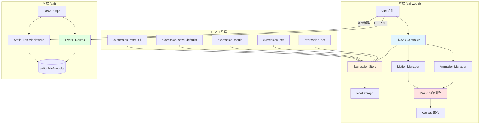

# Live2D 模块设计文档

> **文档版本**: v1.0  
> **创建日期**: 2026-04-22  
> **适用阶段**: Phase 8（Live2D 集成）  
> **参考项目**: AIRI (airi/packages/stage-ui-live2d)

---

## 目录

1. [模块概述](#1-模块概述)
2. [技术选型](#2-技术选型)
3. [架构设计](#3-架构设计)
4. [渲染功能实现](#4-渲染功能实现)
5. [表情控制系统](#5-表情控制系统)
6. [模型存储方案](#6-模型存储方案)
7. [模型管理](#7-模型管理)
8. [API 接口设计](#8-api-接口设计)
9. [配置文件设计](#9-配置文件设计)
10. [前后端职责划分](#10-前后端职责划分)
11. [性能优化](#11-性能优化)
12. [测试策略](#12-测试策略)
13. [部署和运维](#13-部署和运维)
14. [扩展指南](#14-扩展指南)
15. [参考资料](#15-参考资料)

---

## 1. 模块概述

### 1.1 模块定位和职责

Live2D 模块负责在 atri 项目中集成 2D 动态角色模型，为用户提供可视化的角色交互体验。该模块完全复用 AIRI 的 Live2D 实现，通过前端渲染引擎和后端存储服务协同工作。

**核心职责**：
- 加载和渲染 Live2D Cubism 2/3/4 模型
- 提供表情控制系统（通过 LLM 工具接口）
- 管理模型文件的存储和切换
- 实现自动动画（眨眼、呼吸、视线追踪）
- 支持口型同步（与 TTS 模块配合）

### 1.2 核心功能列表

1. **模型渲染**
   - 加载 Live2D 模型（.model3.json）
   - 实时渲染和动画播放
   - 支持 Cubism 2/3/4 版本

2. **自动动画**
   - 自动眨眼
   - 呼吸动画
   - 空闲眼动
   - 鼠标跟踪（眼睛跟随鼠标）
   - 点击触发动作

3. **表情控制**
   - 5 个 LLM 工具接口（set/get/toggle/save/reset）
   - 3 种混合模式（Add/Multiply/Overwrite）
   - 表情参数持久化（localStorage）

4. **模型管理**
   - 模型上传（ZIP 文件）
   - 模型切换
   - 模型删除
   - 模型列表查询

5. **口型同步**
   - 与 TTS 模块集成
   - 实时口型匹配

### 1.3 设计目标

- **完全复用 AIRI 实现**：避免重复开发，确保稳定性
- **前后端分离**：前端负责渲染和交互，后端负责存储和管理
- **易于扩展**：支持添加新模型和自定义表情
- **性能优化**：利用浏览器缓存，减少重复加载
- **用户友好**：提供直观的模型管理界面

### 1.4 与其他模块的关系

```
┌─────────────────────────────────────────────────────────┐
│                     atri 前端                            │
│  ┌──────────────────────────────────────────────────┐   │
│  │  Live2D 渲染层 (复用 AIRI stage-ui-live2d)       │   │
│  │  - PixiJS 渲染引擎                               │   │
│  │  - 表情控制器                                     │   │
│  │  - 动画管理器                                     │   │
│  └──────────────────────────────────────────────────┘   │
│                        ↕                                 │
│  ┌──────────────────────────────────────────────────┐   │
│  │  LLM 工具接口                                     │   │
│  │  - expression_set/get/toggle/save/reset          │   │
│  └──────────────────────────────────────────────────┘   │
└─────────────────────────────────────────────────────────┘
                         ↕ HTTP/WebSocket
┌─────────────────────────────────────────────────────────┐
│                     atri 后端                            │
│  ┌──────────────────────────────────────────────────┐   │
│  │  Live2D API 层 (src/routes/live2d.py)            │   │
│  │  - 模型上传/删除/切换                             │   │
│  │  - 模型列表查询                                   │   │
│  └──────────────────────────────────────────────────┘   │
│                        ↕                                 │
│  ┌──────────────────────────────────────────────────┐   │
│  │  静态文件服务 (FastAPI StaticFiles)              │   │
│  │  - /models 端点                                   │   │
│  │  - atri/public/models/ 目录                       │   │
│  └──────────────────────────────────────────────────┘   │
└─────────────────────────────────────────────────────────┘
                         ↕
┌─────────────────────────────────────────────────────────┐
│  TTS 模块（口型同步）                                    │
└─────────────────────────────────────────────────────────┘
```

---

## 2. 技术选型

### 2.1 渲染引擎

**选择**: PixiJS + pixi-live2d-display

**版本支持**:
- PixiJS: 用于 2D WebGL 渲染
- pixi-live2d-display: Live2D Cubism SDK 的 PixiJS 封装
- 支持 Live2D Cubism 2/3/4 模型

**技术特点**:
- 高性能 WebGL 渲染
- 跨浏览器兼容性好
- 社区活跃，文档完善
- AIRI 已验证稳定性（已打 patch）

### 2.2 参考实现

**AIRI 源码位置**: `D:\Coding\GitHub_Resuorse\emotion-robot\airi\packages\stage-ui-live2d\`

**核心文件**:
- `src/tools/expression-tools.ts` - LLM 工具接口定义
- `src/composables/live2d/expression-controller.ts` - 表情控制逻辑
- `src/stores/expression-store.ts` - 表情状态管理
- `src/utils/live2d-zip-loader.ts` - ZIP 模型加载器
- `src/composables/live2d/animation.ts` - 动画管理
- `src/composables/live2d/motion-manager.ts` - 动作管理

### 2.3 技术选型理由

1. **成熟稳定**: AIRI 已在生产环境验证
2. **完整功能**: 包含表情控制、动画管理、模型加载等完整功能
3. **易于集成**: 基于 Vue 3 + TypeScript，与 atri 前端技术栈一致
4. **性能优异**: WebGL 硬件加速，流畅渲染
5. **可扩展性**: 支持自定义表情、动作、模型

### 2.4 依赖项

**前端依赖**:
```json
{
  "pixi.js": "^7.x",
  "pixi-live2d-display": "^0.5.x",
  "jszip": "^3.x"
}
```

**后端依赖**:
```python
# requirements.txt
fastapi>=0.104.0
python-multipart>=0.0.6  # 用于文件上传
```

---

## 3. 架构设计

### 3.1 整体架构图



### 3.2 模块分层

**前端渲染层**:
```
atri-webui/src/
├── components/
│   └── live2d/
│       ├── Live2DCanvas.vue          # 渲染画布组件
│       └── Live2DController.vue      # 控制面板组件
├── composables/
│   └── live2d/
│       ├── useLive2D.ts              # Live2D 主控制器
│       ├── useExpressionController.ts # 表情控制器
│       └── useAnimationManager.ts    # 动画管理器
└── stores/
    └── live2d.ts                     # Live2D 状态管理
```

**后端存储层**:
```
atri/
├── src/
│   └── routes/
│       └── live2d.py                 # Live2D API 路由
├── public/
│   └── models/                       # 模型文件存储
│       ├── hiyori/                   # 默认模型
│       │   ├── hiyori.model3.json
│       │   ├── textures/
│       │   └── motions/
│       └── custom/                   # 用户上传模型
└── storage/
    └── live2d_storage.py             # 模型存储抽象层（可选）
```

### 3.3 核心组件关系

```
┌─────────────────────────────────────────────────────────────┐
│                    Live2D 核心组件                           │
├─────────────────────────────────────────────────────────────┤
│                                                             │
│  ┌──────────────┐      ┌──────────────┐                    │
│  │ ZIP Loader   │─────>│ Model Parser │                    │
│  └──────────────┘      └──────────────┘                    │
│         │                      │                            │
│         v                      v                            │
│  ┌──────────────────────────────────┐                      │
│  │   Expression Controller          │                      │
│  │  - 解析 exp3.json                │                      │
│  │  - 注册表情参数                   │                      │
│  │  - 应用混合模式                   │                      │
│  └──────────────────────────────────┘                      │
│         │                                                   │
│         v                                                   │
│  ┌──────────────────────────────────┐                      │
│  │   Expression Store (Pinia)       │                      │
│  │  - 表情状态管理                   │                      │
│  │  - 持久化到 localStorage          │                      │
│  └──────────────────────────────────┘                      │
│         │                                                   │
│         v                                                   │
│  ┌──────────────────────────────────┐                      │
│  │   Animation Manager              │                      │
│  │  - 自动眨眼                       │                      │
│  │  - 呼吸动画                       │                      │
│  │  - 鼠标跟踪                       │                      │
│  └──────────────────────────────────┘                      │
│         │                                                   │
│         v                                                   │
│  ┌──────────────────────────────────┐                      │
│  │   PixiJS Renderer                │                      │
│  │  - WebGL 渲染                     │                      │
│  │  - 帧循环管理                     │                      │
│  └──────────────────────────────────┘                      │
│                                                             │
└─────────────────────────────────────────────────────────────┘
```

---

## 4. 渲染功能实现

### 4.1 模型加载和渲染

**加载流程**:

```typescript
// 参考: airi/packages/stage-ui-live2d/src/composables/live2d/index.ts

import { Live2DModel } from 'pixi-live2d-display'

// 1. 从后端加载模型
const modelUrl = 'http://localhost:8430/models/hiyori/hiyori.model3.json'
const model = await Live2DModel.from(modelUrl)

// 2. 添加到 PixiJS 舞台
app.stage.addChild(model)

// 3. 设置模型位置和缩放
model.x = window.innerWidth / 2
model.y = window.innerHeight / 2
model.scale.set(0.5)

// 4. 启动渲染循环
app.ticker.add(() => {
  model.update(app.ticker.deltaMS)
})
```

**模型配置示例**:

参考 AIRI 默认模型 hiyori 的配置文件：
- 配置文件位置: `airi/apps/stage-web/public/assets/models/hiyori/hiyori.model3.json`
- 在线查看: [AIRI hiyori model3.json](https://github.com/moeru-ai/airi/blob/main/apps/stage-web/public/assets/models/hiyori/hiyori.model3.json)

### 4.2 自动眨眼

**实现原理**:

```typescript
// 参考: airi/packages/stage-ui-live2d/src/utils/eye-motions.ts

// Live2D 模型内置眨眼参数
const eyeBlinkParams = [
  'ParamEyeLOpen',  // 左眼开合
  'ParamEyeROpen'   // 右眼开合
]

// 眨眼逻辑（由 pixi-live2d-display 自动处理）
// 默认每 3-5 秒眨眼一次
model.internalModel.motionManager.eyeBlink = {
  enabled: true,
  interval: 4000,  // 平均间隔 4 秒
  closingTime: 100, // 闭眼时间 100ms
  closedTime: 50,   // 完全闭合时间 50ms
  openingTime: 150  // 睁眼时间 150ms
}
```

### 4.3 呼吸动画

**实现原理**:

```typescript
// 呼吸动画通过周期性调整模型参数实现
const breathParams = [
  'ParamBreath',      // 呼吸参数
  'ParamBodyAngleX'   // 身体倾斜
]

// 呼吸周期：3-4 秒一次
// 由 pixi-live2d-display 自动处理
```

### 4.4 鼠标跟踪

**实现原理**:

```typescript
// 参考: airi/packages/stage-ui-live2d/src/composables/live2d/animation.ts

// 监听鼠标移动
window.addEventListener('mousemove', (event) => {
  // 计算鼠标相对于模型的位置
  const dx = (event.clientX - model.x) / window.innerWidth
  const dy = (event.clientY - model.y) / window.innerHeight
  
  // 更新眼睛和头部参数
  model.internalModel.coreModel.setParameterValueById('ParamEyeBallX', dx)
  model.internalModel.coreModel.setParameterValueById('ParamEyeBallY', dy)
  model.internalModel.coreModel.setParameterValueById('ParamAngleX', dx * 30)
  model.internalModel.coreModel.setParameterValueById('ParamAngleY', dy * 30)
})
```

### 4.5 点击触发动作

**实现原理**:

```typescript
// 点击模型触发随机动作
model.on('hit', (hitAreas) => {
  // hitAreas: 被点击的区域（如 'Body', 'Head'）
  
  // 播放随机动作
  const motions = model.internalModel.motionManager.definitions.tap
  if (motions && motions.length > 0) {
    const randomMotion = motions[Math.floor(Math.random() * motions.length)]
    model.motion(randomMotion.File)
  }
})
```

### 4.6 口型同步

**实现原理**:

```typescript
// 参考: airi/packages/stage-ui-live2d/src/composables/live2d/beat-sync.ts

// 与 TTS 音频同步
function syncLipWithAudio(audioData: Float32Array) {
  // 计算音频音量
  const volume = calculateVolume(audioData)
  
  // 映射到口型参数 (0.0 - 1.0)
  const mouthOpen = Math.min(volume * 2, 1.0)
  
  // 更新口型参数
  model.internalModel.coreModel.setParameterValueById('ParamMouthOpenY', mouthOpen)
}

// 音量计算
function calculateVolume(audioData: Float32Array): number {
  let sum = 0
  for (let i = 0; i < audioData.length; i++) {
    sum += Math.abs(audioData[i])
  }
  return sum / audioData.length
}
```

---

## 5. 表情控制系统

### 5.1 表情参数管理

#### 5.1.1 表情数据来源

表情参数从两个文件中解析：

1. **model3.json** - 模型配置文件
   - 定义表情文件列表
   - 位置: `FileReferences.Expressions[]`
   
2. **exp3.json** - 表情参数文件
   - 定义具体的参数值和混合模式
   - 每个表情一个文件

**示例配置**:

参考 AIRI hiyori 模型的表情配置：
- model3.json: `airi/apps/stage-web/public/assets/models/hiyori/hiyori.model3.json`
- exp3.json 示例: `airi/apps/stage-web/public/assets/models/hiyori/expressions/*.exp3.json`

**model3.json 结构**:

```json
{
  "FileReferences": {
    "Expressions": [
      { "Name": "Angry", "File": "expressions/angry.exp3.json" },
      { "Name": "Happy", "File": "expressions/happy.exp3.json" },
      { "Name": "Sad", "File": "expressions/sad.exp3.json" }
    ]
  }
}
```

**exp3.json 结构**:
```json
{
  "Type": "Live2D Expression",
  "Parameters": [
    {
      "Id": "ParamEyeLOpen",
      "Value": 0.5,
      "Blend": "Multiply"
    },
    {
      "Id": "ParamMouthForm",
      "Value": 1.0,
      "Blend": "Add"
    }
  ]
}
```

#### 5.1.2 表情组定义

**数据结构**:

```typescript
// 参考: airi/packages/stage-ui-live2d/src/stores/expression-store.ts (line 40-55)

interface ExpressionGroupDefinition {
  name: string
  parameters: {
    parameterId: string
    blend: ExpressionBlendMode
    value: number
  }[]
}
```

#### 5.1.3 参数条目结构

**数据结构**:

```typescript
// 参考: airi/packages/stage-ui-live2d/src/stores/expression-store.ts (line 16-38)

interface ExpressionEntry {
  name: string
  parameterId: string
  blend: ExpressionBlendMode
  currentValue: number
  defaultValue: number
  modelDefault: number
  targetValue: number
  resetTimer?: ReturnType<typeof setTimeout>
}
```

### 5.2 LLM 工具接口

#### 5.2.1 expression_set

**功能**: 设置表情或参数值

**参数**:
```typescript
{
  name: string,
  value: boolean | number,
  duration?: number
}
```

**源码**: `airi/packages/stage-ui-live2d/src/tools/expression-tools.ts` (line 30-53)

#### 5.2.2 expression_get

**功能**: 获取当前表情状态

**参数**:
```typescript
{
  name?: string
}
```

**源码**: `airi/packages/stage-ui-live2d/src/tools/expression-tools.ts` (line 56-74)

#### 5.2.3 expression_toggle

**功能**: 切换表情

**参数**:
```typescript
{
  name: string,
  duration?: number
}
```

**源码**: `airi/packages/stage-ui-live2d/src/tools/expression-tools.ts` (line 77-96)

#### 5.2.4 expression_save_defaults

**功能**: 保存当前状态为默认值

**源码**: `airi/packages/stage-ui-live2d/src/tools/expression-tools.ts` (line 99-112)

#### 5.2.5 expression_reset_all

**功能**: 重置所有表情

**源码**: `airi/packages/stage-ui-live2d/src/tools/expression-tools.ts` (line 115-128)

### 5.3 表情混合模式

#### 5.3.1 Add（加法）

**计算**: `modelDefault + currentValue`  
**无效值**: 0  
**场景**: 叠加偏移

#### 5.3.2 Multiply（乘法）

**计算**: `currentFrameValue * currentValue`  
**无效值**: 1  
**场景**: 比例缩放，保留动画效果

#### 5.3.3 Overwrite（覆盖）

**计算**: `currentValue`  
**无效值**: modelDefault  
**场景**: 直接替换

**源码**: `airi/packages/stage-ui-live2d/src/composables/live2d/expression-controller.ts` (line 209-220)

### 5.4 持久化机制

**存储位置**: localStorage  
**存储键**: `expression-defaults:{modelId}`  
**源码**: `airi/packages/stage-ui-live2d/src/stores/expression-store.ts` (line 78-101)

---

## 6. 模型存储方案

### 6.1 存储位置

**后端存储路径**: `atri/public/models/`

**目录结构**:
```
atri/public/models/
├── hiyori/                      # 默认模型（从 AIRI 复制）
│   ├── hiyori.model3.json       # 模型配置文件
│   ├── hiyori.moc3              # 模型数据文件
│   ├── textures/                # 纹理目录
│   │   ├── texture_00.png
│   │   └── texture_01.png
│   ├── motions/                 # 动作目录
│   │   ├── idle_01.motion3.json
│   │   └── tap_body.motion3.json
│   ├── expressions/             # 表情目录
│   │   ├── angry.exp3.json
│   │   ├── happy.exp3.json
│   │   └── sad.exp3.json
│   └── physics/                 # 物理效果（可选）
│       └── physics.physics3.json
└── custom/                      # 用户上传的自定义模型
    └── atri/
        └── ...
```

### 6.2 FastAPI 静态文件服务配置

**实现代码**:

```python
# atri/src/app.py

from fastapi import FastAPI
from fastapi.staticfiles import StaticFiles
from pathlib import Path

app = FastAPI()

# 挂载 Live2D 模型静态文件目录
models_dir = Path(__file__).parent.parent / "public" / "models"
app.mount("/models", StaticFiles(directory=str(models_dir)), name="models")
```

**访问方式**:
- URL 格式: `http://localhost:8430/models/{model_name}/{file_path}`
- 示例: `http://localhost:8430/models/hiyori/hiyori.model3.json`

### 6.3 前端加载方式

**加载代码**:

```typescript
// atri-webui/src/composables/useLive2D.ts

import { Live2DModel } from 'pixi-live2d-display'

// 从后端加载模型
const modelUrl = `${apiBaseUrl}/models/hiyori/hiyori.model3.json`
const model = await Live2DModel.from(modelUrl)
```

### 6.4 浏览器缓存机制

**缓存策略**:
1. **首次加载**: 从服务器下载模型文件（约 15MB）
2. **后续访问**: 浏览器自动从缓存加载
3. **缓存失效**: 清除浏览器缓存或模型文件更新时重新下载

**性能优化**:
- 本地网络加载速度: < 1 秒
- 缓存命中后加载速度: 几乎瞬间
- 建议设置合理的 Cache-Control 头

---

## 7. 模型管理

### 7.1 模型上传

#### 7.1.1 ZIP 文件结构要求

**必需文件**:
1. `.model3.json` 或 `.model.json` - 模型配置文件（必须有）
2. `.moc3` 文件 - 模型数据文件（必须恰好 1 个）
3. `.png` 文件 - 纹理文件（至少 1 个）

**可选文件**:
- `.motion3.json` 或 `.mtn` - 动作文件
- `physics` 相关文件 - 物理效果
- `pose` 相关文件 - 姿势
- `.exp3.json` - 表情文件

**自动配置生成**:

如果 ZIP 中没有 `.model3.json`，系统会自动生成配置：

```typescript
// 参考: airi/packages/stage-ui-live2d/src/utils/live2d-zip-loader.ts (line 34-78)

// 自动检测并生成配置
const settings = new Cubism4ModelSettings({
  url: `${modelName}.model3.json`,
  Version: 3,
  FileReferences: {
    Moc: mocFile,              // 自动检测 .moc3
    Textures: textures,        // 自动检测 .png
    Physics: physics,          // 自动检测 physics 文件
    Pose: pose,                // 自动检测 pose 文件
    Motions: motions.length ? {
      '': motions.map(motion => ({ File: motion }))
    } : undefined
  }
})
```

**源码位置**: `airi/packages/stage-ui-live2d/src/utils/live2d-zip-loader.ts`

#### 7.1.2 上传流程

```
用户选择 ZIP 文件
    ↓
前端验证文件类型
    ↓
POST /api/live2d/models (FormData)
    ↓
后端接收并验证 ZIP
    ↓
解压到 atri/public/models/{model_id}/
    ↓
验证必需文件存在
    ↓
返回模型信息
    ↓
前端刷新模型列表
```

### 7.2 模型切换

**切换流程**:

```
用户选择新模型
    ↓
POST /api/live2d/set-model
    ↓
后端更新当前模型配置
    ↓
前端卸载旧模型
    ↓
前端加载新模型
    ↓
应用持久化的表情设置
```

**前端实现**:

```typescript
async function switchModel(modelId: string) {
  // 1. 卸载当前模型
  if (currentModel) {
    currentModel.destroy()
    expressionStore.dispose()
  }
  
  // 2. 加载新模型
  const modelUrl = `${apiBaseUrl}/models/${modelId}/${modelId}.model3.json`
  currentModel = await Live2DModel.from(modelUrl)
  
  // 3. 初始化表情控制器
  await expressionController.initialise(...)
  
  // 4. 添加到舞台
  app.stage.addChild(currentModel)
}
```

### 7.3 模型删除

**删除流程**:

```
用户点击删除
    ↓
前端确认对话框
    ↓
DELETE /api/live2d/models/{id}
    ↓
后端检查是否为当前使用模型
    ↓
删除模型文件目录
    ↓
返回删除结果
    ↓
前端刷新模型列表
```

**级联影响处理**:

⚠️ **待 Phase 8 实施时明确**：
- 如果删除的是当前正在使用的模型，如何处理？
  - 选项 A: 禁止删除，提示用户先切换到其他模型
  - 选项 B: 允许删除，自动切换到默认模型
  - 选项 C: 允许删除，前端显示占位符
- 建议：选项 A（最安全）

---

## 8. API 接口设计

### 8.1 获取模型列表

**端点**: `GET /api/live2d/models`

**请求**: 无参数

**响应**:
```json
{
  "models": [
    {
      "id": "hiyori",
      "name": "Hiyori",
      "thumbnail": "/models/hiyori/thumbnail.png",
      "is_default": true,
      "is_current": true,
      "size": 15728640,
      "created_at": "2026-04-22T10:00:00Z"
    },
    {
      "id": "atri_custom",
      "name": "ATRI Custom",
      "thumbnail": "/models/atri_custom/thumbnail.png",
      "is_default": false,
      "is_current": false,
      "size": 12582912,
      "created_at": "2026-04-22T11:30:00Z"
    }
  ]
}
```

### 8.2 上传模型

**端点**: `POST /api/live2d/models`

**请求**: FormData
```
file: <ZIP 文件>
name: <模型名称>（可选，默认从 ZIP 文件名提取）
```

**响应**:
```json
{
  "success": true,
  "model": {
    "id": "new_model",
    "name": "New Model",
    "url": "/models/new_model/new_model.model3.json"
  }
}
```

**错误响应**:
```json
{
  "success": false,
  "error": "Invalid ZIP structure: missing .moc3 file"
}
```

### 8.3 切换模型

**端点**: `POST /api/live2d/set-model`

**请求**:
```json
{
  "model_id": "hiyori"
}
```

**响应**:
```json
{
  "success": true,
  "current_model": "hiyori"
}
```

### 8.4 获取模型文件列表

**端点**: `GET /api/live2d/models/{id}/files`

**请求**: 路径参数 `id`

**响应**:
```json
{
  "model_id": "hiyori",
  "files": [
    "hiyori.model3.json",
    "hiyori.moc3",
    "textures/texture_00.png",
    "textures/texture_01.png",
    "motions/idle_01.motion3.json",
    "expressions/happy.exp3.json"
  ]
}
```

### 8.5 删除模型

**端点**: `DELETE /api/live2d/models/{id}`

**请求**: 路径参数 `id`

**响应**:
```json
{
  "success": true,
  "message": "Model deleted successfully"
}
```

**错误响应**:
```json
{
  "success": false,
  "error": "Cannot delete current active model"
}
```

### 8.6 错误码定义

| HTTP 状态码 | 错误码 | 说明 |
|------------|--------|------|
| 400 | INVALID_ZIP | ZIP 文件格式无效 |
| 400 | MISSING_REQUIRED_FILES | 缺少必需文件 |
| 400 | INVALID_MODEL_CONFIG | 模型配置文件无效 |
| 404 | MODEL_NOT_FOUND | 模型不存在 |
| 409 | MODEL_IN_USE | 模型正在使用中（删除时） |
| 413 | FILE_TOO_LARGE | 文件过大 |
| 500 | INTERNAL_ERROR | 服务器内部错误 |

---

## 9. 配置文件设计

### 9.1 模型配置（model3.json）

参考 AIRI hiyori 模型配置：
- 文件位置: `airi/apps/stage-web/public/assets/models/hiyori/hiyori.model3.json`
- 在线查看: [hiyori model3.json](https://github.com/moeru-ai/airi/blob/main/apps/stage-web/public/assets/models/hiyori/hiyori.model3.json)

### 9.2 表情配置（exp3.json）

参考 AIRI hiyori 表情配置：
- 文件位置: `airi/apps/stage-web/public/assets/models/hiyori/expressions/`
- 在线查看: [hiyori expressions](https://github.com/moeru-ai/airi/tree/main/apps/stage-web/public/assets/models/hiyori/expressions)

### 9.3 角色卡中的 Live2D 配置

```typescript
// 角色卡扩展配置
{
  extensions: {
    airi: {
      modules: {
        live2d: {
          source: 'file' | 'url',
          file?: string,
          url?: string,
          position: { x: number, y: number },
          scale: number
        }
      }
    }
  }
}
```

### 9.4 前端 LocalStorage 配置

**表情默认值**:
- 键: `expression-defaults:{modelId}`
- 值: `{ "ParamEyeLOpen": 0.8, ... }`

**模型位置和缩放**:
- 键: `live2d-settings:{modelId}`
- 值: `{ "x": 960, "y": 540, "scale": 0.5 }`

---

## 10. 前后端职责划分

### 10.1 前端职责

1. **模型渲染**
   - 加载 Live2D 模型
   - PixiJS 渲染循环
   - 动画播放

2. **表情控制**
   - 表情参数管理
   - LLM 工具接口实现
   - 混合模式计算
   - 持久化到 localStorage

3. **自动动画**
   - 自动眨眼
   - 呼吸动画
   - 鼠标跟踪
   - 点击触发

4. **用户交互**
   - 模型位置拖拽
   - 缩放控制
   - 表情选择界面

5. **完全复用 AIRI**
   - 直接使用 `packages/stage-ui-live2d`
   - 无需重新实现

### 10.2 后端职责

1. **模型存储**
   - 文件系统管理
   - 静态文件服务

2. **模型管理 API**
   - 上传处理
   - 删除操作
   - 列表查询
   - 切换管理

3. **文件验证**
   - ZIP 结构验证
   - 必需文件检查
   - 文件大小限制

4. **配置管理**
   - 当前模型记录
   - 模型元数据存储

### 10.3 数据流向

```
用户操作
    ↓
前端 Vue 组件
    ↓
Live2D Controller (AIRI)
    ↓
Expression Store (Pinia)
    ↓
PixiJS 渲染引擎
    ↓
Canvas 画布

用户上传模型
    ↓
前端 FormData
    ↓
POST /api/live2d/models
    ↓
后端验证和存储
    ↓
返回模型信息
    ↓
前端加载新模型
```

---

## 11. 性能优化

### 11.1 模型预加载

**策略**:
- 在用户进入主页面前预加载默认模型
- 使用 Service Worker 缓存模型文件
- 预加载常用表情的 exp3.json 文件

**实现**:
```typescript
// 预加载默认模型
async function preloadDefaultModel() {
  const modelUrl = `${apiBaseUrl}/models/hiyori/hiyori.model3.json`
  await fetch(modelUrl)  // 触发浏览器缓存
}
```

### 11.2 浏览器缓存策略

**Cache-Control 设置**:
```python
# FastAPI 静态文件缓存配置
app.mount(
  "/models",
  StaticFiles(directory="public/models"),
  name="models"
)

# 建议在 nginx 或 CDN 层设置
# Cache-Control: public, max-age=31536000  # 1 年
```

**缓存优势**:
- 首次加载: 15MB，约 1-2 秒（本地网络）
- 后续加载: 从缓存，几乎瞬间

### 11.3 渲染性能优化

**帧率控制**:
```typescript
// 限制帧率为 60 FPS
app.ticker.maxFPS = 60

// 在不可见时暂停渲染
document.addEventListener('visibilitychange', () => {
  if (document.hidden) {
    app.ticker.stop()
  } else {
    app.ticker.start()
  }
})
```

**WebGL 优化**:
- 使用硬件加速
- 避免频繁的纹理切换
- 合理使用 Sprite 批处理

### 11.4 内存管理

**模型卸载**:
```typescript
// 切换模型时正确卸载旧模型
function unloadModel(model: Live2DModel) {
  // 1. 停止所有动画
  model.internalModel.motionManager.stopAllMotions()
  
  // 2. 清除表情状态
  expressionStore.dispose()
  
  // 3. 从舞台移除
  app.stage.removeChild(model)
  
  // 4. 销毁模型
  model.destroy({ children: true, texture: true, baseTexture: true })
}
```

**内存监控**:
```typescript
// 监控内存使用
if (performance.memory) {
  console.log('Used JS Heap:', performance.memory.usedJSHeapSize / 1048576, 'MB')
  console.log('Total JS Heap:', performance.memory.totalJSHeapSize / 1048576, 'MB')
}
```

---

## 12. 测试策略

### 12.1 单元测试

**表情控制逻辑测试**:

```typescript
// 测试表情混合模式
describe('Expression Blend Modes', () => {
  test('Add mode calculation', () => {
    const entry = { modelDefault: 0.5, currentValue: 0.3, blend: 'Add' }
    const result = computeTargetValue(entry)
    expect(result).toBe(0.8)  // 0.5 + 0.3
  })
  
  test('Multiply mode calculation', () => {
    const entry = { currentValue: 1.2, blend: 'Multiply' }
    const currentFrameValue = 0.8
    const result = computeTargetValue(entry, currentFrameValue)
    expect(result).toBe(0.96)  // 0.8 * 1.2
  })
})
```

**LLM 工具接口测试**:

```typescript
describe('Expression Tools', () => {
  test('expression_set with boolean', async () => {
    const result = await expression_set({ name: 'Happy', value: true })
    expect(result.success).toBe(true)
    expect(result.state).toBeDefined()
  })
  
  test('expression_get all', async () => {
    const result = await expression_get({})
    expect(result.success).toBe(true)
    expect(Array.isArray(result.state)).toBe(true)
  })
})
```

### 12.2 集成测试

**API 接口测试**:

```python
# 测试模型上传
def test_upload_model():
    with open('test_model.zip', 'rb') as f:
        response = client.post(
            '/api/live2d/models',
            files={'file': f},
            data={'name': 'test_model'}
        )
    assert response.status_code == 200
    assert response.json()['success'] is True

# 测试模型切换
def test_switch_model():
    response = client.post(
        '/api/live2d/set-model',
        json={'model_id': 'hiyori'}
    )
    assert response.status_code == 200
    assert response.json()['current_model'] == 'hiyori'
```

### 12.3 前端渲染测试

**模型加载测试**:

```typescript
describe('Live2D Model Loading', () => {
  test('load model successfully', async () => {
    const model = await Live2DModel.from('/models/hiyori/hiyori.model3.json')
    expect(model).toBeDefined()
    expect(model.internalModel).toBeDefined()
  })
  
  test('handle invalid model URL', async () => {
    await expect(
      Live2DModel.from('/models/invalid/model.json')
    ).rejects.toThrow()
  })
})
```

### 12.4 测试覆盖率目标

- 单元测试覆盖率: >= 80%
- 集成测试覆盖率: >= 70%
- 关键路径测试: 100%（模型加载、表情控制、API 接口）

---

## 13. 部署和运维

### 13.1 模型文件管理

**初始化默认模型**:

```bash
# 从 AIRI 复制默认模型
cp -r airi/apps/stage-web/public/assets/models/hiyori atri/public/models/

# 验证文件结构
ls -R atri/public/models/hiyori/
```

**模型文件权限**:
```bash
# 确保后端有读取权限
chmod -R 755 atri/public/models/
```

### 13.2 依赖安装

**前端依赖**:

```bash
cd atri-webui
npm install pixi.js pixi-live2d-display jszip
```

**后端依赖**:

```bash
cd atri
pip install fastapi python-multipart
```

### 13.3 环境要求

**前端环境**:
- Node.js >= 18
- 支持 WebGL 的现代浏览器
- 推荐 Chrome/Edge/Firefox 最新版

**后端环境**:
- Python >= 3.10
- FastAPI >= 0.104.0
- 磁盘空间: 至少 500MB（用于存储模型）

**浏览器兼容性**:
- Chrome/Edge >= 90
- Firefox >= 88
- Safari >= 14

### 13.4 监控指标

**性能指标**:
- 模型加载时间: < 2 秒（首次）
- 渲染帧率: >= 60 FPS
- 内存使用: < 200MB（单个模型）

**业务指标**:
- 模型切换成功率: >= 99%
- 表情控制响应时间: < 100ms
- API 接口可用性: >= 99.9%

---

## 14. 扩展指南

### 14.1 如何添加新的表情

**步骤**:

1. 创建 exp3.json 文件
```json
{
  "Type": "Live2D Expression",
  "Parameters": [
    {
      "Id": "ParamEyeLOpen",
      "Value": 0.5,
      "Blend": "Multiply"
    }
  ]
}
```

2. 将文件放入模型的 expressions 目录
```
atri/public/models/hiyori/expressions/new_expression.exp3.json
```

3. 更新 model3.json
```json
{
  "FileReferences": {
    "Expressions": [
      { "Name": "NewExpression", "File": "expressions/new_expression.exp3.json" }
    ]
  }
}
```

4. 前端自动识别新表情（无需修改代码）

### 14.2 如何自定义动作

**步骤**:

1. 使用 Live2D Cubism Editor 创建动作
2. 导出为 .motion3.json 文件
3. 放入模型的 motions 目录
4. 更新 model3.json 的 Motions 配置
5. 前端通过 model.motion('motion_name') 播放

### 14.3 如何集成新的 Live2D 模型

**步骤**:

1. 准备模型文件（必需: .model3.json, .moc3, .png）
2. 打包为 ZIP 文件
3. 通过前端上传界面上传
4. 或手动复制到 atri/public/models/{model_name}/
5. 通过 API 或前端界面切换到新模型

**注意事项**:
- 确保模型文件结构符合要求
- 纹理文件不要过大（建议单个 < 2MB）
- 测试模型在不同分辨率下的显示效果

---

## 15. 参考资料

### 15.1 AIRI 源码位置

**核心文件**:

1. **表情控制工具**
   - 路径: airi/packages/stage-ui-live2d/src/tools/expression-tools.ts
   - 在线: https://github.com/moeru-ai/airi/blob/main/packages/stage-ui-live2d/src/tools/expression-tools.ts

2. **表情控制器**
   - 路径: airi/packages/stage-ui-live2d/src/composables/live2d/expression-controller.ts
   - 在线: https://github.com/moeru-ai/airi/blob/main/packages/stage-ui-live2d/src/composables/live2d/expression-controller.ts

3. **表情状态管理**
   - 路径: airi/packages/stage-ui-live2d/src/stores/expression-store.ts
   - 在线: https://github.com/moeru-ai/airi/blob/main/packages/stage-ui-live2d/src/stores/expression-store.ts

4. **ZIP 模型加载器**
   - 路径: airi/packages/stage-ui-live2d/src/utils/live2d-zip-loader.ts
   - 在线: https://github.com/moeru-ai/airi/blob/main/packages/stage-ui-live2d/src/utils/live2d-zip-loader.ts

5. **动画管理器**
   - 路径: airi/packages/stage-ui-live2d/src/composables/live2d/animation.ts
   - 在线: https://github.com/moeru-ai/airi/blob/main/packages/stage-ui-live2d/src/composables/live2d/animation.ts

6. **动作管理器**
   - 路径: airi/packages/stage-ui-live2d/src/composables/live2d/motion-manager.ts
   - 在线: https://github.com/moeru-ai/airi/blob/main/packages/stage-ui-live2d/src/composables/live2d/motion-manager.ts

7. **眼动工具**
   - 路径: airi/packages/stage-ui-live2d/src/utils/eye-motions.ts
   - 在线: https://github.com/moeru-ai/airi/blob/main/packages/stage-ui-live2d/src/utils/eye-motions.ts

8. **口型同步**
   - 路径: airi/packages/stage-ui-live2d/src/composables/live2d/beat-sync.ts
   - 在线: https://github.com/moeru-ai/airi/blob/main/packages/stage-ui-live2d/src/composables/live2d/beat-sync.ts

**示例模型**:

- **Hiyori 模型配置**
  - 路径: airi/apps/stage-web/public/assets/models/hiyori/
  - 在线: https://github.com/moeru-ai/airi/tree/main/apps/stage-web/public/assets/models/hiyori

### 15.2 Live2D 官方文档

- **Live2D Cubism SDK**: https://www.live2d.com/en/sdk/
- **Cubism 4 SDK Manual**: https://docs.live2d.com/cubism-sdk-manual/top/
- **Model3.json 规格**: https://docs.live2d.com/cubism-sdk-manual/model3-json/

### 15.3 pixi-live2d-display 文档

- **GitHub 仓库**: https://github.com/guansss/pixi-live2d-display
- **API 文档**: https://guansss.github.io/pixi-live2d-display/
- **示例**: https://codepen.io/guansss/pen/oNzoNoz

### 15.4 相关设计文档

- **项目架构设计**: docs/项目架构设计.md
- **前端设计文档**: docs/前端设计文档.md
- **后端设计**: docs/后端设计.md
- **TTS 模块设计**: docs/TTS 模块设计文档.md
- **ASR 模块设计**: docs/ASR 模块设计文档.md

---

## 附录

### A. 常见问题

**Q1: 模型加载失败怎么办？**

A: 检查以下几点：
1. 模型文件路径是否正确
2. 必需文件是否完整（.model3.json, .moc3, .png）
3. 浏览器控制台是否有错误信息
4. 网络请求是否成功（检查 Network 面板）

**Q2: 表情控制不生效？**

A: 检查：
1. 表情参数 ID 是否正确
2. 混合模式是否合适
3. 是否有其他表情冲突
4. 查看 Expression Store 状态

**Q3: 如何调试渲染问题？**

A: 使用以下工具：
1. Chrome DevTools Performance 面板
2. PixiJS Inspector 扩展
3. 查看 WebGL 错误信息
4. 监控帧率和内存使用

**Q4: 模型文件过大怎么优化？**

A: 优化方法：
1. 压缩纹理图片（使用 TinyPNG 等工具）
2. 减少不必要的动作文件
3. 使用合适的纹理分辨率
4. 考虑使用 WebP 格式（需要 SDK 支持）

