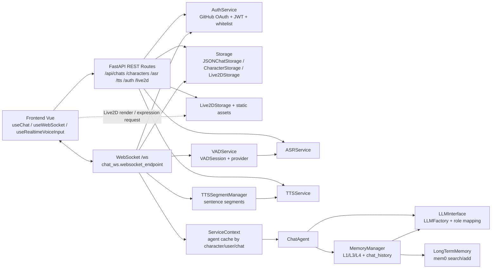
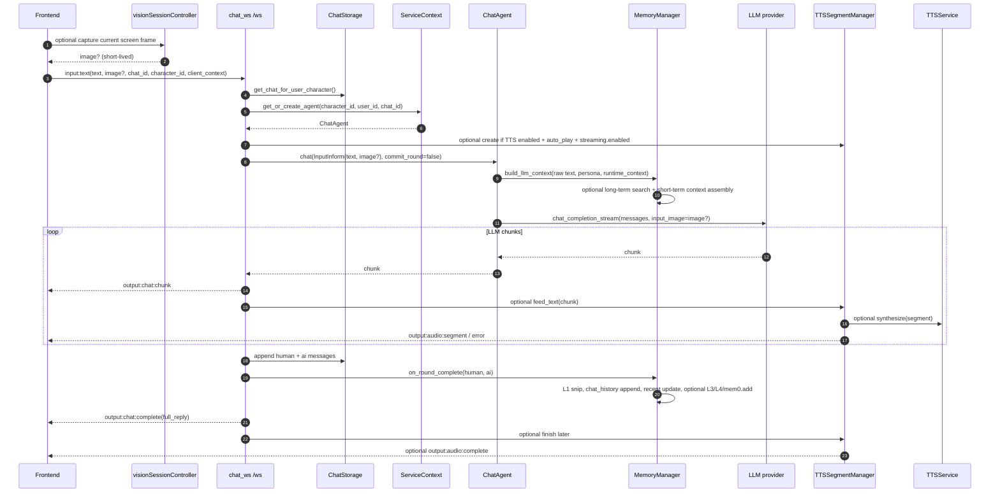
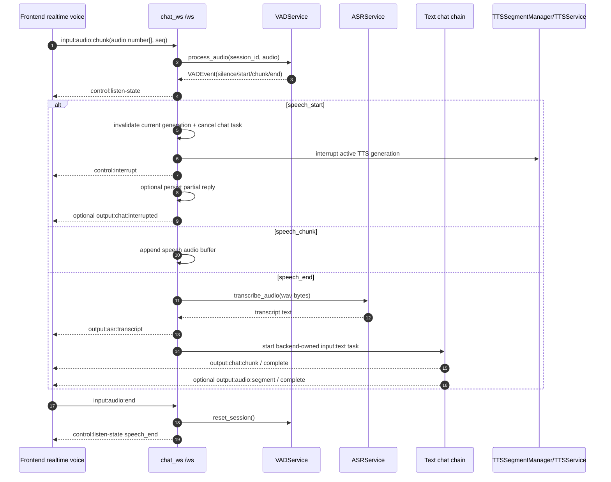

# 项目架构设计

> 文档版本: v2.0
> 创建日期: 2026-04-23
> 最后更新: 2026-07-09
> 维护范围: 项目级架构、跨模块工作流、代码入口和开发文档导航

---

## 文档定位

本文是 ATRI 项目的项目级架构入口。它回答四个问题：

1. 当前系统由哪些模块组成。
2. 运行时如何把配置、路由、服务、Agent、记忆和前端串起来。
3. 文本聊天、实时语音、TTS 输出、认证和存储等主链路如何流转。
4. 开发者开始修改代码时，应先阅读哪些长期设计文档和 feature 文档。

本文只描述长期有效的架构事实和跨模块边界。模块内部细节应沉淀到
`docs/developments/modules/`；某次功能的开发过程应沉淀到
`docs/developments/features/`；适合迁移到 GitHub Wiki 的文章应整理到
`docs/developments/wiki/`。

除非明确说明，本文路径均为仓库相对路径。

## 阅读路径

| 场景 | 推荐阅读 |
|---|---|
| 刚进入项目 | 先读本文的“当前系统概览”“运行时装配”“核心工作流” |
| 修改某个后端模块 | 先读本文的“后端模块边界”，再读 `docs/developments/modules/<module>/` |
| 继续某个功能开发 | 先读 `docs/developments/features/<YYYY-MM-feature>/`，再回到本文确认跨模块边界 |
| 调整接口或协议 | 先读本文的“API 与协议入口”，再读 `docs/developments/api/` |
| 写开发 blog 或 Wiki | 先在 feature dev-log 记录事实，完成后整理到 `docs/developments/wiki/` |

---

## 1. 当前系统概览

ATRI 是一个带长期记忆、多角色 Persona、实时语音交互和 Live2D 前端的情感聊天机器人。后端以 FastAPI 提供 REST API 和 WebSocket，前端以 Vue 3/Vite 提供聊天、设置、实时语音、角色和 Live2D 交互。

### 1.1 当前能力状态

| 能力 | 当前状态 | 主要代码入口 |
|---|---|---|
| 文本聊天 | 已实现 | `src/routes/chat_ws.py`, `src/agent/chat_agent.py` |
| WebSocket 流式输出 | 已实现 | `src/routes/chat_ws.py`, `frontend/src/utils/websocket.ts` |
| 角色 Persona | 已实现 | `src/agent/persona.py`, `src/routes/characters.py` |
| 聊天历史 CRUD | 已实现 | `src/routes/chats.py`, `src/storage/json_storage.py` |
| 记忆系统 | 已实现 | `src/memory/manager.py`, `src/memory/*` |
| 长期记忆 | 可选启用 | `src/memory/long_term.py`, `config/memory_config.yaml` |
| 认证系统 | 已实现，可配置启用 | `src/auth/*`, `src/middleware/auth.py`, `src/routes/auth.py` |
| ASR | 已实现 REST 与 WebSocket 链路 | `src/asr/*`, `src/routes/asr.py`, `src/routes/chat_ws.py` |
| VAD | 已实现于 WebSocket 实时语音链路 | `src/vad/*`, `src/routes/chat_ws.py` |
| TTS REST 合成 | 已实现 | `src/tts/*`, `src/routes/tts.py` |
| TTS 分段流式输出 | 后端已实现，前端消费需按当前代码确认 | `src/tts/segment_manager.py`, `src/routes/chat_ws.py` |
| Live2D 资源管理 | 已实现 | `src/storage/live2d_storage.py`, `src/routes/live2d.py`, `frontend/src/components/live2d/*` |
| 翻译模块 | 配置预留，主链路尚未成型 | `config/translate_config.yaml`, `src/translate/` |

### 1.2 技术栈

| 层 | 技术 |
|---|---|
| 后端语言 | Python 3.11+ |
| 后端框架 | FastAPI, Uvicorn |
| 依赖管理 | uv, `pyproject.toml`, `uv.lock` |
| 配置 | YAML, `${ENV_VAR}` 环境变量替换 |
| 日志 | loguru |
| LLM | OpenAI SDK 兼容接口、自定义 provider |
| 记忆 | 本地短期记忆、压缩摘要、可选 mem0 长期记忆 |
| 语音 | ASR/VAD/TTS provider 工厂 |
| 前端 | Vue 3, Vite, TypeScript, Pinia |
| 前端 UI | UnoCSS, reka-ui, AIRI 风格组件 |
| Live2D | pixi-live2d-display, PixiJS |
| 测试 | pytest, pytest-asyncio, mypy, ruff, vue-tsc |

### 1.3 当前代码事实边界

这些边界在写设计、计划和实现时需要保持清楚：

| 主题 | 边界 |
|---|---|
| ASR/TTS/Auth/Live2D/VAD | 都已有实际实现，不应继续写成纯“规划中” |
| VAD | 没有独立 REST API，当前主要嵌入 `/ws` 实时语音链路 |
| TTS streaming | 后端已有 `output:audio:*` 事件；前端仍存在 REST TTS 自动播放路径，不应过度声称已完全 WS 音频流化 |
| Storage | 当前活跃聊天存储是 `JSONChatStorage`；`DatabaseChatStorage` 仍是骨架，不应写成可用主路径 |
| Live2D | 后端管理模型和静态资源，前端负责渲染和表情请求 |
| Translate | 目前主要是配置和目录预留，不属于主链路 |

---

## 2. 运行时装配

### 2.1 启动入口

后端入口是 `src/main.py`。它负责读取根配置、创建 FastAPI 应用，并通过 Uvicorn 启动服务。应用工厂在 `src/app.py` 的 `create_app(config)` 中完成。

`create_app()` 的核心职责：

| 职责 | 说明 |
|---|---|
| 创建 FastAPI 实例 | 设置应用标题、版本、lifespan |
| 初始化共享服务 | ASR、TTS、VAD、Auth、CharacterStorage、Live2DStorage |
| 注册中间件 | CORS、认证中间件 |
| 注册 REST 路由 | health、auth、asr、tts、characters、chats、data、live2d |
| 注册 WebSocket | `/ws` -> `websocket_endpoint` |
| 挂载静态资源 | `/api/assets/avatars`、`/api/assets/live2d`、`/static/avatars` |

### 2.2 应用状态

`app.state` 是路由层访问共享服务的运行时容器：

| `app.state` 字段 | 作用 |
|---|---|
| `config` | 合并后的全局配置 |
| `storage` | 聊天存储，由 lifespan 根据 `storage` 配置创建 |
| `service_context` | ChatAgent 生命周期容器 |
| `asr_service` | ASR 配置、provider、转写服务 |
| `tts_service` | TTS 配置、provider、合成服务 |
| `vad_service` | VAD 会话与 provider 服务 |
| `vision_service` | 视觉配置、安全投影与持久化开关服务 |
| `auth_service` | GitHub OAuth、JWT、白名单认证 |
| `character_storage` | 角色 Persona 和头像管理 |
| `live2d_storage` | Live2D 模型资源管理 |

### 2.3 ServiceContext

`ServiceContext` 是聊天主链路的组合入口。它按 `(character_id, user_id, chat_id)` 缓存 `ChatAgent`，按 `(character_id, user_id)` 共享长期记忆句柄。

创建一个 Agent 时，`ServiceContext` 会依次完成：

1. 读取角色 Persona。
2. 获取或创建长期记忆。
3. 构造 LLM role factory。
4. 构造 `MemoryManager`。
5. 通过 `create_from_role("chat", llm_config)` 创建主聊天 LLM。
6. 组合成 `ChatAgent(chat_llm, memory_manager, persona)`。

这个设计让聊天主流程只依赖 `ChatAgent`，而 LLM provider、记忆配置、角色和长期记忆都被封装在创建阶段。

---

## 3. 项目级系统总览



图中有四条主轴：

| 主轴 | 说明 |
|---|---|
| REST 管理面 | 聊天 CRUD、角色、认证、配置、ASR/TTS REST、Live2D 资源 |
| WebSocket 对话面 | 文本聊天、实时语音、VAD 打断、ASR 自动提交、TTS 分段事件 |
| Agent 组合面 | ServiceContext 组合 Persona、LLM、MemoryManager 和长期记忆 |
| Provider 扩展面 | LLM/ASR/TTS/VAD 通过 interface/factory/providers 扩展 |

---

## 4. 后端模块边界

### 4.1 Routes 层

`src/routes/` 是外部接口入口。它不应承载 provider 细节，而是负责协议解析、参数验证、调用应用服务、把结果转换为 HTTP/WebSocket 响应。

| 路由文件 | 职责 |
|---|---|
| `health.py` | 服务健康检查 |
| `auth.py` | GitHub OAuth 登录、回调、当前用户、登出 |
| `characters.py` | 角色列表、角色详情、创建、更新、删除、头像上传 |
| `chats.py` | 聊天列表、创建、详情、标题更新、删除 |
| `data.py` | 用户/角色/聊天相关数据清理 |
| `asr.py` | ASR provider、配置、健康检查、REST 转写 |
| `tts.py` | TTS provider、配置、健康检查、voices、REST 合成 |
| `live2d.py` | Live2D 模型上传、列表、表达式、更新、删除 |
| `vision.py` | 视觉配置读取与 `enabled` 白名单写入 |
| `chat_ws.py` | 文本/视觉聊天、实时语音、VAD、ASR 自动提交、TTS 分段事件 |

### 4.2 Agent 层

`src/agent/` 是聊天编排层。`ChatAgent` 自身不拥有复杂状态，而是组合：

| 依赖 | 作用 |
|---|---|
| `LLMInterface` | 流式生成回复 |
| `MemoryManager` | 构造上下文、提交轮次、管理短期和长期记忆 |
| `Persona` | 提供角色 system prompt 和显示信息 |

`ChatAgent.chat()` 的默认路径会在流结束后自动调用 `MemoryManager.on_round_complete()`。但在 WebSocket 路由中，`chat_ws.py` 使用 `commit_round=false`，由路由先持久化聊天存储，再手动提交记忆，避免前端断连或 generation 失效时写入不一致。

`ChatAgent` 接受 `InputInform(input_text, image?)`。文本进入 Memory，上层可选图片只进入当前 LLM 调用。`LLMError` 保持异常控制流，由 WebSocket 路由转换为瞬态 generation failure，不写聊天归档或 Memory。

### 4.3 LLM 层

`src/llm/` 提供 LLM 调用抽象：

| 文件 | 职责 |
|---|---|
| `interface.py` | 定义统一 LLM 接口 |
| `factory.py` | 注册表工厂、role 到 provider 配置的解析 |
| `multimodal.py` | 把最终当前 user 消息组装为可选单图请求 |
| `providers/` | 具体 provider，例如 OpenAI 兼容接口、小米接口 |
| `exceptions.py` | LLM 异常类型 |

LLM 的关键配置不是单个 active provider，而是 `llm_roles` 到 `llm_configs` 的映射。主聊天、L3 压缩、L4 合并可以使用不同 role。

### 4.4 Memory 层

`src/memory/` 是记忆系统。核心对象是 `MemoryManager`。

| 组件 | 职责 |
|---|---|
| `manager.py` | 调度会话、构造 LLM 上下文、提交轮次、触发压缩 |
| `short_term.py` | 短期记忆读写 |
| `chat_history.py` | 聊天历史追加和恢复 |
| `compressor.py` | L3/L4 压缩 |
| `long_term.py` | mem0 长期记忆封装 |
| `retrieval_policy.py` | 长期记忆检索策略 |
| `search_cache.py` | 检索缓存 |
| `snip.py` | L1 用户输入清洗 |

记忆层的基本原则：

| 原则 | 说明 |
|---|---|
| 原始输入优先 | LLM 上下文和长期检索使用用户原始输入，L1 清洗在提交阶段处理 |
| chat_history 是恢复源 | 本地短期状态损坏时，应能从聊天历史恢复 |
| 压缩异步演进 | L3/L4 是在轮次提交后按策略触发的压缩结果 |
| 长期记忆可选 | mem0 不可用时，系统应能以本地短期记忆继续工作 |

### 4.5 Storage 层

`src/storage/` 管理聊天、角色资源和 Live2D 资源。

| 组件 | 当前定位 |
|---|---|
| `interface.py` | `ChatStorageInterface` 抽象 |
| `factory.py` | 根据配置创建聊天存储 |
| `json_storage.py` | 当前主用聊天存储实现 |
| `db_storage.py` | 数据库存储骨架，尚非可用主路径 |
| `character_storage.py` | 角色 Persona、头像、角色元信息 |
| `live2d_storage.py` | Live2D 模型文件和元信息 |

### 4.6 ASR / VAD / TTS

ASR、VAD、TTS 都采用服务层加 provider 工厂的模式，但职责不同：

| 模块 | 负责 | 不负责 |
|---|---|---|
| ASR | 音频转文字、provider 配置、REST 转写、WebSocket speech_end 转写 | VAD 判断、聊天生成 |
| VAD | 判断语音开始/持续/结束、维护实时语音 session | ASR 转写、文本聊天 |
| TTS | 文本合成音频、voices、REST 合成、分段流式管理 | LLM 生成、VAD 判断 |

TTS 分段流式当前是应用层方案：`TTSSegmentManager` 使用 `SentenceDivider` 把 LLM 文本 chunk 聚合成句段，再调用现有 `TTSService.synthesize()` 生成完整小音频段。

### 4.7 Vision 层

`src/vision/` 提供屏幕视觉输入的领域边界：

| 组件 | 职责 |
|---|---|
| `models.py` | `InputText`、`InputImage`、`InputInform` |
| `config.py` / `service.py` | 视觉配置校验、安全读取和 `enabled` 持久化 |
| `validation.py` | JPEG/Base64/大小与 WebSocket 文本帧校验 |
| `capture_coordinator.py` | 按 generation 协调 VAD 截图 Future |

图片只属于当前 LLM 调用，不进入 Storage、Memory 或压缩。首版只支持浏览器屏幕共享的一张 JPEG，不包含 OCR、摄像头或持续视频分析。

### 4.8 Auth 层

`src/auth/` 和 `src/middleware/auth.py` 负责认证边界：

| 组件 | 职责 |
|---|---|
| `service.py` | 认证服务、白名单校验、token 认证 |
| `jwt.py` | JWT 创建和校验 |
| `oauth.py` | GitHub OAuth 交换和用户信息 |
| `session.py` | session cookie 处理 |
| `whitelist.py` | 用户白名单 |
| `dependencies.py` | FastAPI 依赖入口 |
| `middleware/auth.py` | HTTP 请求认证中间件 |

WebSocket 连接也会解析用户身份。认证关闭时，系统通常使用默认用户；认证开启时，受保护接口和 WebSocket 需要合法凭据。

---

## 5. 前端模块边界

前端位于 `frontend/`，采用 Vue 3 + Vite + Pinia。

| 目录 | 职责 |
|---|---|
| `src/pages/` | 页面级入口，包括首页、登录、设置页 |
| `src/components/` | 视觉组件和业务组件 |
| `src/stores/` | Pinia 状态层 |
| `src/composables/` | 可复用业务逻辑和副作用封装 |
| `src/api/` | REST API 客户端封装 |
| `src/utils/` | WebSocket、音频、鉴权、Live2D 等工具 |
| `src/types/` | 前端类型定义 |

前端主链路可分为三类：

| 链路 | 主要文件 |
|---|---|
| 文本聊天 | `useChat.ts`, `useWebSocket.ts`, `stores/chat.ts` |
| 实时语音 | `useRealtimeVoiceInput.ts`, `components/chat/RealtimeVoiceInput.vue` |
| 屏幕视觉 | `useVision.ts`, `visionSessionController.ts`, `screenCapture.ts`, `VisionInput.vue` |
| 音频播放 | `useAudioPlayer.ts`, `stores/tts.ts`, `api/tts.ts` |
| Live2D | `components/live2d/*`, `stores/live2d.ts` |
| 认证 | `stores/user.ts`, `api/auth.ts`, `utils/authToken.ts` |

前端 WebSocket 会话层负责把服务端消息类型分发为前端事件，例如 `chat:chunk`、`chat:complete`、`chat:generation-error`、`vision:capture-request`、`asr:transcript`、`vad:listen-state`、`vad:interrupt`。如果新增 WebSocket 事件，应同时检查后端发送、前端分发、store/composable 消费和测试。

---

## 6. 核心工作流

### 6.1 文本聊天链路



文本聊天链路的关键点：

| 点 | 说明 |
|---|---|
| WebSocket 是主对话入口 | 文本聊天从 `input:text` 进入 `/ws` |
| 路由负责 generation 控制 | stale generation 的 chunk、complete、TTS 事件会被丢弃 |
| 存储先于 complete | 后端在发送 `output:chat:complete` 前先写聊天存储和记忆 |
| 记忆由路由提交 | WebSocket 路径使用 `commit_round=false`，再手动调用 `on_round_complete()` |
| TTS 不阻塞聊天 complete | TTS finish 可在 complete 后由任务继续发送 |
| 图片不进入持久化 | 可选图片只进入当前 LLM 调用，Storage 和 Memory 只接收文本 |
| failure 是独立终态 | pre-success 失败发送 `output:chat:error`，不写 Storage/Memory |

### 6.2 实时语音链路



实时语音链路的关键点：

| 点 | 说明 |
|---|---|
| 前端负责采集 | `useRealtimeVoiceInput` 采集麦克风并发送 `input:audio:chunk` |
| 后端负责 VAD | `VADService` 输出 speech_start、speech_chunk、speech_end 等事件 |
| speech_start 是打断边界 | 默认取消聊天任务并失效 generation；若已进入 `committing`，只停止音频并保留聊天 generation 等待 complete |
| speech_end 触发 ASR | 有效语音段转写后，后端自动进入文本聊天链路 |
| VAD 状态是控制消息 | 前端通过 `control:listen-state` 更新听觉状态 |

### 6.3 屏幕视觉链路

视觉有两条截图时序：

```text
键盘 / 普通 ASR
  -> 前端发送前截图
  -> input:text(image?)

VAD + 后端 ASR
  -> control:vision:capture-request(generation_id)
  -> input:vision:capture-result(generation_id)
  -> 后端继续 InputInform(text, image?)
```

设置页 `vision.enabled` 决定后端模块是否允许视觉；主页 `VisionInput` 决定当前标签页是否持有 MediaStream。两者都开启时才会使用图片。

图片校验失败、本地截图失败或 VAD 截图 timeout 都降级为纯文本。Base64 不进入日志、Pinia、Storage、Memory 或上下文压缩。

### 6.4 记忆与存储链路

聊天持久化和记忆提交是两条相关但不同的链路：

| 链路 | 文件 | 作用 |
|---|---|---|
| 聊天存储 | `src/storage/json_storage.py` | 面向 UI 的聊天列表、消息历史、聊天标题 |
| 短期记忆 | `src/memory/short_term.py` | 面向 LLM 上下文的近期对话和压缩块 |
| 聊天历史 | `src/memory/chat_history.py` | 记忆恢复的 source of truth |
| 长期记忆 | `src/memory/long_term.py` | 可选 mem0 检索和写入 |

WebSocket 正常完成一轮时，路由先向 `ChatStorage` 追加 human 和 ai 消息，再调用 `MemoryManager.on_round_complete()`，用于保证正常路径的处理顺序。两者都是 best effort：单项写入失败会被记录，但不会把已经成功生成的 generation 改判为失败。`output:chat:complete` 表示 generation 成功结束，不是 ChatStorage 与 Memory 都已成功持久化的严格事务确认。

### 6.5 认证链路

认证链路由 REST 登录流程、HTTP 中间件和 WebSocket 身份解析共同组成：

1. 前端访问 `/api/auth/login` 获取 GitHub OAuth 授权地址。
2. GitHub 回调进入 `/api/auth/callback`。
3. 后端校验 OAuth state、获取 GitHub 用户、执行白名单检查。
4. 后端签发 session/JWT，并通过 cookie 或 bearer token 参与后续请求。
5. HTTP 请求由 `auth_middleware` 做保护。
6. WebSocket 连接建立时解析用户身份，失败时关闭连接。

认证可通过配置关闭。关闭时，系统会落到默认用户语义；开启时，受保护资源必须携带合法凭据。

---

## 7. 可插拔扩展点

```mermaid
flowchart TB
  subgraph LLM["LLM"]
    LLMIF["LLMInterface"] --> LLMF["LLMFactory.register/create"]
    LLMCONF["config/llm_config.yaml<br/>llm_roles -> llm_configs"] --> LLMF
    LLMF --> LLMP["providers<br/>openai/openai_compatible/siliconflow/xiaomi"]
  end

  subgraph ASR["ASR"]
    ASRIF["ASRInterface"] --> ASRF["ASRFactory"]
    ASRCONF["ASRConfigStore"] --> ASRS["ASRService"]
    ASRF --> ASRP["providers<br/>web_speech_api/faster_whisper/whisper_cpp/sherpa/openai_whisper"]
    ASRS --> ASRF
  end

  subgraph TTS["TTS"]
    TTSIF["TTSInterface"] --> TTSF["TTSFactory"]
    TTSCONF["TTSConfigStore"] --> TTSS["TTSService"]
    TTSF --> TTSP["providers<br/>edge/gpt_sovits/siliconflow/cosyvoice3"]
    TTSS --> TTSF
    SEG["TTSSegmentManager + SentenceDivider"] --> TTSS
  end

  subgraph VAD["VAD"]
    VADIF["VADInterface"] --> VADF["VADFactory"]
    VADCONF["VADConfigStore"] --> VADS["VADService + VADSession"]
    VADF --> VADP["providers<br/>fake/silero_vad"]
    VADS --> VADF
  end
```



扩展点原则：

| 原则 | 说明 |
|---|---|
| interface 稳定 | 调用方依赖抽象接口，不直接依赖 provider |
| provider 自注册 | 新 provider 通过 factory 装饰器注册 |
| 配置驱动选择 | LLM 使用 role 映射，ASR/TTS/VAD 使用 active provider 配置 |
| service 封装运行策略 | 缓存、健康检查、敏感字段过滤、更新配置由 service 处理 |
| 测试跟随扩展 | 新 provider 至少需要接口、工厂和配置边界测试 |

新增 provider 的典型步骤：

1. 阅读对应模块文档和接口。
2. 在 `providers/` 下新增实现。
3. 使用 `@Factory.register(...)` 注册。
4. 更新 YAML 配置和 ConfigStore 默认值。
5. 增加 factory/service/provider 测试。
6. 更新对应 `docs/developments/modules/<module>/` 文档。

---

## 8. 配置架构

配置入口由根配置和子配置组成。`src/utils/config_loader.py` 负责读取根配置，将形如 `*_config: config/*_config.yaml` 的路径引用展开为模块配置，并替换 `${ENV_VAR}`。

| 配置文件 | 作用 |
|---|---|
| `config/server_config.yaml` | 服务端 host、port、CORS 等 |
| `config/storage_config.yaml` | 聊天存储模式和路径 |
| `config/llm_config.yaml` | LLM provider 配置池和 role 映射 |
| `config/memory_config.yaml` | 短期记忆、压缩、mem0 等 |
| `config/auth.yaml` | 认证开关、GitHub OAuth、JWT、白名单 |
| `config/asr_config.yaml` | ASR active provider 和 provider 参数 |
| `config/vad_config.yaml` | VAD active provider、采样率、阈值、debounce |
| `config/tts_config.yaml` | TTS active provider、auto_play、streaming 等 |
| `config/vision_config.yaml` | 视觉模块开关、截图、Provider detail 与传输上限 |
| `config/translate_config.yaml` | 翻译模块预留配置 |

配置原则：

| 原则 | 说明 |
|---|---|
| 敏感信息走环境变量 | API key、secret 不应硬编码进 YAML |
| 未使用分支可保留占位符 | 未设置的 `${ENV_VAR}` 会保留字面值，避免未启用 provider 阻塞启动 |
| 配置更新由 service 把关 | ASR/TTS/VAD service 会过滤敏感字段和后端专用字段 |
| 默认值在代码中兜底 | ConfigStore 应提供模块可运行的默认结构 |

---

## 9. API 与协议入口

### 9.1 REST API

| 分类 | 路径前缀 | 说明 |
|---|---|---|
| 健康检查 | `/health` | 服务健康状态 |
| 认证 | `/api/auth` | 登录、回调、当前用户、登出、状态 |
| 角色 | `/api/characters` | 角色 CRUD 和头像上传 |
| 聊天 | `/api/chats` | 聊天 CRUD、历史读取、标题更新 |
| 数据 | `/api/data` | 短期记忆、长期记忆等数据清理 |
| ASR | `/api/asr` | provider、配置、健康检查、转写 |
| TTS | `/api/tts` | provider、配置、voices、合成 |
| Vision | `/api/vision` | 视觉安全配置与 `enabled` 开关 |
| Live2D | `/api/live2d/models` | 模型、表达式、资源管理 |

稳定接口文档应放在 `docs/developments/api/`。当 REST 请求或响应结构变化时，需要同步更新该目录。

### 9.2 WebSocket 协议

`/ws` 是文本、屏幕视觉和实时语音的主通道。

| 方向 | 消息类型 | 说明 |
|---|---|---|
| client -> server | `ping` | 心跳 |
| client -> server | `input:text` | 文本聊天输入，可带当前轮单图 |
| client -> server | `input:vision:state` | 当前连接屏幕共享状态 |
| client -> server | `input:vision:capture-result` | VAD generation 截图结果 |
| client -> server | `input:audio:chunk` | 实时语音音频块 |
| client -> server | `input:audio:end` | 结束当前音频输入 |
| server -> client | `pong` | 心跳响应 |
| server -> client | `output:chat:chunk` | LLM 文本 chunk |
| server -> client | `output:chat:complete` | 文本回复完成 |
| server -> client | `output:chat:interrupted` | 被 VAD 打断后的部分回复 |
| server -> client | `output:chat:error` | pre-success generation failure |
| server -> client | `output:asr:transcript` | ASR 最终转写 |
| server -> client | `control:listen-state` | VAD 听觉状态 |
| server -> client | `control:interrupt` | 打断当前输出 |
| server -> client | `control:vision:capture-request` | 请求当前 generation 的屏幕一帧 |
| server -> client | `output:audio:segment` | TTS 音频段 |
| server -> client | `output:audio:complete` | TTS 音频段发送完成 |
| server -> client | `output:audio:error` | TTS 单段合成失败 |
| server -> client | `error` | 通用错误 |

协议变更必须同时检查：

1. `src/routes/chat_ws.py` 的发送和接收。
2. `frontend/src/utils/websocketSessionController.ts` 的事件分发。
3. `frontend/src/composables/useWebSocket.ts` 或相关 composable 的消费。
4. `tests/routes/test_chat_ws.py` 以及前端类型检查。

---

## 10. 测试与验证地图

测试目录和代码模块大体对齐：

| 测试目录 | 覆盖范围 |
|---|---|
| `tests/llm/` | LLM 接口、工厂、provider |
| `tests/memory/` | 短期记忆、压缩、长期记忆、MemoryManager |
| `tests/agent/` | ChatAgent、Persona、live chat 场景 |
| `tests/storage/` | ChatStorage 接口和 JSON 实现 |
| `tests/auth/` | JWT、AuthService |
| `tests/asr/` | ASR 模块相关测试和执行说明 |
| `tests/vad/` | VAD service、provider、应用集成 |
| `tests/tts/` | SentenceDivider、TTSSegmentManager |
| `tests/vision/` | 视觉配置、模型、校验与截图协调 |
| `tests/routes/` | REST 和 WebSocket 路由 |
| `tests/utils/` | 配置加载、日志等基础工具 |

常用检查命令：

```bash
uv run python -m mypy src/ --ignore-missing-imports
uv run ruff format .
uv run ruff check . --fix
uv run pytest tests/ -v
```

前端常用检查命令：

```bash
cd frontend
npm run type-check
npm run test
npm run build
```

文档变更通常不需要完整执行所有代码检查，但如果文档声称某个链路已实现，应至少通过源码和相关测试文件确认。

---

## 11. 文档导航与维护规则

### 11.1 开发文档目录

| 目录 | 职责 |
|---|---|
| `docs/developments/architecture/` | 项目级架构、分层、跨模块数据流 |
| `docs/developments/api/` | REST API、WebSocket、事件协议 |
| `docs/developments/modules/` | 长期模块设计，目录尽量对齐 `src/` |
| `docs/developments/features/` | 单次功能开发的设计、计划、日志、验收 |
| `docs/developments/wiki/` | GitHub Wiki 本地预发布稿 |
| `docs/developments/decisions/` | ADR 技术决策记录 |
| `docs/developments/templates/` | 文档模板 |
| `docs/developments/archive/` | 历史归档 |

### 11.2 模块文档入口

| 模块 | 推荐入口 |
|---|---|
| Agent / Persona | `docs/developments/modules/agent/README.zh-CN.md` |
| ASR | `docs/developments/modules/asr/README.zh-CN.md` |
| Auth | `docs/developments/modules/auth/README.zh-CN.md` |
| Frontend | `docs/developments/modules/frontend/README.zh-CN.md` |
| Live2D | `docs/developments/modules/live2d/README.zh-CN.md` |
| LLM | `docs/developments/modules/llm/README.zh-CN.md` |
| Memory | `docs/developments/modules/memory/README.zh-CN.md` |
| Routes | `docs/developments/modules/routes/README.zh-CN.md` |
| Storage | `docs/developments/modules/storage/README.zh-CN.md` |
| TTS | `docs/developments/modules/tts/README.zh-CN.md` |
| VAD | `docs/developments/modules/vad/README.zh-CN.md` |
| Vision | `docs/developments/modules/vision/README.zh-CN.md` |

现有模块入口应随实现持续维护；Translation 等尚未形成正式入口的模块，在长期边界稳定后按同样模式补齐。

### 11.3 Feature 文档入口

| Feature | 推荐入口 |
|---|---|
| VAD 实时打断 | `docs/developments/features/2026-06-vad-realtime-interrupt/README.zh-CN.md` |
| TTS 分段流式化 | `docs/developments/features/2026-07-tts-segment-streaming/README.zh-CN.md` |
| 视觉理解 | `docs/developments/features/2026-07-10-visual-understanding/design-docs.md` |

Feature 完成后，应把长期有效结论提炼到 `modules/`，把适合对外阅读的文章整理到 `wiki/`。

### 11.4 维护规则

| 规则 | 说明 |
|---|---|
| 项目级文档讲边界 | 本文不堆模块内部实现细节 |
| 模块文档讲长期设计 | `modules/` 说明接口、配置、生命周期、数据流 |
| Feature 文档讲过程 | `features/` 记录当次开发的方案、日志、验收和遗留问题 |
| Wiki 文档讲可阅读成果 | `wiki/` 不放原始开发流水 |
| 代码事实优先 | 文档状态必须以当前源码和测试为准 |
| 实现变化先改设计 | 如果实现改变既有架构约束，应先更新对应设计文档 |

---

## 12. 后续演进方向

这些方向不是当前已完成事实，写实现计划时需要进入 feature 文档：

| 方向 | 说明 |
|---|---|
| TTS streaming 前端消费闭环 | 明确 `output:audio:*` 在前端的分发、队列和播放策略 |
| 数据库存储实现 | 将 `DatabaseChatStorage` 从骨架推进为可用实现 |
| ASR/VAD/TTS 文档补齐 | 将旧 `module-design/CN` 内容提炼到 `modules/` |
| WebSocket 协议文档稳定化 | 将消息格式沉淀到 `docs/developments/api/` |
| Translate 主链路设计 | 明确翻译作为 LLM 输出消费者还是 TTS 前处理 |
| 文档 Wiki 化 | 从 `docs/developments/wiki/` 迁移整理后的文章到 GitHub Wiki |

---

## 附录 A. 关键代码入口

| 主题 | 代码入口 |
|---|---|
| 应用启动 | `src/main.py` |
| FastAPI 装配 | `src/app.py` |
| 服务上下文 | `src/service_context.py` |
| WebSocket 主链路 | `src/routes/chat_ws.py` |
| ChatAgent | `src/agent/chat_agent.py` |
| Persona | `src/agent/persona.py` |
| 记忆管理 | `src/memory/manager.py` |
| LLM 工厂 | `src/llm/factory.py` |
| ASR 服务 | `src/asr/service.py` |
| VAD 服务 | `src/vad/service.py` |
| TTS 服务 | `src/tts/service.py` |
| TTS 分段 | `src/tts/segment_manager.py`, `src/tts/sentence_divider.py` |
| 聊天存储 | `src/storage/json_storage.py` |
| 认证 | `src/auth/service.py`, `src/middleware/auth.py` |
| 前端 WebSocket | `frontend/src/utils/websocket.ts`, `frontend/src/composables/useWebSocket.ts` |
| 前端实时语音 | `frontend/src/composables/useRealtimeVoiceInput.ts` |
| 前端音频播放 | `frontend/src/composables/useAudioPlayer.ts` |
